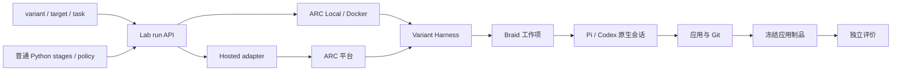

# Factory26 跨组件技术说明

本文维护本轮 run 架构的跨组件职责、生命周期和证据边界。命令与执行细节归 [Lab 入口](../../lab/README.md)，旧冻结执行另遵循 [lab.exp 合同](../../lab/exp/README.md)；资源归 [runtime-resources](runtime-resources.md)，恢复操作归 [恢复手册](../deployment/recovery.md)，产品目标归 [PRD](../prd/index.md)。架构已经采用不代表部署和真实验收已完成，当前结果以[任务 packet](../../tasks/finals-experiment-loop/packet.md)为准。

## 组件与调用关系

新入口由 `lab.run` 接受 start、stop、pause、resume、restart 等实际 run 操作，`lab.arc_bench.execution` 持有 ARC Local/Docker 或 Hosted 的真实句柄。每个 run 独立执行、采集和保存结果，CLI/Console 退出不取消运行。普通 Python 组织跨 run 策略与 stages，没有 experiment/job/attempt 控制器、admission、slot、reservation 或未来任务队列。旧 `lab.exp` 仅服务原冻结执行与历史记录，不把它的容量和证明链带入新入口。

`lab.exp.definitions` 管理不可变 Harness 组件的组合，`lab.exp.delivery` 将其投影为 SDK 目录或 Hosted ZIP。交付格式不决定内部材料边界；执行器源码、Harness 定义和 runtime 身份保持独立。工具凭据是每次 attempt 的私有输入，不进入共享定义；SDK 为实际子进程提供可读的私有配置，Hosted 的自包含私有交付保持独立身份，不能修改共享组件的所有权。`lab.exp.assembly` 记录实际域的 reference/member/local_root/access 与可写 state，`scripts.execution_bootstrap` 持有本域服务和入口生命周期，`scripts.execution_context` 是 Harness 读取这些事实的共同入口。父域路径不能被角色名或 basename 猜测成子域路径。Capture source binding 显式关联 workspace/state 的实际卷和成员、装配记录、容器出生身份与冻结 capture 代码；公共 helper 解析这些位置，不要求 SDK workspace 模拟普通 Docker runner 的目录。外层 Local attempt 与内层 Docker child 保留各自身份及关系。

`lab.exp.terminal` 将一次已封存内容提供给输出和终态证据消费者。具有 managed capture 获取证明的快照也可供 checkpoint 复用；普通终态内容不证明完整写者关闭或跨文件同一切点，不能事后补 closure 升级成检查点。旧 attempt 的消费者在写权交接前绑定快照；活动 state 的物理位置不能成为历史结果的当前内容。域权威管理 generation、capture 和唯一 writer，实际启动也受同一许可约束，文件快照本身不证明写者已关闭。控制查询只验证实际控制代码、必要依赖、解释器及记录归属，再核对域权威的资源和 holder；runtime、Harness 输入和快照字节在对应构建、启动或消费边界验证。无关输入失效不能阻止停止原执行。

`lab.exp.compiler` 将显式 intent 的目标、模型选择和逐应用评价政策编译为严格冻结 recipe；选择原件、生产选择与 compiler 摘要保留在 compilation 中；输入内容身份由所选 job 的 build 冻结到发布制品。同一编译 bundle 只接受相同输入/政策/版本，变化须新 bundle。Compiler 不请求平台、执行模型或隐式准备环境；I14 的逐实验策略 launcher 已退役。`lab.exp.readiness` 只读聚合声明 runtime/材料、模型凭据变量覆盖与 Docker 宿主事实，不安装或预约；域权威提供只读 query；未取得当前容量原件时明确 unknown，查询不能替代 start 的当前门控。

新运行固定分离 program、inputs、data、records、snapshots 和 evaluations。程序重新组装，restart 只迁移全部 data，不继承旧控制句柄、费用、遥测库或隐藏评分。私有凭据在可迁移数据之外。相同 task/需求版本恢复原生身份；下一 task 创建新原生任务状态，保留应用及历史。停止来源和保存数据失败不能悄悄退回空会话或旧快照。

Braid 持有 Issue/PR、成员身份、工作项上下文、clone 和共同 origin；Pi/Codex 持有原生会话、工具和内部子代理；SVC 以独立技能文件提供方法和模板。三者的正文不由 Factory 复制成第二份规范。

| 组件 | 拥有 | 不拥有 |
| --- | --- | --- |
| variant/Harness | 生成流程、角色技能、材料选择和应用语义 | 实验调度、Braid 对象或官方评分判断 |
| lab.run / automation | 实际 run 操作、保存记录查询、普通 Python 自动化 | 实验级调度器或 Agent 内部协作语义 |
| lab.arc_bench | ARC 执行、官网响应、完整数据接续、应用冻结和独立测评 | Braid 私有语义或猜测的平台能力 |
| Lab Collector/Backend/Console | 三信号 OTLP、保存状态与结果、通用运行展示 | 运行现场写入、另一个采集循环或实时 Braid CLI 控制 |
| Braid/Pi/SVC | 工作项、原生会话、工具和方法材料 | 对方的私有生命周期或验收结论 |

组件间只沿明确的材料和回执建立关系：

图中的 Braid 是团队 variant 的路径，不是 Pi-only 的强制依赖。共享 Collector/Backend 在单个 Python 服务中保存与查询原件，SQLite 使用服务宿主本地磁盘；Hosted 只携带轻量接收落盘核心，回收后导入。Braid 自有 reader 解码新增 batch，按固定 cutoff 低频后台重建并发布，页面读取物化结果，正文按需分页，不查询现场私有 DB。

## 生命周期边界

一次 run 的 execution lifecycle 为 starting、running、paused、completed、failed、stopped 或 unknown。activity、brief 和 last_activity_at 来自本次 program 绑定的只读状态脚本；脚本错误只令活动判断 unknown，不改写执行事实或阻塞运行。自动保存所有终态的实际可得材料；archive 只是列表隐藏标记。零分但正常结束的评测是 completed，环境或评测程序中断才是 failed。

experiments/ 保存任务及 evaluations 清单，runs/ 保存实际运行材料与原件。评测建立独立 run，配置中的 simulate、task、official 消费同一不可变应用快照的独立副本，评分、费用和错误不覆盖生成事实。官方 billing_mode 显式指定，不从模型 route 推断；隐藏结果不进入生成 inputs 或阶段控制分支。

自动化程序退出不撤销已经启动的 run，不承诺任意 Python 代码断点重放。已经发出的收费 POST 效果未知时查询原请求，不更换身份盲目重发。恢复只复制确定保存的数据；Hosted 强制取消后只报告平台实际导出的范围与时点，不能补猜测升级成最新完整现场。

## 证据归属与授权

编译、readiness、status 和离线读回只证明它们实际读取的材料。它们不授予模型、官网、Docker、Console、宿主迁移或历史清理许可。保存状态、消息送达和 receipt 存在也不等于现场完成。

制品以 manifest 身份发布，传输在接收边界核验字节；失败 staging、原错和未确认半成品保留。telemetry 保存 stream/epoch/序列和封口事实，分析不能从批次数推导 token、费用或语义进度。回收必须有稳定保留意图和完整证据，目录名、completed、hash 或 Git 提交不能单独授权删除。

模型 route、endpoint、凭据引用与评测政策在实际展开的 task/target/run 记录中保存。native cost=0 不代表平台费用为零；spend 保留 actual/estimate、来源、币种和 as_of，事实缺失保持 unknown。通用层不读取 Braid 私有 SQL，不从 collector 存活或 endpoint 名称推断已调用、已计费。

## 人工查看与物理运行控制

Docker 控制使用该 run 保存的实际 daemon 与容器身份，不以 PID 或名字相近命中其他运行；资源限制和采样是执行配置与事实，不是另一套准入回执。程序、可迁移数据与私有输入分离；跨域迁移遵守实际路径与执行平台能力。

官方 ARC 运行由 lab.arc_bench 保存请求、响应、需求版本和终态 GET。提交受理不能证明模型已开始；HTTP 状态、原响应、需求差异和平台限制必须保留。生成与评价使用独立 run，评分不覆盖生成事实。

新 Console 不进入生成容器，不登记 accessor/writer，也不通过 live Braid CLI 修改工作项。CLI 与 Console 读取同一份保存 status；控制仍使用 run 绑定的实际执行句柄。自管 Docker pause/unpause 不改变 run，Hosted 明确不支持；stop 不级联影响其他 run 或独立自动化程序。旧冻结执行的准入、捕获和访问协调按 [lab.exp](../../lab/exp/README.md) 原合同处理。

## Braid、原生 Agent 与 SVC

Braid 维护工作项、协作和成员；Pi/Codex 维护原生输入、工具调用和会话历史；SVC 提供按需读取的方法。Factory 的装配不能把 Braid 成员、原生主会话和内部角色混成同一配置对象，具体材料消费者见下节。

原生会话恢复先区分继续历史和新建会话；没有适用失效时保留原 context，未知执行状态先确认停止和可恢复性，不能盲目重放。资源压力、进程出生身份、物理停止和逻辑接续的细节见 runtime-resources.md。

## 工作项上下文与原生会话生命周期

工作项的 Braid description、Issue/PR、成员身份和原生 session context 各自维护；只有有效 description 变化才触发上下文重建，普通 comment 不替代工作项合同。恢复前先确认原执行已停止和 context revision，不能把新 profile 文件或一条 handoff 消息当作已有进程即时更新。

## 角色与材料的三个消费者

| 消费者 | 材料与责任 |
| --- | --- |
| Braid 成员 | profile 持有成员能力、主模型和协作身份；run.py 指定根工作项启动成员，之后通过 assignee 指派。 |
| 原生主会话 | native_files 装配 launcher、设置、扩展和技能发现入口；打包存在的材料不自动启用。 |
| Pi 内部角色 | agents 下的角色文件持有自身模型、工具和技能入口；它不是 Braid assignee。 |

I14 的 materials.json 声明材料，公共 producer 决定实际组件内容，三个消费者分别解释所选材料。技能正文保持独立文件，发现入口只携带名称、description 和路径。具体修改位置见 [I13 接线](../../variants/pi-braid-i13/README.md)，其它 variant 按自己的实现读取。

## 交付与评测

variant 的 materials.json 声明材料，build.py 转交显式参数；scripts/agent_support.py、braid_runtime.py 和 runtime.py 只提供各自公开边界。Braid 的共享 origin、PR 和独立 clone 是交付关系，不能当作官方评测结果。ARC 的 Git history 通道由官方 CLI 写入 Runner 项目，不修改应用或实验索引。

实验定义、runtime、artifact、request、telemetry、attempt、platform run 和评分保持各自身份。一个统一的 trace ID 不能替代这些 producer identity；跨组件只建立显式 relation。材料存在、实际调用、采集成功、归档完成和官方 verdict 必须分开显示。

## 实现、实验与执行身份

Docker/宿主控制、来源停止、完整 checkpoint 恢复、非空遥测封口、官网写入和模型行为需要真实授权实验。源码编译、离线材料读回、保存 receipt 或 status projection 不替代这些验收。旧冻结 ZIP、旧 schema 和历史 variant 保留自身合同，不因当前源码更新而获得新保证。

实现、实验和执行身份必须分别核对：源码提交只证明实现字节，experiment/attempt/remote run 各自证明自己的阶段，Braid/native/Console/ARC 事实只能由对应 producer 原件提供。跨组件只建立显式 relation，不把多个身份压成万能 trace ID。

ARC 本地生成由 intent 的 `arc-local-generate` operation 编译为现有 Local runner 与 external_docker 配方。Environment 选择宿主 SDK 和子容器目标域，实验定义选择输入、模型及限额；公共 ARC job 构造器承接两者接线。材料生产目录的身份来自已绑定 artifact 的 producer provenance，交付 ZIP 的身份来自包清单，不为了检查器改写冻结定义。模型环境由 adapter 合并公开配方及私有输入，实际子容器 Config.Env 的读回证明传播，子容器组合入口提供自身资源和遥测服务；这些交接事实均不等同于模型受理或生成成功。操作方法见 [Lab](../../lab/README.md)。

新执行以冻结 experiment、job、attempt、execution instance 和发布制品建立关系，当前控制与恢复合同见本文的组件说明及 [Lab](../../lab/README.md)。旧 ARC operation 曾作为一次已批准范围的持久接续入口，prepare 冻结 experiment 或 Competition inputs 及操作源码，run 消费其冻结结果，status 从原 run、journal 和 scheduler 读回；这是旧冻结协议，不是工作树的新启动入口。历史记录通过专用 reader 或 history 读取，不扩大原作用域，也不把旧来源伪装为新 attempt。组件原件继续是事实来源，跨组件回执只证明交接效果。

controller、runner 和共享支持模块核对完整进程身份：同机且确认为不存在是 lost，存在但缺少出生依据是 unknown，只有非空出生依据匹配才是 alive。旧记录不回填猜测身份；unknown 不允许按失联放行接管、重试或破坏性清理。旧 collector/scheduler 的自动接续合同只解释对应历史程序，新托管执行由单个 attempt 的冻结 observer 唯一采集。输出归档保留链接字面值且不跟随外链；严格输入冻结与执行输出保全是不同契约，归档失败保留远端唯一副本，不改判为模型生成失败。

## 关联入口

- [Lab 入口](../../lab/README.md)
- [lab.exp：实验定义与编译](../../lab/exp/experiments.md)
- [lab.exp：执行、恢复与状态投影](../../lab/exp/execution.md)
- [lab.exp：制品、遥测与恢复证据](../../lab/exp/artifacts.md)
- [ARC 适配与评测证据](../../lab/arc_bench/README.md)
- [Variant 索引](../../variants/README.md)
- [恢复手册](../deployment/recovery.md)

源码或本页合同的存在不证明完整模型、官网或跨环境生命周期已经验收；实际验收以对应任务的授权和保存原件为准。
