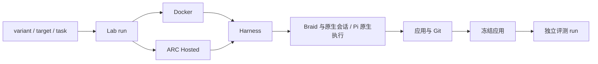

# 架构说明

本文维护跨组件责任和生命周期。命令与接口见 [Lab](../../lab/README.md)、[公共工具](../../tooling/scripts/README.md)和[运行手册](../deployment/index.md)；进程所有权与采样详见[执行资源约定](runtime-resources.md)。采用这些合同不表示所有执行路径已完成实际验收，剩余事项见 [Lab 实施记录](../../tasks/finals-experiment-loop/packet.md)。

## 组件责任

| 组件 | 责任 |
| --- | --- |
| variant / Harness | 生成流程、角色、技能、原生会话适配和应用交付。 |
| Lab run / automation | 实际运行的启动、观察、控制、保存，以及普通 Python 策略与 stages。 |
| ARC adapter | Docker/Hosted 句柄、平台请求和响应、应用冻结、独立评测与数据接续。 |
| Collector / Backend / Console | OTLP 与保存事实的接收、查询和展示。 |
| Braid | Issue/PR、成员、讨论、工作项上下文、独立 clone 与共同 origin。 |
| Pi / Codex | 原生模型会话、工具和会话内部子代理。 |
| SVC | 按需读取的工作方法与模板。 |

CLI 和 Console 退出不取消运行。跨 run 策略使用普通 Python；旧 `lab.exp` 仅解释其冻结执行与历史记录。通用层不读取 Braid 私有 SQL，也不替 Agent 判断业务完成。

## 装配与模型

公共装配拥有最终程序目录或 ZIP，加入安装器、gateway、collector、输入与运输材料；variant 选择生成程序、角色、技能和原生支持。Local 与 Hosted 消费同一依赖锁、补丁和公共入口。Braid/model-proxy 的编译产物属于程序，npm 工具按锁安装；浏览器与下载缓存属于运行环境。

Pi 与插件补丁顺序由 `tooling/scripts/runtime.py::native_patch_specs` 维护，producer 记录最终目标字节，消费者核对其身份。variant 不另行修写公共 Pi/plugin。standalone completion/drain 和 managed Braid RPC 保留不同生命周期。

应用 shell、npm 生命周期及服务使用应用 Node 环境，工具启动器以绝对路径使用工具 Node；工具依赖不得通过全局 `NODE_PATH` 渗入应用。跨 ABI 接续须在独立副本重装应用依赖，保留源码、锁和业务数据；当前适用范围及未验事项见[应用环境记录](../../tasks/harness-app-environment/packet.md)。

自费装配冻结所选模型配方与 catalog，通过 model-proxy 提供 `OPENAI_BASE_URL/API_KEY`。平台模型运输直接消费平台注入端点和凭据。Hosted 表单模型由 builder 的 `submission-models.json` 导出；供应商配方与官方 `billing_mode` 分别持有调用和评分身份。具体选路见[模型配方](../../materials/model-recipes/README.md)。

## 数据与接续

run 分离 `program`、`inputs`、`data`、`records`、`snapshots` 和 `evaluations`。应用在 `data/workspace`，原生 home、Braid DB/worktree 和 retained request 在 `data/harness`；凭据独立于可迁移数据。target 决定宿主物理位置，容器逻辑路径保持稳定。

`restart` 重新装配同名 variant，默认创建新应用与原生身份；只有 `keep_data=True` 才迁移完整 data。同 task/需求版本恢复原生历史，新 task 保留应用与历史并建立新原生任务状态。来源执行必须停止且数据保存成功；失败不能悄悄退回空会话或旧快照。控制句柄、旧费用、遥测库和隐藏评分不随 data 继承，来源现场保留。历史记录未带 keep_data 时按其冻结版本解释。

Braid description 的有效变化触发工作项上下文重建；comment 不替代合同。profile 的 Braid 成员、native_files 的原生主会话与 agents 目录的 Pi 内部角色是三个消费者。技能正文保持独立文件，发现入口仅提供名称、描述和路径。修改模板不表示已有进程即时采用新材料。

## 状态与证据

execution lifecycle 为 starting、running、paused、completed、failed、stopped 或 unknown。activity 和 last_activity_at 由本次 program 的只读脚本解释；观察失败保留原错误与上次事实的时间，不改变实际执行状态。archive 仅隐藏列表项。正常结束的零分评测是 completed，评测设施中断是 failed。

应用评测建立独立 run，消费不可变快照的独立副本；评分、费用和错误不覆盖生成事实。源码版本、制品、请求、平台 run、原生会话和应用快照各有身份，通过显式关系关联。HTTP 状态和响应原件保留，上传受理不代表生成完成或已有评分。

费用保存 actual/estimate、币种、价格来源、用量截止点和覆盖缺项。`coverage=partial` 是已知小计；未知用量不是零，同名模型不能把 ARC 价格套到其它供应商套餐。共享账户差值不作为单 run 账单。

制品按 manifest 核验字节，失败 staging 和未确认远端副本保留。保存输出不跟随外链。telemetry 保留 stream、epoch、序列和封口事实；批次增长不能证明语义进展。

## 查看与控制

Collector/Backend 使用服务宿主本地 SQLite；Hosted 携带轻量落盘核心，回收后导入。Console 消费保存 status 与 OTLP，Braid reader 负责解码、按固定 cutoff 发布物化协作页面，正文按需分页。当前 Console 不进入生成容器或调用 live Braid 写命令。

Docker 控制使用 run 保存的 daemon 与容器身份。pause/unpause 保持同一次执行，Hosted 不支持暂停/恢复；stop 不影响其它 run 或独立自动化程序。已发出的收费请求效果未知时，查询原请求后再决定动作。

原生恢复先采用已有结果，再核对 context revision、进程出生身份和所有权；失去 workflow 续体时明确记录中断。后台命令使用真实 owner handle，子代理 ID 与后台 Bash handle 不混用。应用验收的服务独立于业务数据，fresh-data 不重置交付数据。

E2E owned-client 冻结启动环境与命令，后续复用同一 handle 和 mcporter daemon；连接丢失明确失败，收尾关闭自有服务。参赛包装入口可能记录错误后返回零以让平台评测已有应用，原生退出码、terminal 和 entry outcome 必须分别读取；操作系统强杀不能由包装入口兜底。细节由所选 variant 和[共享 E2E 材料](../../materials/e2e/)持有。
