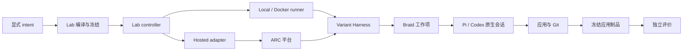

# Factory26 跨组件技术说明

本文只维护跨组件职责、生命周期和不可替代的证据边界。命令与执行细节归 [Lab 入口](../../lab/README.md) 及 [lab.exp 合同](../../lab/exp/README.md)；资源压力归 [runtime-resources](runtime-resources.md)；操作门控归 [恢复手册](../deployment/recovery.md)；产品目标归 [PRD](../prd/index.md)。

## 组件与调用关系

variant 持有生成流程、角色与技能、材料选择和应用语义；build.py 决定实际装入的材料。Harness 不改变 Braid 的工作项模型，也不替 Agent 判定产品结果。

lab.exp 持有新实验的 intent、recipe、编译、环境事实、attempt 编排、单次执行、制品关系和公开状态投影。controller 组织实验级生命周期，Local/Docker runner 负责单个 attempt，托管 adapter 负责平台身份和 pending 请求。lab.arc_bench 只负责 ARC Runner、平台响应、模型事实、结果和重放证据。

Braid 持有 Issue/PR、成员身份、工作项上下文、clone 和共同 origin；Pi/Codex 持有原生会话、工具和内部子代理；SVC 以独立技能文件提供方法和模板。三者的正文不由 Factory 复制成第二份规范。

| 组件 | 拥有 | 不拥有 |
| --- | --- | --- |
| variant/Harness | 生成流程、角色技能、材料选择和应用语义 | 实验调度、Braid 对象或官方评分判断 |
| lab.exp controller/runner | recipe、attempt、预算、执行、恢复和公开投影 | Agent 内部协作语义或平台隐藏状态 |
| lab.arc_bench | ARC Runner、官网响应、模型事实、结果和重放证据 | 新实验的 recipe、attempt 关系或跨组件状态数据库 |
| Braid/Pi/SVC | 工作项、原生会话、工具和方法材料 | 对方的私有生命周期或验收结论 |

组件间只沿明确的材料和回执建立关系：

本地通用命令可以不使用 ARC Runner 或 Braid；图中的 Harness 路径表达参赛实现的关系，不作为所有 backend 的强制流程。Console 通过公开 CLI 或保存归档查看 Braid，实验控制仍交给冻结执行器。

## 生命周期边界

一次实验依次经过定义、编译、材料生产、build、attempt、执行、归档/遥测封口、输运和评价。每一阶段保存自己的 producer identity、观察时间和原始错误。入口退出、执行终态、archive、telemetry、transport 和平台 verdict 分别成立，任何一个不能替代另一个。

定义资产、派生输入和可写运行状态属于同一执行生命周期的不同材料。experiments/ 保存可维护定义和冻结 bundle；runs/ 保存 runtime、attempt、制品、遥测和回执。重试建立新的 attempt，不修改原定义；历史记录按原 schema 只读解释。

Controller 的退出不撤销已受理的 runner；重入同一请求不能重跑入口。恢复必须重新核对来源执行身份、停止观察、OS/架构、runtime 和 logical root。缺少连续停写、Git/native、外链或路径证据时保持 partial/unknown。

## 证据归属与授权

编译、readiness、status 和离线读回只证明它们实际读取的材料。它们不授予模型、官网、Docker、Console、宿主迁移或历史清理许可。保存状态、消息送达和 receipt 存在也不等于现场完成。

制品以 manifest 身份发布，传输在接收边界核验字节；失败 staging、原错和未确认半成品保留。telemetry 保存 stream/epoch/序列和封口事实，分析不能从批次数推导 token、费用或语义进度。回收必须有稳定保留意图和完整证据，目录名、completed、hash 或 Git 提交不能单独授权删除。

模型、费用、endpoint、credential_env、预算和评价政策在 recipe/deployment 中显式冻结。通用层不读取 Braid 私有 SQL，不从 collector 存活、Console 配置或 endpoint 名称推断已连接、已调用或已计费。

## 人工查看与物理运行控制

Docker runner 使用实际 daemon、镜像、资源和网络模式的准入回执；旧 dispatcher、预约和在途启动未明确交接时不能接管。Local/Docker 可写运行状态与只读定义资产分离，跨域或托管消费才输运制品。

官方 ARC 运行由 lab.arc_bench 记录请求、响应、需求版本和终态 GET。提交受理不能证明模型已开始；HTTP 错误、pending、需求差异和平台限制必须保留。生成与评价使用独立 attempt，评分不覆盖生成事实。

Console 访问属于实验执行的外部消费者。access_resource_id、创建/启动出生身份和 checkpoint 捕获必须由同一 authority 排序；停止后的 accessor 不能重启，需重新创建和登记。Console 部署仍由其 owner 负责，缺少公开静止协调能力时不能声称暂停完成。

## Braid、原生 Agent 与 SVC

Braid 维护工作项、协作和成员；Pi/Codex 维护原生输入、工具调用和会话历史；SVC 提供按需读取的方法。Factory 的装配不能把 Braid 成员、原生主会话和内部角色混成同一配置对象，具体材料消费者见下节。

原生会话恢复先区分继续历史和新建会话；没有适用失效时保留原 context，未知执行状态先确认停止和可恢复性，不能盲目重放。资源压力、进程出生身份、物理停止和逻辑接续的细节见 runtime-resources.md。

## 工作项上下文与原生会话生命周期

工作项的 Braid description、Issue/PR、成员身份和原生 session context 各自维护；只有有效 description 变化才触发上下文重建，普通 comment 不替代工作项合同。恢复前先确认原执行已停止和 context revision，不能把新 profile 文件或一条 handoff 消息当作已有进程即时更新。

## 角色与材料的三个消费者

| 消费者 | 材料与责任 |
| --- | --- |
| Braid 成员 | profile 持有成员能力、主模型和协作身份；run.py 指定根工作项启动成员，之后通过 assignee 指派。 |
| 原生主会话 | native_files 装配 launcher、设置、扩展和技能发现入口；打包存在的材料不自动启用。 |
| Pi 内部角色 | agents 下的角色文件持有自身模型、工具和技能入口；它不是 Braid assignee。 |

build.py 决定实际包内容，三个消费者分别解释所选材料。技能正文保持独立文件，发现入口只携带名称、description 和路径。具体修改位置见 [I13 接线](../../variants/pi-braid-i13/README.md)，其它 variant 按自己的实现读取。

## 交付与评测

variant/build.py 选择包内材料；scripts/agent_support.py、braid_runtime.py 和 runtime.py 只提供各自公开边界。Braid 的共享 origin、PR 和独立 clone 是交付关系，不能当作官方评测结果。ARC 的 Git history 通道由官方 CLI 写入 Runner 项目，不修改应用或实验索引。

实验定义、runtime、artifact、request、telemetry、attempt、platform run 和评分保持各自身份。一个统一的 trace ID 不能替代这些 producer identity；跨组件只建立显式 relation。材料存在、实际调用、采集成功、归档完成和官方 verdict 必须分开显示。

## 实现、实验与执行身份

Docker/宿主控制、来源停止、完整 checkpoint 恢复、非空遥测封口、官网写入和模型行为需要真实授权实验。源码编译、离线材料读回、保存 receipt 或 status projection 不替代这些验收。旧冻结 ZIP、旧 schema 和历史 variant 保留自身合同，不因当前源码更新而获得新保证。

实现、实验和执行身份必须分别核对：源码提交只证明实现字节，experiment/attempt/remote run 各自证明自己的阶段，Braid/native/Console/ARC 事实只能由对应 producer 原件提供。跨组件只建立显式 relation，不把多个身份压成万能 trace ID。

## 关联入口

- [Lab 入口](../../lab/README.md)
- [lab.exp：实验定义与编译](../../lab/exp/experiments.md)
- [lab.exp：执行、恢复与状态投影](../../lab/exp/execution.md)
- [lab.exp：制品、遥测与恢复证据](../../lab/exp/artifacts.md)
- [ARC 适配与评测证据](../../lab/arc_bench/README.md)
- [Variant 索引](../../variants/README.md)
- [恢复手册](../deployment/recovery.md)

源码或本页合同的存在不证明完整模型、官网或跨环境生命周期已经验收；实际验收以对应任务的授权和保存原件为准。
