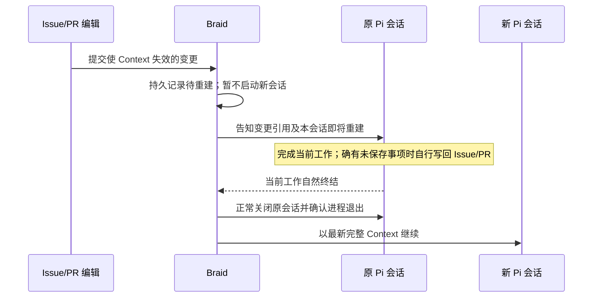

# Context 重建前的原会话交接

阶段：用户于 2026-09-27 明确授权“可以应用 Context reset 前告知旧会话”。Braid 源码已接入旧 Pi 会话通知、原生消息证据和自然终结后的重建，正在做边界核对；当前官网冻结包保持原样。这里只处理**已决定重建 Context** 时的原会话收尾；是否能减少重建次数是另一项调查。

## 问题与产品行为

当前 Braid 在运行中的工作项出现 `Invalidate` 后，`writer()` 先拒绝旧 turn 写入；worker 随即执行 `begin_active_context_reset()`，将旧会话标为 `reset_pending` 并调用 `SessionManager::remove()`。Agent 来不及根据新变化整理正在做的事，进程就开始退出。这个顺序把“上下文需要换新”误当成了“当前工作必须立刻中断”。

期望顺序如下。只有一种 Context 重建，不按修改类型分级：

这条消息只陈述环境变化和会话边界，不命令 Agent 必须另写一条评论、给出确认或开启固定的“交接 turn”。Agent 可在原本工作中写回必要进度；没有未保存事项时无需额外动作。Braid 不评价交接内容是否充分，也不据此代替 Issue/PR 协作。

## 已核实的 Pi 投递语义

当前冻结 Pi 版本的 RPC `steer` 在接收命令后只把用户消息加入队列并返回成功。Pi agent loop 会在当前 assistant 消息及工具调用结束后、下一次 LLM 调用前取出 steering 消息，并发出用户 `message_start`/`message_end`；`message_end` 会把消息写入原生 JSONL。因此 RPC 成功只能证明**入队**，不能证明模型看见了消息。若消息恰好到达运行结束边界，不能仅凭 ACK 关闭旧会话。

Braid 现有的紧急 steer 在 RPC 成功后就消费 batch，也不构成模型已处理的证明。实施时应将“已入队”和“原生消息已写入/被采样”分开记录。只有同一物理会话的原生用户消息和后续 assistant 活动能证明旧会话实际有机会处理这条通知；单看 `pendingMessageCount=0` 仍不够，因为它没有逐条消息身份。

## 最小状态与时序

复用现有 `Invalidate` 事件和 Context reset 记录；只为**等待原会话自然终结**增加持久的 pending 阶段及通知身份，不建第二套协作队列。它绑定当前工作项、原物理会话及待处理失效事件，重复轮询只能更新同一待重建项。当前会话活跃时，Braid 用 Pi `steer` 发送具体变更引用和“当前会话结束后将重建”提示。新失效事件合并到待重建项；若前一条通知尚未真正进入原生消息，更新通知内容，避免已入队的旧文本被误认为覆盖了新变更。

原会话空闲时，需要给它一次普通输入才能让模型看到变化；这是有条件的同会话继续执行，不是每次重建都强制增加一轮。活跃会话的 steer 若已被原生消息记录并有后续 assistant 活动，则沿原执行收尾。若到终结仍无法证明通知已被处理，保留原会话，在同一会话发送普通输入；只在此确有必要时增加一次执行。原会话忙碌、Pi 正在 compact 或 RPC 暂时失败时保持待重建状态，等可接收时重试，不能将一次发送失败解释成可以直接换会话。

旧会话报告自然终结后，Braid 再进入现有 reset teardown：先禁止该原会话继续写入，等待原生进程确认退出，再以**当时最新**的完整 Context 建立新物理会话。必要的未完成工作由 Agent 自行写回 Issue/PR；Braid 不要求存在某条“交接评论”，也不因此阻断正常重建。若原会话长期不结束或进程退出无法证明，保留原始状态并报告具体阻碍，不强杀并另开一个可能并发写入的新会话。

### 当前 `writer()` 栅栏的冲突

现有 `writer()` 在 pending invalidate 出现时立即拒绝旧 turn，阻止了 Agent 在收到通知后把必要进度写回自己的工作项。要实现上述行为，须把“仅因 Context 失效而撤销写入”延后到原会话终结；已经发生的取消指派、权限撤销和 run 封存仍按各自真实权限拒绝，不能借交接恢复权限。

延后栅栏有明确代价：steer 入队到模型看见之间，原 turn 可能继续依据旧信息写入。若同时要求“不打断旧 turn”和“失效后绝无陈旧写入”，两者在当前 Pi 投递语义下不能同时保证。建议接受这个短暂窗口，由新会话读取最终对象状态；若业务确需零陈旧写入，需另行决定是否允许暂时阻止旧写入，不能把它藏进实现细节。

## 实施前的验证与边界

用隔离的真实 Pi 会话分别预演：活跃工具调用期间失效、空闲时失效、steer 在自然终结边界到达、通知后再次失效、Pi 请求失败和原生进程退出失败。逐次对齐失效事件、RPC ACK、Pi 原生用户消息、后续 assistant 活动、旧进程退出及新会话初始 Context；仅用 Braid 内部状态或 Agent 自述不算投递证明。验收要看到原会话没有被主动中断、无需写回时也能正常重建、确有进度时可写回、失败时不会出现两个并行 writer。现有官网 run 使用冻结包，保持原样。

## 本轮实现与检查

`sources/braid` 已将 invalidate 后的写入栅栏推迟到 teardown，将 active reset 保留为 `interrupting` 并向原 Pi turn 发送变更引用。Pi adapter 扫描原生 JSONL，以同一条用户消息和后续 assistant 消息证明通知被处理；RPC steer ACK 不算证明。消息错过终点时，同一物理会话先执行一次 notice 输入。Pi 明确拒绝忙碌期间的 prompt 时保留该输入并稍后重试；无法判断是否接收的超时或断连不盲目重放。已在原生进程退出得到确认后才把 reset 推进到 `materializing`；重启时遗留的未验证通知进入 blocked，不自动创建替代写者。新 invalidate 并入现有 reset，并按更新后的引用重新通知；活跃轮询间隔三秒，terminal 处仍强制刷新，避免每 250 毫秒写 SQLite。

`cargo check --locked` 和 `cargo build --locked` 已通过。六次隔离、无模型的 Pi RPC 预演使用当前 Braid binary、临时 Git 仓库和临时原生 JSONL：运行中编辑 Issue 后，旧 turn 的 native JSONL 记录了 steer 用户消息及后续 assistant 消息，reset `applied`，旧会话 `replaced`，新会话 `idle`，没有额外通知 turn；空闲时编辑 Issue 后，同一旧会话先产生 `context_reset_notice` turn，原生记录包含 Context 前缀及通知正文，随后 reset `applied`；运行中连续两次编辑 Issue 后，reset 吸收两项事件、旧会话收到两条通知，仍只进行一次重建而未增设通知 turn；模拟 steer 已 ACK 但没有写入原生消息，旧 turn 自然结束后，同一旧 session 再运行 `context_reset_notice`，随后 reset `applied`，没有根据 ACK 提前替换会话；Pi 明确拒绝第一次空闲 prompt 为 `already processing` 后，Braid 留下一个 failed notice turn，在同一旧 session 重试并最终 reset `applied`；模拟旧 Pi 在 EOF 时以非零状态退出，Braid 返回 `native teardown could not be proven`，reset 保持 `interrupting`，只存在旧 session，没有创建第二写者。临时证据分别在 `/tmp/factory26-reset-active-path`、`/tmp/factory26-reset-spike-path`、`/tmp/factory26-reset-twice-path`、`/tmp/factory26-reset-missed-path`、`/tmp/factory26-reset-busy-path`、`/tmp/factory26-reset-stopfail-path` 指向的隔离目录。预演发现并修复了普通 prompt 带 Context 前缀时，通知证据误判为未送达的问题。

`cargo test --locked context_reset` 在编译既有测试时被此前过期的测试夹具阻断：`local.rs`、`objects.rs`、`provider/factory.rs` 仍引用已删除的 `ProfileDefaults` / `set_profile_defaults` 与旧 `SessionFactory` 参数，共 33 处编译错误；这些不是本轮运行代码的编译错误。真实 Pi 加模型的边界验收尚未运行，也未替换正在运行的冻结 ZIP。
