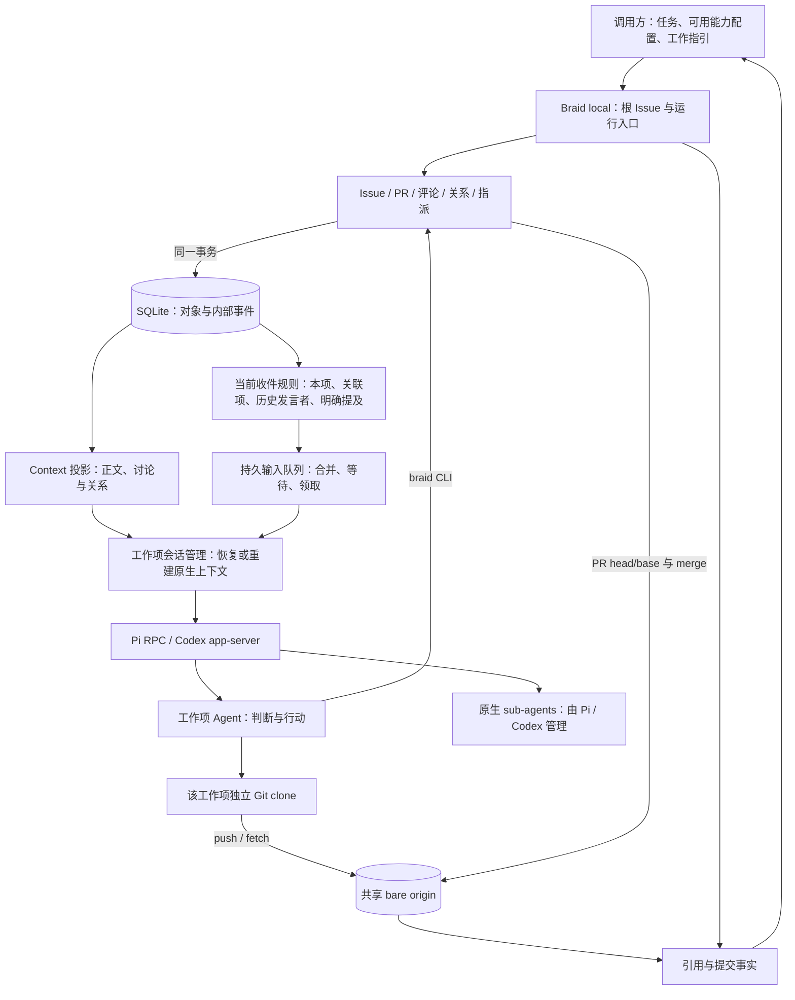
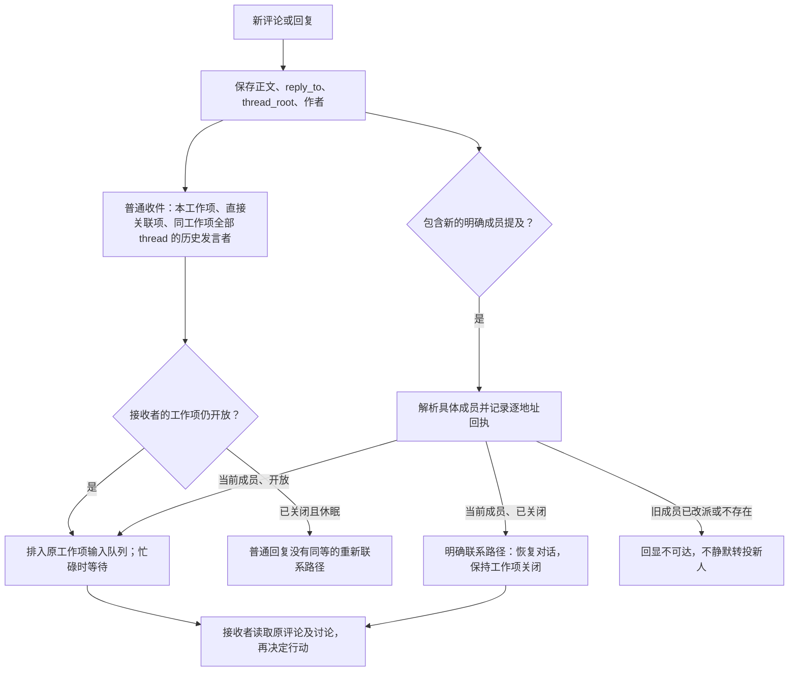
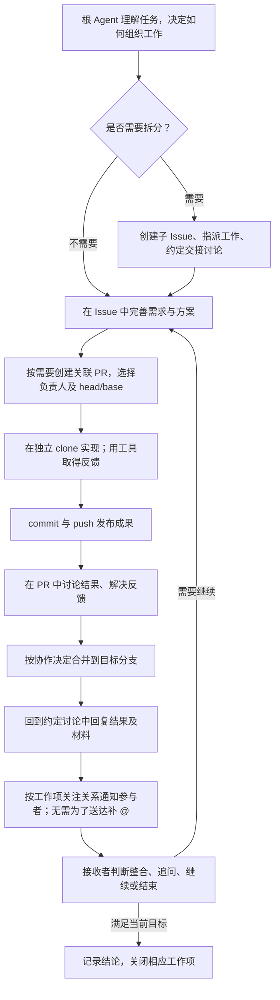
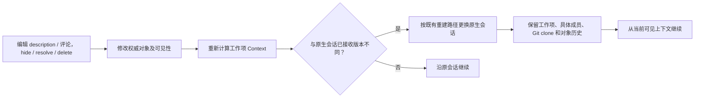

# Braid 软件开发协作体验再审计

2026-09-27。对象为 sources/braid 当前未提交工作树；这是源码与现有运行证据的审计，不是新行为验收，也不将源码等同于已运行的冻结版本。
本次只更新任务材料，不修改实现或实验。

## 目标与判断

目标是让 Agent 凭既有 GitHub 经验发现工作、讨论、发布代码、交接和再次接手，同时保留 Braid 的可编辑会话上下文。
语义判断归 Agent；Braid 提供对象、可达的协作者、持久上下文与 Git 协作环境。

当前 Git 发布/合并边界已经比较清楚。最重要的缺口集中在“关注谁的工作、回复能否到达、回来以后怎么看懂变化”。
跨 thread 发言者收件已修复，不能再列为未实现；但它仍是从历史发言推算的关系，并非持久订阅。
普通回复与明确 @ 在已关闭工作项上的可达性不同，是自然协作的具体断点。

## 当前架构：三条相连的路径

图中的事件是内部可靠投递手段，不是替 Agent 决定“该设计、实施或验收”的业务流程。
工作项和具体成员持久存在；原生会话可能因上下文编辑而更换。Provider 内部 sub-agent 不自动成为 Braid 成员。
调用方决定工作方法及如何采用交付结果；Braid 的 quiescent 不表示产品完成。

## 当前评论与回复路径

当前回复使用 reply_to 所属的 thread_root，不能回复到另一个工作项；thread 组织内容，普通收件范围已经覆盖整个工作项的历史发言者。
但创建者没有独立、持久的关注登记；只被 @ 而未发言的成员也没有由此建立普通后续订阅。
收件人 SQL 不按评论 visible/hidden/deleted 过滤，因此隐藏或删除评论不会自然取消其历史发言关系；目前也没有显式 subscribe/unsubscribe CLI。
当前成员改派后，原评论作者不再满足 assignment revision 条件。责任变化同时改变了后续收件资格，二者仍有耦合。

## Agent 组织工作的目标流程

以下是已讨论的协作方式，不是 Braid 强制执行的阶段状态机。

@ 是邀请或特别点名的能力，不是回复和交接成功的必要条件。
子项关闭不自动生成父项交接；子 Agent 自己说明实际结果。父子关系继续提供范围和导航。
最终验收的方法与标准由工作指引和 Agent 的需求分析确定，不由 Braid 从评论或状态中推断。

## 可编辑上下文的当前流程

这是关系示意，不表示每次操作都立即打断模型；实际重建还受当前执行与 dispatch 的协调控制。
hide 支持原因、可恢复；resolve 折叠截止到当时最后一条评论，新回复可重新进入可见上下文；delete 清除正文并保留墓碑。
`comment view --thread --include-hidden` 可展开隐藏和已解决内容，无法恢复已删除正文。
可见性属于共享评论对象，不是每个接收者各自的阅读偏好。参与关系和内容投影应分别定义，不能把 hide 当退订。

## 主要发现与取舍

| 优先级 | 当前事实与证据入口 | 协作影响 | 建议 |
| --- | --- | --- | --- |
| 高 | objects.rs::discussion_changed 从评论作者与当前 assignment 推导参与者；create_issue 不登记作者关注 | 创建过、被邀请过但未发言，不等于能持续收到后续回复；改派同时改变关注资格 | 定义持久的工作项关注关系及退出语义，责任与关注分离；复用现有队列 |
| 高 | direct_mentions 为关闭对象生成 direct_contact；普通 discussion_changed 生成 Wake，休眠重新激活走另一入口 | 对已完成成员普通回复可能无法继续对话，迫使 Agent 补 @ | 合法普通回复沿同样的联系人存续语义恢复对话，不重开工作项 |
| 高 | lifecycle 当前仍向直接父项发 child_closed/child_reopened Wake | 状态变更被当成额外交接；与用户最新选择不符 | 后续移除自动父项通知，以 Agent 在约定讨论中的交接替代；本次未修改 |
| 中 | CLI 有 view/comments 与对象关系，没有统一协作 timeline 或作者/参与等列表筛选；内部 events 混有调度事实 | 消息错过后不易还原谁在何时改变了关系、责任与状态 | 从持久事实提供可导航的协作历史；先复用现有记录，不直接展示内部 events |
| 中 | react、hide、resolve 等沿 discussion_changed 通知参与者及直接关联项；关联项自动收件不限于发言者 | reaction 的轻反馈可能触发多方执行；关联被隐含当成关注 | 单独明确不同动作的关注与通知规则，避免每次元数据改变都要求回应 |
| 中 | objects.rs::set_parent_in 更新当前 parent，缺专门双向关系历史；Issue/PR 关联会触发唤醒 | 可查当前关系，但不足以复原关系变化的原因和过程 | 保留创建/移除关系的协作事实；区分可见历史和是否通知 |
| 保留 | PR 存 base/head/draft；merge 操作共享 origin，支持期望 head SHA，不操作别人 clone | 已符合发布成果与私人工作区分离的方向 | 不重造 Git 层；以实际创建、push、冲突、merge 和 fetch 核验 |
| 待论证 | 没有独立 review request、approve/request-changes、Checks 产品入口；可评论并使用普通 Git/测试工具 | 是能力差异，尚不能据此认定必须扩建 | 先判断现有评论能否满足明确协作需求；不加入强制审核或 V&V 状态机 |

指派仍以能力配置产生具体成员；多个工作项不共享一个“GitHub 账号会话”。这是 Braid 已确认的有意差异，不通过复制 GitHub 账号机制改变。
关闭、合并、通知送达和产品验收分别是不同事实。

## 审计依据与验证边界

- `sources/braid/src/objects.rs`：create_issue_with_parent_and_profile、comment_reply、discussion_changed、direct_mentions、react、read_comments、set_parent_in、lifecycle、merge_with_match、apply_merge。
- `sources/braid/src/store/mod.rs`：pending lifecycle/direct_contact 候选、begin_agent_assignment、claim_runnable_turn、schedule_event。
- `sources/braid/src/group/dispatch.rs`：Context 版本比较与重建；`group/provider.rs`：持续指令与成员目录。
- `sources/braid/src/context.rs`：正文、讨论、隐藏/解决状态的投影；`cli/mod.rs`：实际可用的 Agent 界面。
- [GitHub 独立调查](github-collaboration-baseline.md)区分官方保证、公开样本与未知；[旧实现基准](braid-cooperation-current.md)用于识别已经修复的行为，不能代替当前源码。

后续行为验证应覆盖：无 @ 的新 thread 和回复、关闭后普通追问、只创建或只被邀请后的接续、改派与退订、隐藏后回复、忙碌接收、重叠收件去重，以及跨 clone 的发布和合并。
本次没有运行这些新场景；源码审计只证明实现规则，不能代替端到端送达与协作效果。
下一阶段是复核产品规则并制定技术/验收方案，然后按既有流程准备实施与开工确认。
