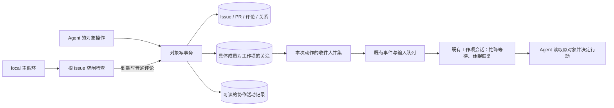

# 协作体验：技术与验收方案

2026-09-27，用户已复核通过，进入实施准备。本文提出实现契约，不代表当前行为或开工授权；实施接缝以预演结果补充。
目标、已确认决定与材料入口见 [cell](cells/cooperation-experience.md)。本方案不修改已有运行。

## HLD：保留现有运行架构，补齐关注与历史

对象、关注关系与协作历史属于 LocalObjects；排队、执行与恢复继续由 Store/group/provider 承担。
不新增 inbox、第二套消息队列或阶段状态机。协作活动仅记录已经发生的操作，不推断下一步任务。
当前每个工作项一个具体负责人、每个工作项独立 clone、共享 bare origin 的架构保留。

## LLD：参与、关注和联系

新增关注表，以工作项 ID 与不可复用的具体 member_login 为唯一键，记录关注状态、最近变更时间及来源。
成员名在 assign 时已预留，assignment 执行记录稍后才建立，因此关注关系不依赖物化时机。上下文重建不改变联系人；对 Agent 只显示具体成员名。
关注与执行容量无关，关注多少工作项不会建立额外 Agent。

| 动作 | 建议行为 |
| --- | --- |
| 创建 Issue/PR | 创建者关注新对象；宿主/Braid 系统身份不成为执行收件人 |
| 接受指派 | 新具体成员关注自己的工作项 |
| 评论或回复 | 作者关注当前工作项；不同 thread 共用此关注关系 |
| 有效 @ | 明确投递，并让被邀请成员关注源工作项 |
| 显式退订 | 停止普通更新；自己再次评论或被明确 @ 时恢复关注 |
| 改派 | 新成员承担责任并关注；旧成员的关注记录保留，但因其执行身份已退休而显示不可达，不转投新人 |
| hide/resolve/delete | 改变共享内容或投影，不改变关注关系 |
| 工作项关闭/PR 合并 | 保持成员可联系；普通讨论输入也能恢复休眠成员，不重开对象 |

以 `issue/pr subscribe ID`、`unsubscribe ID` 操作当前具体成员自己的关注，以 `view --json` 查询成员及关注状态。这是 Braid 对本地协作的扩展，不宣称 gh 有相同子命令。
当前负责人不能退订自己仍负责的工作项；改派后原身份的再启用不在本轮范围。这样既保留责任输入，也不为联系旧成员新建一套执行生命周期。
历史状态迁移只从可证实的当前负责人和评论作者建立初始关注；缺失的作者或过去 @ 订阅不猜测补造，并记录这一历史限制。

收件人按一次动作汇总：当前负责人、有效关注者及新明确提及取并集，排除作者自回声。每个具体成员同一次动作只入队一次。
关注目标是具体成员，实际输入继续进入该成员所属工作项的队列。取消/改派与投递在事务内重新核对身份，旧地址不会意外指向新人。
新产生的 Assign 与成员定向投递事件均保存目标具体成员身份及必要 revision，Store 消费时核对当前 desired_member_login/assignment revision；不匹配时记为失效或不可达，不投给新负责人。尚在物化的正确成员等待原指派完成，不提前判不可达；已确认退休或阻断且不能恢复的收件记录给出原因并结束该投递，执行故障仍独立报告。
普通回复和明确 @ 共用成员可达性与休眠恢复逻辑；只在收件人来源和明确联系回执上不同。仍在执行时保留输入，沿既有调度在可领取时送达。
在工作项关闭、finalizing 与新消息交错时，输入保留至收尾后再激活；不把 CLOSED 当作丢弃普通回复的条件。

PR 和 Issue 的关联用于导航与上下文，取消“只因关联就向对方无条件广播”的隐含规则。创建者、责任人、参与者的关注关系承担持续收件；需额外邀请时使用 @ 或主动订阅。
这是行为调整，必须用创建 PR 后的正常协作链验证，不能只检查通知 SQL。
关注通知与 Context 依赖分开：关联增删和既有外部 Issue description 的 cross_surface 失效路径保留。关联评论、hide/resolve 等改变嵌入式投影，但不据此向无关注者制造普通 Wake；下次合法输入派发前重新计算完整 Context 并比较已接收 revision，必要时重建，不用过期缓存。当前工作项自身自编辑的重建与继续执行语义保留。

## LLD：动作分类与可读历史

新建一张小的协作活动表：可读的局部序号、时间、作者、动作、来源对象/评论、涉及对象及必要变更摘要。
正文仍只有原对象一个权威，不复制每条评论或维护完整历史正文版本。删除正文保留墓碑；活动记录不恢复已删除内容。
新增记录与对象变更、通知入队共用事务；合并活动在 origin 合并意图落实为 MERGED 时记录一次，不在 prepared 阶段宣称成功。
新增此表的理由是现有 events 同时包含内部调度状态、一次动作的多个收件副本，且缺少完整关系历史，不适合作为 Agent 的协作时间线。

| 动作 | 可读历史 | 通知和上下文 |
| --- | --- | --- |
| 新评论/回复、可见正文编辑 | 保留来源和修改事实 | 通知关注者；必要 Context 更新沿既有重建路径 |
| 指派、状态、PR draft/ready/merge | 记录作者、对象与前后事实 | 通知当前对象的关注者；不自动决定下一步 |
| 父子或 Issue/PR 关系增删 | 在涉及的双方可查询同一事实 | 本轮不由关系操作自动建立跨对象关注 |
| hide/resolve/delete | 记录操作与 hide 原因，原正文依可见性读取 | 更新受影响 Context；建议不向所有跨项参与者单独发普通提醒 |
| reaction | 保留表达者和反应 | 建议默认不唤醒所有成员；它不等于对方已经行动 |
| 子项 close/reopen | 子项状态与父项当前子列表可查 | 删除专门的 child_closed/child_reopened 父项通知；交接由 Agent 评论完成 |

`issue/pr view ID --timeline` 展示有界的协作历史，按局部序号分页；正文、comments、timeline 和对象关系分别按需读取，避免每次 view 自动展开全部历史。
普通通知只送简短来源引用；Agent 可回到对象读取。源码诊断中的内部 ID 不进入这套界面。
现有普通评论只有 @ 地址回执：本轮建议复用回执存储记录实际收件成员，并以简短结果显示已排队或不可达。delivered 仍只表示输入已交给原生会话，不等于模型理解或已完成工作。

## LLD：根 Issue 五分钟空闲检查

在 `local.rs` 既有主循环中增加根检查入口；对象层用独立的系统作者 `Braid` 创建普通评论，不能伪装成根 Agent 或 external 用户。
在 local_run 中增加根空闲起点和最近检查评论的关联字段，不新建后台服务。

“空闲”须同时满足：根 Issue OPEN、当前负责人可执行、没有 starting/running 执行、没有待处理输入或 lifecycle/reset/materialization/recovery 工作。
判断以 Store 的持久执行事实为准，不能只看 agent_instances 的 idle 字段。资格查询限定根及当前成员的输入/执行/恢复事实，其他子项独立工作不阻止根检查；来自子项、实际已投给根的输入当然计入。
进入该条件时保存 idle_since；根开始执行或出现上述待处理工作时清除计时。其他子项活跃不取消根的空闲资格。
连续满足条件五分钟后，在一个事务中重新核对条件并写入一次普通评论：“请检查当前工作进展。”，同时清除本次 idle_since。入队的输入使其不再符合空闲条件，避免重复评论。
重启后保留已落盘的起点；先完成必要恢复，再判断到期。若已跨过多周期，只补一次，不追补历史评论。运行停止期间不生成评论。
根关闭后停止检查。根未指派、不可达或恢复失败时报告具体执行阻塞，不以提醒继续重试或创建另一个负责人。

主循环保留原有显式错误判断；根 OPEN 且可继续执行时，即使全局暂时没有 runnable 工作，也等待下一个检查时点。根 CLOSED 后沿既有条件等待其他实际执行收尾，再允许 quiescent。
本规则只保障根有机会重新判断，不声称根关闭表示应用验收通过。

系统评论沿普通关注规则投递，因此根 Issue 的其他有效关注者也可能收到。当前方案不偷偷限制收件人；其带来的额外执行量列入真实运行观察。
周期评论作为真实历史允许按普通 hide/resolve 方式整理，不自动删除或替 Agent 总结。

## 指引与修改面

Braid 持续指令只说明自然协作和工具能力：回复当前讨论可通知相关参与者，@ 用于邀请或特别点名，任务完成后回到约定讨论交接。不给每次初始 user message 加工作方法。
SVC、具体模型、任务拆分决策、验收方法和 Factory 交付标准不在本 cell 修改范围。
主要修改面为 objects、CLI/context、Store/group 的休眠联系入口、local 主循环与新增 migration；Git merge 算法和 provider 原生 sub-agent 生命周期保留。

## 验收方案

不新增 Factory/基础设施测试、伪装探针或 SVC 内容测试。采用获授权的真实协作操作与生成应用 benchmark；编译检查只证明可构建。

| 需要证明的行为 | 实际操作及判据 |
| --- | --- |
| 自然回复可达 | 两名实际成员在同一 Issue 参与后，新 thread 和 reply 均不写 @；在原生输入看到对应评论引用，同次动作不重复投递 |
| 关注独立于发言 | 创建者未留言、被邀请者尚未回复，后续普通评论仍到达；明确退订后停止普通投递，再次参与按契约恢复 |
| 关闭后仍能协作 | 先完成并关闭成员工作项，再普通回复其参与的讨论；原具体成员收到，工作项仍 CLOSED |
| 并发与身份 | 忙碌时收到的评论保留；改派后旧地址不可达且不转投新人；hide/resolve 不改变关注关系 |
| 正常任务交接 | 子项负责人回父讨论交接，父成员收到；仅关闭子项不会伪造交接评论或专门父项提醒 |
| 根周期检查 | 实际等待五分钟：空闲前不发、到期一次、待输入/恢复中不发；根执行后重新计时，关闭后停止；重启不追补多条 |
| 可重建协作历史 | view 显示真实指派、关系与合并变化；提交/版本可查；不存在先写“已合并”后 Git 失败的假记录 |
| 整体效果 | 先按既定 Lite 优先顺序观察完整交接与应用评分，再推进已批准的 Hackathon 范围；新运行的矩阵、制品和开工授权在实施准备时列明 |

证据按“对象事实 → 收件/排队 → 原生输入 → Agent 行动 → 交付和评分”分别记录。Agent 不行动可能是判断问题，不能反推投递失败。
若真实操作中模型未触发所需场景，标为未覆盖，不用代码阅读或局部评分冒充验证。

下一阶段：用户复核本方案后，制定有依赖顺序的实施计划并完成独立预演；再呈现最终改动、影响和实验安排取得开工确认。

实施接缝经 [独立预演](cooperation-preflight.md) 与主 Agent 收敛，具体决定见 [实施计划](cooperation-plan.md)。预演没有替代行为验收。
