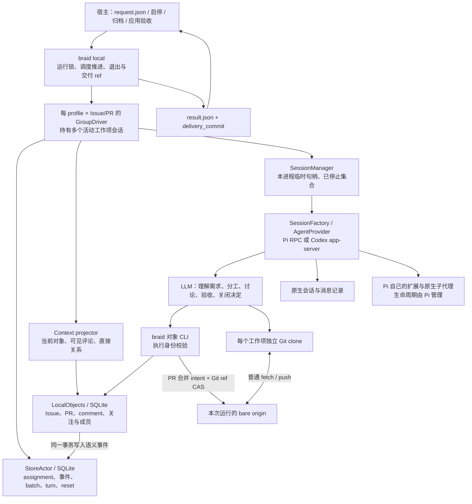
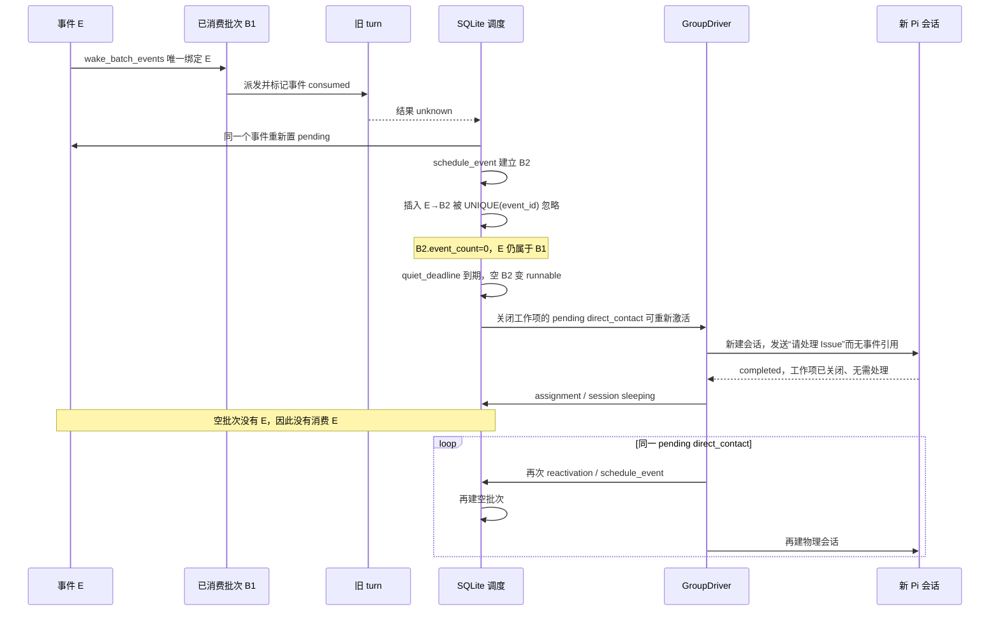
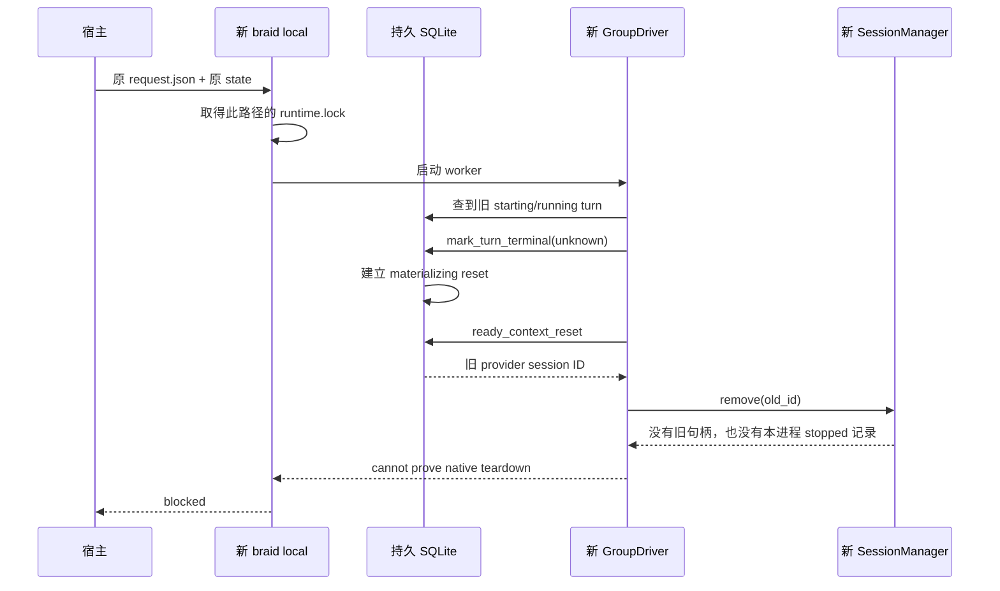
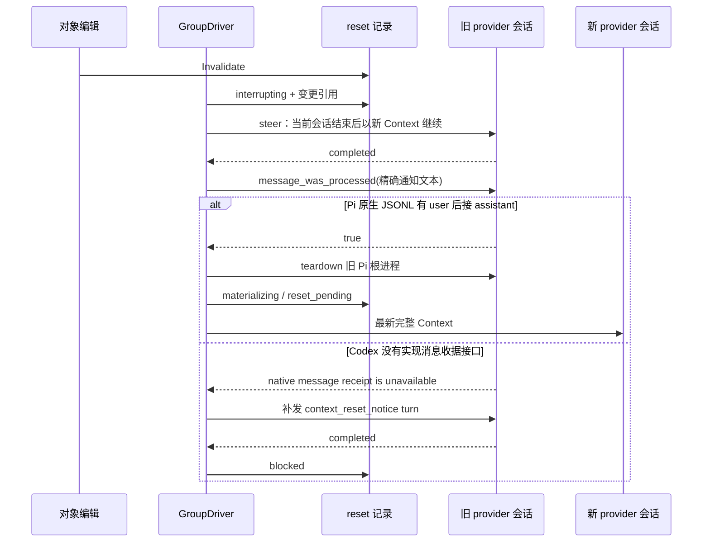

# 系统拓扑与关键时序

以下拓扑按当前工作区实现绘制。来源快照证明了空批次回环；冷恢复与 Codex reset 的路径由源码确定，尚未用当前二进制重放。

这组边界值得保留：对象是持久工作记忆，成员责任由 assignment 表达；一次原生会话休眠不取消 assignee。Git clone 保留工作项的文件与提交，Context reset 只替换模型上下文。Git/SQLite 无法共同提交，merge intent 与原子 ref 更新有具体必要性。宿主使用 `delivery_commit` 做后续验收；Braid 不根据应用功能或 benchmark 分数调度，也不管理 SVC 或 Pi 内部子代理。

对象 CLI 直接打开 SQLite，StoreActor 在长驻进程内串行处理控制状态；因此一致性的真正边界是 SQLite 事务，并非 StoreActor 的内存消息队列。每个 profile 的 worker 是一组会话的驱动器，不是仅有一个执行名额的成员。

## 已发生的空批次回环

来源数据库与原生输入支持下列完整路径。普通评论互相唤醒也确实存在，但不是数百会话的唯一原因。

关键代码为 `store::mark_turn_terminal` 的 unknown 分支、`schedule_event`、`advance_scheduler`、`complete_work_item_reactivation` 和 `claim_runnable_turn`。当前 `delivery_complete` 只在所有对象终态后跳出 Local 运行，不能修复根 Issue 仍开放时的这条回路。

## 冷恢复的矛盾边界

已有 `materializing/reset_pending` 也走同一空句柄 `remove(old_id)`。若旧 provider 状态为 unknown，则可能先重启同一原生会话、再关闭新句柄；这同样没有证明来源旧进程已停止。启动时遇到 `interrupting` reset，`recover_context_resets` 直接置为 blocked。这里缺少的是可恢复的“旧执行已经停止”事实，新的文件锁只能证明这一路径没有另一 Braid 主进程持锁。

## Context reset 的 adapter 边界

“RPC 已接收”与“模型有机会处理”需要区分，这个要求本身成立。问题是共享 worker 依赖一项只有 Pi 实现的收据能力，导致 Codex 的正常终结也无法进入重建。
