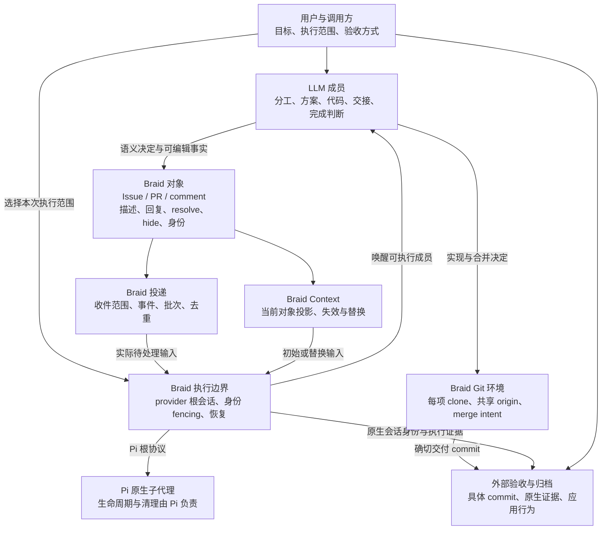
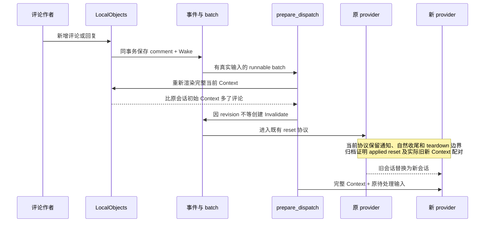
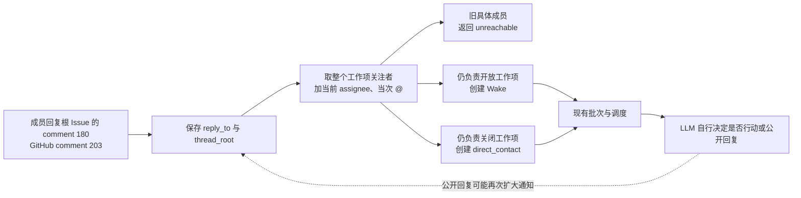
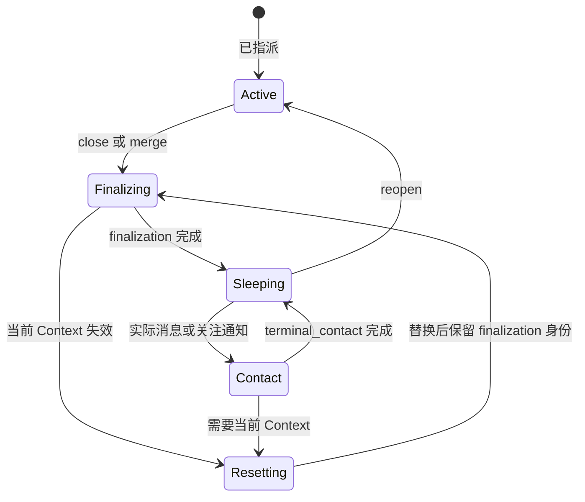
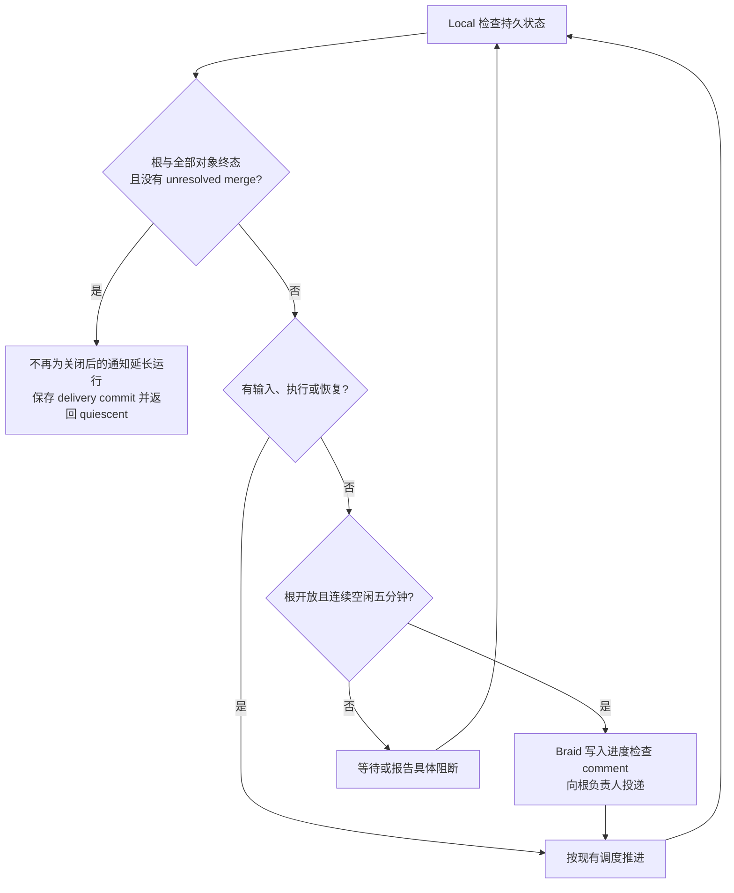

# 产品职责与关键时序

图中的实线描述本轮基线行为；标为“建议”的部分尚未实现。实现缺陷的独立证据见 [技术拓扑](architecture.md)，需求判断与取舍见 [产品审查](product-review.md)。

## 职责拓扑

需要审查的是 O→E 的默认收件范围、O→C 的失效条件和 O→R 的关闭规则。LLM 决策、Pi 内部生命周期和外部验收均不应被吸入这三个接口。

## 真实新增评论为何进入 reset

Sheet reset `01a0e209-71fd-7700-a447-1c2c10939fe4` 的新增内容只有系统 comment #5；GitHub reset `01a0e230-b9b6-74a0-912e-9a805e63b9c1` 的新增内容只有开工提醒 #7。建议只改变是否产生 Invalidate：新增评论继续使用 Wake，真正修改既有正文仍走同一 reset 协议。

## 普通回复的收件范围

comment #203 有 9 个收件目标，归档中 1 delivered、3 queued、5 unreachable；不能画成 9 个已完成执行。建议收件集合改为当前 assignee、同讨论参与者、当次 @ 和显式全项关注者，不新增语义过滤或另一套消息执行机制。

## 关闭对象与执行生命周期的交叉

此图只表达审查涉及的主要关系，不是完整数据库状态机。最小建议移除“close 必须再授予一个执行机会”的承诺，仍保留正在执行的自然结束、实际关闭通知、晚到评论和原成员身份。不能将图简化成“关闭即杀进程”，也不能取消未知执行的恢复证明。

## Local 当前的推进与结束政策

这一政策不是任务质量验收。根开放时五分钟检查是用户明确要求，保留。建议先明确单次执行范围及结束请求，再决定是否要求所有对象终态；不能仅靠增加退出分支把持续协作和单次交付的冲突隐藏起来。实际关闭顺序和正在执行的收尾仍需独立验证。
