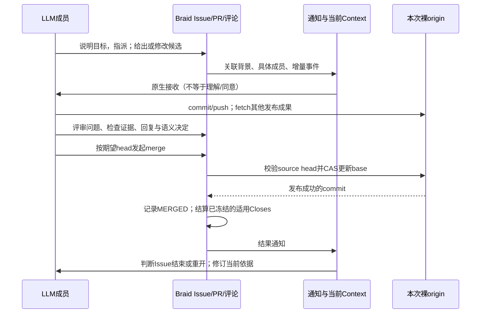

# GitHub 最小协作体验：第二次独立复审

2026-09-28，Astra。范围是本地 Braid 的协作模型，不是生成出的 GitHub 仿真应用。只读源码、官方文档和两题终态原始记录；未改源码/应用/运行，未新开实验或测试。源码 HEAD `89212933c976b889f27de1b8cfe863baf8f6042e` 加当前 dirty 工作树，关键文件 SHA256 与选定原始证据见 [evidence](github-minimum-second-evidence.json)。前次 [reassessment](../reassessment.md) 用作问题入口，不作为独立事实基线。

**结论：Braid 已能完成“发布候选→讨论修改→按明确 head 合并→反馈结果”的最小闭环；当前最有价值的是兑现并讲清已有动作，而非补齐 GitHub 功能清单。** 需要明确的差异比单纯缺少命令更重要：`--assignee` 选配置并创建新成员，`--issue/link` 是上下文关联，显式退订不会因一次 @ 自动变回订阅。新 Closes/退订/Context 修复已写源码并形成发布材料，但旧 continuation-03 不证明这些修复已经被模型采用。

## 1. 从 GitHub 用户的动作建立基线

这里的“最小”指能可靠协作所需的契约，不指完整网站。GitHub 的某种团队习惯也不自动成为平台强制规则。

|用户动作|GitHub 的可核实承诺|最小协作真正需要|
|---|---|---|
|clone、建分支、commit、push|在分支工作并发布提交，其他人才能看到和协作；后续 push 更新同一个 PR|有权威发布仓库，可分清本地未发布和已发布候选|
|提 Issue / 提 PR|Issue 承载问题，PR 提议把 head 的变化合入 base；不以先有 Issue 或不同实施者为一般前置条件|目标可定位，候选 head/base 明确|
|请求评审、回复、继续修改|评审可 Comment、Approve、Request changes；能就变化讨论，再 commit/push 更新候选|反馈与候选对应；语义判断有负责人|
|merge 或 close|merge 发布改动；close 可放弃候选而不合并；具体强制审批来自仓库保护配置|关闭和发布不可混淆，失败不能报成功|
|关闭/重开 Issue|关闭可表示完成，也可表示不计划实施；状态本身不证明产品正确|可回到问题重新工作，保留原讨论与理由|
|assign、@、关注和退订|指派说明责任；review request 另有关系；通知可退订，重新参与或被 @ 可再次订阅|找得到具体人，通知原因可解释，退出自动关注有效|

分支、持续 push 和评审循环依据 [GitHub flow](https://docs.github.com/en/get-started/using-github/github-flow)；评审状态与可配置审批门依据 [PR reviews](https://docs.github.com/en/pull-requests/reference/pull-request-reviews)；close 不合并依据 [Closing a pull request](https://docs.github.com/en/pull-requests/how-tos/merge-and-close-pull-requests/closing-a-pull-request)；Issue关闭语义依据 [Closing an issue](https://docs.github.com/en/issues/tracking-your-work-with-issues/administering-issues/closing-an-issue)；指派依据 [Assignees](https://docs.github.com/en/issues/tracking-your-work-with-issues/using-issues/assigning-issues-and-pull-requests-to-other-github-users)。这些事实没有要求 Braid 增加 Projects、CI 队列、审批计数或行级评论。

关闭关联需要单独说清：GitHub 在合并到默认分支时关闭相应 linked Issue，既支持正文 `Closes/Fixes/Resolves`，也支持 Development 手工关联。正文关键字对非默认目标分支忽略；commit message 关键字是另一个入口。不能把 Braid 的普通上下文关联直接等同 GitHub Development 关闭关联。[官方链接与关闭规则](https://docs.github.com/en/issues/tracking-your-work-with-issues/using-issues/linking-a-pull-request-to-an-issue)

GitHub 允许修改开放 PR 的 base；改变 base 可能使原评论与差异过时。这是有用能力，但是否加入 Braid 要看真实需求，不由“官网有按钮”决定。[Changing the base branch](https://docs.github.com/en/pull-requests/how-tos/create-pull-requests/changing-the-base-branch-of-a-pull-request)

## 2. 将基线映射到 Braid 当前路径

|路径|源码锚点（`sources/braid/`）|当前能力与判断|
|---|---|---|
|本次 Git 发布仓库|`src/local.rs:345`；`:358` 设置 symbolic HEAD|裸 origin 拥有发布 refs；初始默认分支与 delivery ref 同值，但二者概念不同。无需另造 Git server/API|
|独立工作目录|`src/worktree.rs:40`、`:75`|`git clone --no-local --branch`，独立 index/工作区；resume 核对 origin 并保留本地改动。这是 Braid 的隔离选择，不是 GitHub 要求每个 Issue/PR 都有 clone|
|Issue 及责任|`src/objects.rs:592`、`:660`、`:197`|创建/编辑/改派；当前 native writer 身份校验可拒绝过期执行。一次一位具体成员；配置与成员不同|
|PR 与 head/base|`src/objects.rs:1318`；`src/cli/mod.rs:201`|可接已发布 head，或从发布 base 新建空候选分支再指派实施；至少一个 `--issue` 必填；base 创建后不能改|
|交接上下文|`src/group/pr_agent.rs:23`、`:54`；`src/context.rs:289`|PR 获得直接关联 Issue，独立 clone；当前指引把 Issue 定为需求/设计、PR 定为实施。无需增加强制阶段状态机|
|评审与修改|`src/objects.rs:794`；CLI PR Comment/Edit/Ready|使用评论、Git diff、追加 push 和候选状态。没有持久 review decision、指定reviewer列表或行级线程；普通评论里的 ready 不自动等于批准|
|按候选合并|`src/objects.rs:1635`、`:1752`、`:1875`|读取 origin 发布 head/base，支持 match-head；prepared intent 后 CAS 更新 base，并校验 source head；发布后完成 SQLite 状态和恢复。draft 拒绝 merge；不自动验收应用|
|关闭/重开|`src/objects.rs:1538`、`:1586`|close 要理由，reopen 保留责任并安排可执行成员；MERGED PR 不可重开。关闭并不删除分支或 clone，也不禁止后续联系|
|Closes 生命周期|`src/objects.rs:1607`、`:1620`、`:1847`；migration0014|dirty 已解析本仓库正文关键字，按 origin HEAD 判断默认分支；merge intent 冻结目标，普通发布/已整合认领/恢复共享结算。不解释 commit message 或跨仓库引用|
|讨论与投递|`src/objects.rs:794`、`:833`、`:860`、`:876`|同工作项 reply-to/thread；owner、thread参与者、显式关注者、当次 @ 有收据；旧地址返回 reassigned/unreachable。投递成功不证明模型理解|
|退订|`src/objects.rs:239`、`:890`|dirty 已排除明确退订的历史参与者；owner不能退订，当次 @ 仍投递；退出记录持续有效，@ 不自动重新订阅|
|当前依据维护|`src/objects.rs:920`、`:994`、`:1027`；`src/context.rs:437`|edit/hide/resolve 改变后续 canonical Context；resolve 只折叠当前边界，后续回复可见；delete 无法恢复正文。语义整理由 LLM 决定|
|原生消息生命周期|`src/provider/pi.rs:415`；`src/store/mod.rs:3655`|dirty 已有成功接受后清空 pending Context、终态通知合批；未实现 sleeping native session 复用|

这里没有将 `context.rs` 可渲染的 reviews/labels/projects 字段误当本地操作能力：Local `pull_request()` 在 `objects.rs:1214` 只构造本地对象字段，其余走默认值；是否可创建、更新真实 review 对象需看本地命令与存储，不由 renderer 的兼容字段推断。

## 3. 三个应明示的差异，以及不必现在扩展的功能

**配置不是已存在的协作者。** GitHub assignee 通常是现有账户；Braid 创建/改派的 `--assignee glm` 选择能力配置并返回 `@glm-N`，后者用于联系而不能再次作为 assignee 输入。当前共用指引已写明这点，但 CLI Create 的该参数尚无同样清晰的帮助说明。本轮 Sheet 10:02:37 实际使用 `--assignee glm-1` 失败，错误完整解释“可用 deepseek、glm，成员名不可再次指派”，4秒后用 glm 成功。这是具体认知摩擦；最小建议是让 create/edit 参数帮助与回执沿用已有“配置名→新负责人”用语。无需引入账户目录或重做成员模型。

**关联不是关闭意图。** Braid `--issue/link` 让 PR 消费共享背景，可以 N:M 关联根需求、具体任务与契约，不能照抄 GitHub 手工 Development link 的自动关闭行为，否则会关闭只是提供背景的 Issue。新 `closing_issues` 已与 `associated_issues` 分列；应把这个差异放在 link 的公开含义中。保留此取舍；不建议为了“还原”把所有关联自动 close，也不把这称为完整 GitHub link 兼容。

**Braid 的显式退出更持久。** GitHub 的重新参与/@会重新订阅该讨论；Braid 当前 `direct_mentions` 只投递此次消息，`subscribe_in` 也不覆盖 explicit 状态。因此普通回复在随后仍被显式退出挡住，直到用户主动 subscribe；owner 另有不能退订约束。对 Agent 避免重新卷入无关长串，这是合理的窄规则，但需明确，不应报告成 GitHub 的逐项复刻。[GitHub重新订阅规则](https://docs.github.com/en/subscriptions-and-notifications/how-tos/viewing-and-triaging-notifications/triaging-a-single-notification)

其它有意收窄包括：PR必须关联Issue、每项单负责人、指派会启动Agent、Issue设计→独立PR实施、close必须写理由、整次run可seal。这些属于 Braid 产品/执行模型；GitHub不会因给普通人assign就保证执行，也不会因单个 Issue close 自动封存仓库。其成本是否值得，应看交接是否被消费和运行能否恢复，不是以相似外观证明正确。

暂不增加：base retarget、独立无Issue的PR、squash/rebase选项、自动审批门、merge queue、reviewer运行时、完整通知箱、全量GitHub权限/Moderation。现有Git已覆盖 diff/log/fetch/branch 操作。对两种缺失尤其需要诚实：没有结构化review状态就不能机器判断“所有评审已批准”；没有 retarget 就必须正确选base或明确关闭重建，但本轮尚未发现因改base而造成的真实阻塞。

`hide/resolve` 是 Braid 的工作记忆投影动作，不能仅因 GitHub 有隐藏评论/解决review conversation 的界面而说两者同义。当前Braid允许有效执行成员整理共享讨论，隐藏保留理由和可展开入口；它不能让已在途的LLM忘记旧内容，resolve也不表示应用问题经客观验证已解决。无需新增自动隐藏器、情绪/价值分类器或强制总结模板。

## 4. 从终态运行验证“是否真的用起来”

数据与完整定位来自 [两题终态快照](../../braid-product-reaudit/cells/token-final-review/snapshot.json.gz)，增量从09:20 UTC至 GH10:09、Sheet12:02；下列证明“某行为发生过”，不代表全量合规或应用正确。

### 确切 head 与发布已经产生实际保护

Sheet 根 session `01a0e750-f3cb…` 第474行，11:08:08，以 `--match-head-commit 9063ca1…` 合并 PR23，工具返回 merge `b4a4b0c…`。Issue5 comment353 随后核实合并tree与已验head相同、五文件改动范围，并采用#344/#345等证据决定无需重跑。这里有“提交→独立核验→merge receipt→结果消费”的完整链，不只有接口存在。

PR25 同一 session 第540行，11:18:52，旧 head `8826b4d…` 被拒绝，工具返回当前 `dfcc039…`。第548行按新head合入；comment370解释这是合入develop使候选前进，并给出tree等价关系。护栏确实阻止了按过期head无声发布，不能为减少一次错误响应而删除。

但 comment370 同时明确“新head全套回执到达前不要用旧退出码合并”，实际合并早于完整回执#385。**head对上不等于评审条件已满足。** 当前工具只保证发布的提交正确，是否已有充分证据是LLM的决定；这里应复核成员是否明确采纳/调整了该前提，不能通过新增一套自动审批门掩盖语义缺口。后续#385/#392补齐结果，也不能倒写成合并前就已有。

### 关闭可回到真实问题，而非只追求所有对象 CLOSED

Sheet Issue4 曾被重开，comment313及后续讨论把未决项定位到“重开透视编辑器应显示可见错误”；后续 PR25 修正 `PivotDialogs.tsx` 并补浏览器检查。comment386返回实际交付commit、逐条判据和边界，comment392补负责人验收。可见 reopen、讨论、代码、证据、再关闭这一闭环实际发生；不能从最终 CLOSED 自行推出中间没有返工。

### 重复 PR 来自接管竞态，不是缺 retarget

comment368与SQLite一致：PR24由owner11:17:36创建，PR25由原负责人11:17:52创建；**同head `8826b4d`，同base develop**。owner误以为对方迟迟没有PR而接管，随后关闭24、把其review证据迁到25（#362→#366），明确只合并一次。根仍尝试merge24收到 `PR is closed`，然后转25。

这证明允许普通close和继续讨论有恢复价值，也证明“看见暂时没有对象”不等于工作停滞。单次撞车尚不足以增加跨Agent锁、自动PR去重或强制认领阶段；同head/base也不天然说明两个PR语义相同。下一步若再发生，应优先用现有工作项回复明确谁负责发布，并在接管前刷新对象事实。`request_id`只能幂等同一次创建请求，不会自动解决两个成员各自发起的不同请求。

### 讨论能消费证据，也会被旧通知放大

comment345是独立PR23复核，comment353明确采用；comment359消费了Issue7的16/16交界探针而不重复写代码。这是有价值的跨成员协作。相反，comment360/365等是迟到通知触发的“无待办、旧提交已替换”长回执；终态 token 报告已量化旧通知重建与重复Context，不将其当新产品进展。

原生记录中有真实 `reply-to`、PR/Issue edit、subscribe，及隐藏误发comment390的动作；该comment保留理由。**隐藏一次probe不证明已系统整理失效设计；命令文本中出现resolve --help也不证明resolve成功。** 当前材料没有新 unsubscribe 的完整自然使用链，因此不以调用/帮助次数声称新工作记忆指引或退订修复已被采用。

## 5. 因果与职责

Braid承担“明确动作做对”：身份不被旧执行冒用、消息不无声丢失、候选不偷换、Git与对象状态最终一致、Context投影诚实。LLM承担“为什么这样做”：拆分、设计、判断证据、采纳反馈、决定合并/关闭/重新评审。原生 clone 隔离的是Git工作区；它不提供浏览器、端口、进程组的全面隔离。比赛预算、评分和应用正确性属于调用方，不移入Braid对象状态。

## 6. 当前修复状态与决策

|对象|已知状态|本次不能声称|
|---|---|---|
|Closes / 显式退订 / 一次性Context / 通知批次|dirty源码存在；[实施记录](../implementation.md)记有定向行为检查与独立新版发布包|旧03已经验证新语义或实际省token|
|共用角色与记忆整理指引|现源码明确Issue/PR边界与edit/hide/resolve用法|所有任务已改为先设计再独立PR实施；旧run全程遵守|
|新版发布包|collaboration-v2，11:58 UTC材料完成，独立ZIP SHA见实施记录|活动03热更新；Sheet无模型materialization recovery验证了行为收益|
|现有Git/讨论/合并|终态真实记录中可见使用和反馈消费|每次评审独立、每次合并已满足所有语义前提|

本次建议不新增运行时功能。第一，使用已完成材料时核对Closes默认分支/恢复、显式退订、第二次通知不重复Context三条现有承诺；验收须分别看对象/投递/原生消息结果。第二，将上述三个差异用现有help/回执/权威文档讲清，尤其配置名与具体成员；不再用“像GitHub”替代实际定义。第三，审查交接结果是否被明确采纳，包含变更head后是否仍满足原review条件；保留LLM决策，不把证据引用变为不可绕过的流程引擎。

限制：本次未重新执行Braid行为检查，也未操作生成应用。实施记录中13项定向检查通过，但较宽objects集合仍有6项失败，禁用两项新行为的独立副本仍复现同样失败；这不是完整历史HEAD基线，不能写成整套绿色。自然运行尚无新Closes/退订完整采用链，也没有充分依据估算新指引的净成本或质量收益。
