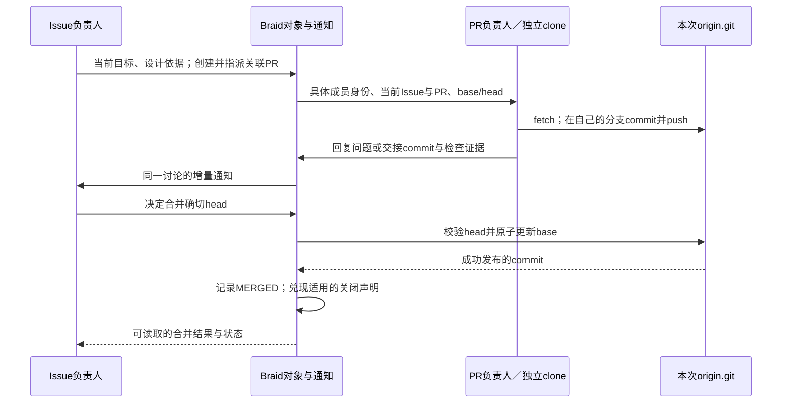

# 从 GitHub 最小协作闭环审查 Braid

> 终态材料上的[第二次独立复审](cells/github-minimum-second-review.md)已完成：补充GitHub官方基线、当前源码映射、PR24/25重复创建与评审条件证据；未修改源码或运行。

当前实施与实验状态以 [迭代10清单](cells/iteration10-status.md) 为准；下面记录最初独立审查的范围与结论。

原审查状态：2026-09-28，独立 Astra 只读审查完成。用户授权的是分析、官方资料核实和方案；未修改源码、应用、运行或评论，未运行测试。源码是 `sources/braid` 当前未提交工作树，HEAD与关键文件摘要见 [baseline.json](baseline.json)。报告与前一轮token分析分开，避免用性能症状代替产品判断。

**结论**：Braid 已具备最小协作闭环的大部分基础，不需要再建流程引擎或复制完整 GitHub。应优先兑现熟悉操作背后的承诺：关闭声明要按默认分支语义生效，显式退订要能退出自动通知，新增消息不要重新复制整份工作记忆。Issue设计、独立PR实施与Git发布之间的分工应继续保留；验收内容、是否采纳建议、何时合并仍由成员决定。

具体实施处置与授权边界见[处置方案](disposition.md)，其中记录后续授权与生命周期、退订、工作记忆及耗时改进；源码实施进展见[实施记录](implementation.md)。

## 先从协作目的推导，而不是从现有命令清单出发

一个最小团队需要共同回答六个问题：现在要解决什么；谁负责下一步；要看的确切代码是什么；哪里还有分歧；哪些变化已经发布；换人或中断后如何接着做。这些问题分别需要持久的任务说明、明确的负责人、可定位的提交、可回复的讨论、权威的分支与可恢复的工作区。

GitHub提供了熟悉的载体：分支隔离改动，commit/push发布成果，PR聚合候选与讨论，后续提交更新同一个PR；Issue可以承载问题与决定。它允许团队通过反馈迭代，不要求每个PR之前都有Issue，也没有天然强制“一个人设计、另一个人实施”。后者是 Braid 选择的协作模型，不能冒称为GitHub平台规则。[GitHub flow](https://docs.github.com/en/get-started/using-github/github-flow)、[PR的协作模型](https://docs.github.com/en/pull-requests/reference/pull-requests)。

|最小需要|需要成立的事实|不由工具替成员判断|
|---|---|---|
|任务依据|当前说明与历史讨论可定位，修正后有当前版本|需求是否充分、哪条旧结论已失效|
|责任与交接|具体成员可寻址；指派与执行状态分开；换人能接住工作区|如何拆分、选谁、是否需要更多人|
|代码候选|知道PR的base/head与实际发布commit；各成员工作区互不干扰|实现方案、重构规模、检查策略|
|反馈与协调|回复回到同一问题，相关成员能收到；能停止不需要的自动关注|是否要回执、是否接受建议、分歧怎样解决|
|集成与结束|Git成功发布与PR状态一致；关闭意图与合入位置对应|应用是否满足需求、是否应合并或重开|
|恢复与记忆|持久对象、已发布代码及未发布本地工作可保留，旧执行不能冒用新身份|怎样整理当前依据、是否需要重新验证|

这六条不需要标签系统、Projects、自动任务图、审批阶段、独立reviewer运行时、CI调度或通用GitHub API模拟器。那些机制只有解决具体使用问题时才值得增加。

## 权威和最小交接

代码的发布事实属于本次裸 `origin.git`；Issue/PR的正文、关系、指派、讨论属于SQLite对象；原生会话是执行载体，不能代替前两者。Issue负责人形成可实施的目标和验收依据，指派关联PR；PR负责人消费这些依据，在独立clone完成计划、实施、排障与自检；问题回到讨论，成果以commit和证据交接。负责人消费证据后决定合并与Issue结论。这个过程可以往返，不是不可逆的线性阶段。

图中“兑现关闭声明”是建议补齐的能力，其余主要链路已存在。验收方案是否充分不由图或Braid自动裁定。

## 对照结果：已有能力和真正缺口

### 身份与指派：基本成立，不应再把Profile当作人

GitHub assignee表达谁在负责；reviewer表达谁被请求评审，是不同关系。[GitHub指派说明](https://docs.github.com/en/issues/tracking-your-work-with-issues/using-issues/assigning-issues-and-pull-requests-to-other-github-users)、[评审请求与决定](https://docs.github.com/en/pull-requests/reference/pull-request-reviews)。

Braid用配置别名选能力，用派生的具体成员名协作，这与真人账户有差异，但对按工作项创建Agent是合理的。`create --assignee CONFIG` 和改派会返回具体成员；后续@收件依赖该成员身份，不按模型名或当前目录猜测。`objects.rs::writer`验证有效原生执行；改派撤销旧writer，保留clone及本地修改；关闭后仍保留责任，原负责人可接到后续联系。这些能力支持恢复与追责，不能用取消指派来回收空闲算力。

源码锚点：`objects.rs::create_item / edit_with_parent_and_assignees / retire_direct_messages / writer`、`worktree.rs::resume / set_member_identity`；公开语义在 `docs/20-product-tdd/local.md`。本次未重新动态验收改派；既有字段和源码分支只能证明实现存在。

**保留的简化**：每个工作项一位负责人；可评论、定向联系其他成员；没有持久reviewer角色或审批计数。评审可先由成员请求、阅读Git diff、在PR评论记录结论。只有真实需要机器判断审批状态时才增加review对象，不能把普通“ready”误作独立批准。

### Issue→独立PR实施：接线成立，角色执行仍要看真实行为

`create_pr_with_options`支持从发布base创建新分支，因而不要求Issue成员先写完代码才能交接；`--head`也允许接手已有发布成果。`group/pr_agent.rs::prepare_pr_context`取得当前关联Issue；`provision_pr_agent_worktree`为PR创建或恢复独立clone；`context.rs::render_pull_request`投影所有直接关联Issue。创建且指派才启动独立成员；未指派回执明确说明尚未交给独立负责人。当前 `group/provider.rs` 明确Issue承担需求/设计/验收依据，PR承担计划/排障/实施/验收。

这解决了“有PR对象但没人接手”的表达缺口。旧官网轨迹中Issue先实施、PR只做后期验收的事实仍成立，不能用新指引倒推旧运行合规；详见[实际设计交接审查](../braid-product-reaudit/cells/braid-value-official.md)。这里不建议新增禁止Issue修改文件的权限沙箱、不要求固定设计模板，也不把每次创建PR变成审批门。

**范围边界**：Braid强制每个PR至少一个`--issue`，而GitHub可有独立PR。这是当前产品选择的收窄，不是还原GitHub的必要条件。它能确保实施始终有需求入口；目前不建议为了对齐命令放开。若以后服务没有Issue的小型修正，应再决定PR正文能否自己承担目标，不能现在建立临时Issue绕行的自动流程。

### Git与合并：应继续复用原生Git，补齐关闭意图

`worktree.rs::provision`实际执行 `git clone --no-local --branch`，不是多个Agent共用index的linked worktree；各clone的origin指向本次裸仓库。`commit`只产生私有成果，`push`才发布；`fetch`才获得其他成员的新代码。Braid merge读取origin发布的head/base，使用prepared intent衔接SQLite与Git，以 `update-ref --stdin`同时验证源head并CAS更新目标；恢复不生成第二次合并。它不更新其他clone的文件，这个隔离是正确的。

`merge_with_match`支持确切head校验，对齐 `gh pr merge --match-head-commit`；draft不能合并。`ready`是草稿/候选状态，不证明应用检查通过；现有代码也没有暗加批准门槛。[GitHub CLI合并参数](https://cli.github.com/manual/gh_pr_merge)、[GitHub draft语义](https://docs.github.com/en/pull-requests/reference/pull-requests)。

**已证缺口A：PR正文的关闭声明无效。** `create_pr_with_options`只处理显式 `--issue`；`apply_merge`及“head已在base”的分支只给关联Issue记 `associated_pr_merged` 活动，均不解析 `Closes/Fixes/Resolves`。因此成员声明要关闭的问题仍需另做手工补偿。GitHub只在PR目标为默认分支时解释PR正文的这些关键字；非默认目标不因正文建立关闭链接，合并也不关闭Issue。commit message是另一个入口，不能把它与PR正文混成一种机制。[官方关闭规则](https://docs.github.com/en/issues/tracking-your-work-with-issues/using-issues/linking-a-pull-request-to-an-issue)。

**默认分支已可确定，无需新增配置。** `local.rs:358`首次运行将裸origin的 `HEAD` 设为delivery ref；本次只读查询两条运行均返回 `refs/heads/main`。所以当前子PR→develop不会按GitHub规则自动关闭，最终→main才可能适用。设计上以裸origin当前symbolic HEAD作为默认分支权威；delivery_ref仍是调用方需要的交付引用，概念不能混同。不要为了修复把所有分支的合并都当默认分支合并，也不要在后续develop→main时重新解释早已合并到develop的PR正文。

**最小修正**：区分“为实施提供上下文的关联”和“该PR将关闭此Issue的声明”。PR正文创建/编辑/删除声明后可查看当前适用目标；真正发布默认分支成功后，在既有merge收据事务/恢复路径中复用Issue关闭、活动与通知。普通PR close、冲突、CAS拒绝都不关闭Issue；多Issue仅关闭明确声明的那些。现有N:M关联可能包含根Issue和共享契约，绝不可一概关闭全部关联项。正文支持的具体形式及本地引用范围需写清；commit关键字、外部仓库引用若未实现应明确不支持，不能声称完整复制GitHub。

风险在于两类合并成功路径和崩溃恢复都要兑现同一声明且不重复通知；正文在prepared阶段变化的取值时点也必须与成功合并的证据绑定。这是机械语义，不应要求LLM记住“先merge再逐个close”来弥补。

**合理取舍**：只提供普通merge commit；没有squash/rebase UI、merge queue、branch protection或CI gate；代码比较用现有Git。直接Git整合后，当前Braid仅在显式 `pr merge` 且有历史独有head正证时认领MERGED，避免把空PR或同步base误认成实现。这种显式协调边界可保留，不需要后台遍历所有ref模拟GitHub自动识别。

### 通知与thread：窄通知合理，显式退订未完整生效

GitHub会因参与讨论而自动订阅，用户可以主动unsubscribe；主动@、指派和review请求是独立的联系原因。[GitHub通知与订阅说明](https://docs.github.com/en/subscriptions-and-notifications/get-started/configuring-notifications)。Braid把普通回复的收件人缩到工作项负责人、同thread参与者与显式关注者，@可联系其他具体成员。比订阅整个工作项更窄，是为降低无关唤醒作出的合理取舍，无需完全复制GitHub通知箱。

`comment_reply`校验回复属于同一工作项；`discussion_changed`用逻辑成员识别参与者；`deliver_comment_to`对旧成员、未知地址返回具体不可达原因；`comment view`可看到queued/delivered/unreachable。delivered只表示原生接收，不证明模型理解。编辑与新增分别走Invalidate与Wake；活动中的消息可通过既有批次steer进入原生端。源码路径提供基本可靠协作能力。

**已证缺口B：unsubscribe无法退出已有thread的自动通知。** `set_subscription`写入 `active=0, source='explicit'`；但 `discussion_changed`的SQL仍无条件UNION该thread历史评论作者，没有检查这条显式退出。也就是说，一个非owner已经退出关注，只要曾在同thread说过话，之后的新回复仍会把他重新列为收件人。这是源码可直接推出的行为；本审查没有制造对象或声称在当前运行中观测到一次真实退订失败。

最小修正是让现有显式退出覆盖自动参与者规则；owner继续承担本项责任，明确@仍可直接联系。无需新建消息分类器、关键词过滤或按已关闭状态丢消息。若日后确需“只退一个thread、仍关注别的thread”，再增加thread级设置；当前先兑现已存在的item unsubscribe。验收命题为：同thread历史参与者退订后不因普通回复被排队，显式@仍有收据，再次subscribe恢复自动通知。

此外，关闭后地址仍有效是必要协作能力，当前逐条通知导致反复新建原生session是实现效率问题，见[token分析第2项](../braid-product-reaudit/cells/token-deep-03.md)。应批量交付并按身份/上下文兼容性恢复原生会话，不能用“关闭就永不通知”替代修复。

**需明确的边界**：Braid当前只在新增/编辑comment调用 `direct_mentions`，正文中的@不是可靠的定向投递入口。当前指引应继续要求需即时联系时在讨论中@，而不是让Agent以为改description就向所有名字发通知。没有本轮误用证据，暂不为GitHub外观扩展全部提及面。

### 可编辑工作记忆：机制齐备，生效时机必须诚实

Issue/PR说明、评论edit、hide及resolve构成完整的当前依据维护手段。resolve折叠到当前评论边界，后续回复仍可见；hide保留身份与理由；`--include-hidden`能追溯尚未删除正文；delete保留墓碑但不能恢复正文。PR只投影直接关联Issue，不递归复制任意任务图。以上是可管理工作记忆所需的最小能力，不需要另造摘要对象或永久知识库。

编辑改变未来的canonical Context，但不能使在途模型瞬间忘记旧文本；普通回复先通知、稳定决定再修订当前说明，是合理方法。被推翻的哪句话应该改、哪些线程可以resolve由LLM判断，Braid只负责准确投影和可靠替换。既有[整理方案](../braid-product-reaudit/cells/context-curation-design.md)已覆盖这点，本报告不另造一套模板。

**已证实现缺陷C**：Pi适配器在同session每个新回合重复附加初始Context，破坏“初始当前依据＋后续增量”的使用体验，也重复带入旧文本。证据与最小修复见[token分析第1项](../braid-product-reaudit/cells/token-deep-03.md)，主线正在独立复核。这里不把它误归为工作记忆产品模型需要推倒重建。

**合理取舍**：不保留每次历史正文版本，也不自动还原删除正文。需要纠错追溯时先回复说明旧结论及依据，再窄改旧句或hide；不能承诺数据库未保存的编辑历史。若今后需要法证级版本审计，再单独设计历史表，而非此次为了“像GitHub”扩展。

## 按用户影响排序的行动建议

|顺序|问题|本轮建议|为什么现在值得做|
|---|---|---|---|
|1|Pi同session重复Context|按首次prompt确认接受后清空待注入副本；失败/Deferred保留，新session重新注入|已见大量真实重复与旧依据追加，成本和理解负担同时存在；不改变协作模型|
|2|关闭声明没有兑现|先实现并明确PR正文→默认分支成功合并的本地语义，复用现有关闭事件|用户已经遇到且明确要求；属于熟悉操作的错误预期，不是新增流程|
|3|退订绕不过thread参与者|显式退出覆盖自动参与者，保留owner和明确@|现有API无法完成其自然目的；不需要新通知系统|
|4|已关闭成员被逐次重建|收敛同收件人的既有待投递批次；兼容时恢复原生会话|真实多次无动作唤醒，保留责任与联系能力即可减少成本|
|5|设计交接、记忆整理是否真正采用|在自然工作中核对负责人消费依据、独立PR产出、旧依据修正与实际采用|现有能力已经足够，继续堆接口不能替代行为证据|

前三项的实现正确性依据不同：初始输入是否丢失；合并成功与Issue状态的对应；通知是否尊重用户意图。不能拿token降低或全部对象CLOSED作为它们共同的验收指标。第4项与投递协议耦合，需同时保留未接受消息和后台完成事件，不能简单复用旧session而无视Context revision。

`pr edit --base`、独立PR、真实review状态、行级评论、分支删除等属于可列出的差异。当前base在创建时固定，若频繁选错目标或需要stacked PR，retarget会有实用价值；这次没有这种直接证据，不列为必修。diff、log、checkout等现有Git已覆盖的动作也无需重新包一套Braid API。

## 验收与职责边界

本报告提出的后续验收应随获授权修复或自然运行执行；本次没有新增或运行测试。关闭声明覆盖正文变更、默认/非默认分支、普通close、合并失败、实际发布与恢复；投递覆盖参与、退出、重新关注、明确@及旧身份；交接覆盖Issue依据→独立PR消费→提交与检查→结果被采纳。没有真实新机会时记录未触发，不制造任务刷使用率。

Braid不含比赛、评分、容器额度、模型预算或题目特有验收逻辑；这些属于调用方。Braid提供协作对象、身份、代码工作区、投递和Context生命周期。SVC负责可复用的工作方法，不拥有Braid运行状态，也不应再复制一套Issue/PR协议。LLM负责语义决定；工具只需把明确动作做对、失败说清、下一步所需事实呈现出来。

交付状态：独立审查材料已提供主线；所有修正仍为建议，除主线另行授权/实施的项外不宣称落地。没有单独提交。
