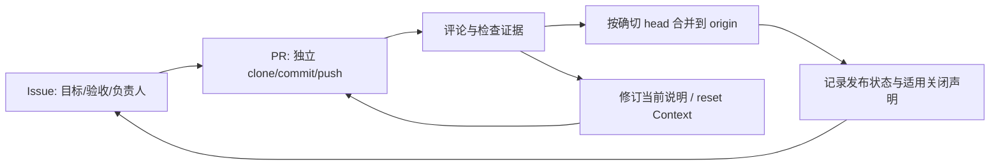

# Braid 最小 GitHub 协作体验复核

> 终态材料上的[第二次独立复审](cells/github-minimum-second-review.md)已完成：补充GitHub官方基线、当前源码映射、PR24/25重复创建与评审条件证据；未修改源码或运行。

复核时间：2026-09-28T12:15Z。范围是当前 `sources/braid` dirty working tree 与 continuation-03 的实际冻结运行，二者严格分开；未修改源码、运行或数据库，未运行测试。

## 目标与最小闭环

用户需要的是可自然协作的最小闭环：目标有持久位置，责任可追踪，代码在独立分支发布，讨论能回到同一 thread，合并结果可验证，修订后的当前依据能被接续者看到。

Issue负责需求、设计依据和验收判断；PR负责人负责计划、实施、排障和检查。Braid负责身份、对象、投递、Git发布和 Context 生命周期，不能替成员决定需求是否充分、是否采纳建议或是否通过产品验收。

## 当前能力与断点

|能力|源码/文档证据|结论|
|---|---|---|
|身份、指派、独立工作区|`src/objects.rs`、`src/worktree.rs`、`src/group/pr_agent.rs`|最小责任闭环已具备；不需要 Profile 冒充真人账户|
|Issue→PR设计/实现分离|`src/group/provider.rs`、`src/context.rs`|当前源码支持；旧官网运行曾有 Issue 先实施的历史，不能倒推为新设计已被运行采用|
|Git发布与确切 head 合并|`src/worktree.rs`、`src/local.rs`|复用原生 Git 足够；`ready` 不等于验收通过，`merged` 必须绑定发布 commit|
|PR正文 `Closes/Fixes/Resolves`|`src/objects.rs` 现有解析与 `tasks/.../implementation.md`|已在 dirty 源码实现并有协议记录；本次 continuation-03 冻结运行发生在该修复部署前，不能把运行结果当作已验证|
|thread 回复与定向通知|`src/objects.rs`、`src/group/dispatch.rs`|同一工作项回复、@定向、delivery receipt 基本成立；`delivered` 只证明原生接收|
|显式退订|当前实施记录声称已修复真实 comment 路径|需在自然运行中验证参与→退订→普通回复不投递→明确@仍投递→重新关注恢复|
|Context reset/可编辑依据|`src/provider/pi.rs`、`src/context.rs`|当前 dirty 源码已在成功 prompt 后清空 pending Context；本次冻结运行仍含历史重复 Context，约 67.1M 只是反事实情景估计，不是实测节省|

实际 continuation-03 证据：GH Braid `pi-braid--hackathon--github-3d75045c72f1d6` 已 ready，Sheet `pi-braid--hackathon--sheet-22730f82778f3a` 在复核截止时仍 running；外层标为 `stopped-before-local-scoring`，不能冒充生成失败或评分结果。原始生成目录仍是 attempt-09 下的旧 workspace 复用目录，不能用于证明 dirty 源码修复已部署。

## 最小处理方向

1. 保持 Issue→PR→Git 发布的边界；不要引入全量 GitHub clone、审批门、CI 队列或新的语义决策层。
2. 以裸 `origin` 的 symbolic HEAD 作为默认分支语义。仅在默认分支合并成功且 merge intent 绑定目标时兑现正文中的显式关闭声明；非默认分支、普通 close、冲突和 CAS 失败不关闭 Issue。恢复路径必须复用同一 intent，避免重复关闭或正文变更后关闭错误目标。
3. 让 explicit unsubscribe 覆盖 thread 历史参与者的自动收件原因；负责人责任和明确 @ 不被退订吞掉。沿用现有 delivery receipt，不按 closed 状态丢弃仍需交接的消息。
4. 把 Context 当作 pending 输入：成功接受后清空，失败/Deferred 保留，新 session/reset 重新注入。先用同一原生 session 的第二个普通通知验收，再讨论跨休眠复用；token 下降不能代替协作正确性验收。
5. 对同一成员、同一 Context revision 的待投递通知批量处理，但保留逐条收据；不要通过禁止联系已关闭成员来掩盖原生 session 重建成本。

## 断点与边界

当前仍应明确：关联 Issue 不等于关闭目标；`assigned` 不等于已开工；`ready` 不等于应用通过；`delivered` 不等于模型理解；`merged` 必须有具体发布 commit。Braid不拥有题目评分、容器额度、模型预算或应用验收，SVC也不应复制 Issue/PR 状态协议。

基于本次证据，真正需要自然运行复核的是：新关闭声明是否在正确默认分支兑现、退订是否阻断自动通知、Context 修复是否在冻结制品中生效，以及批量投递是否保持未接受消息和后台完成事件。其余 Git、thread、独立 PR 基础已经足够支撑最小协作体验。
