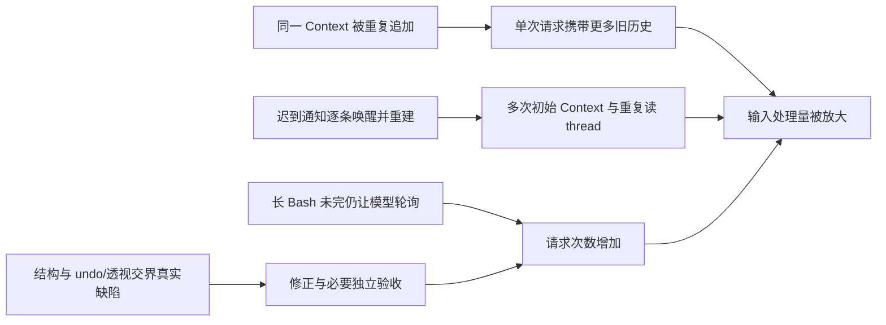

# 最新两题终态 token 复审

2026-09-28，Astra 只读复核。原始材料采集窗口为 2026-09-28T13:20:09.881215+00:00 至 2026-09-28T13:20:13.918956+00:00，准确时间见 [snapshot](token-final-review/snapshot.json.gz) 的 `captured/capture_finished`。本文替代中途截面对 continuation-03 成本的判断，不修改 Harness、应用、运行状态，也未启动实验。

**结论：GH 本次接续为 429 个有用量响应，Sheet 为 4,610 个；Sheet 的输入处理量约为 GH 的 20.7 倍，但输出约为 15.0 倍。** Sheet 既有真实的交界修正和验收，也有 Context 重复追加、迟到通知反复重建、等待时持续调用模型的放大效应。优先消除适配器与投递机制制造的重复，再按候选版本和验证命题复用验收证据；不宜先降低模型或删掉独立核验。

## 1. 来源链与终态

本页“本次接续”只计 `2026-09-28T09:20:00.180875Z` 之后的消息。**09:20 是起点，不是 cutoff**；旧 `continuation03-token-profile.md` 的称呼及 `latest-token-review.md` 对“同一 09:20 cutoff”的描述有误。旧 deep 报告的 Sheet 数据在采集时仍增长，不能当终态。

|题目|continuation-03 执行身份|持久生成目录与 Braid run|最后一个有用量响应|交付终态|
|---|---|---|---|---|
|GH|`github-3d75045c72f1d6`|`github-88884da4b94a0f` / `20260928-030347-78b10c07`|10:09:11.899 UTC|monitor `ready`、agent `completed`，receipt 存在|
|Sheet|`sheet-22730f82778f3a`|`sheet-984a08e3155e3e` / `20260928-025746-66feadac`|12:02:24.990 UTC|03 已停止；`sheet-130e238edd5a6a` 仅恢复 materialization，exit 0、completed|

表中的短执行身份均带前缀 `pi-braid--hackathon--`。原始根为 WSL `/home/yyh/Development/factory26/runs/e20260928-02-deepseek-direct/attempt-09/generation/runs/`，再进入各题 `workspace/official-generation/template/.factory26/<Braid run>/`。

Sheet 恢复计划固定 main `3fb842a46362c6c676bb2e99f92453d46f8394d9`，禁止新迭代且不刷新 native materials；终态 application SHA256 为 `9022b53b7a827a3dd29df7477a5645e2207450fb0aa25efd97ae0a527ac7f28f`。恢复网关导出 `empty`，原始网关没有该 recovery run 的 requested 记录。因此恢复不另计模型费用，也不能把恢复时再归档的 native 副本重新累加。证据见 [terminal-provenance.json](../packet.md)。旧 monitor 的 Sheet `failed` 是被停止的执行容器状态，不推翻随后恢复出的 completed 交付。

## 2. 统计口径及三路核对

复用 [既有采集器的终态版本](../packet.md) 与 [聚合器](../packet.md)。只读 SQLite；原生每条 `message.usage` 只计一次，以 `(native session ID, record.id, timestamp)` 去重，不递归遍历嵌套 usage，不把 transcript、归档和 recovery 副本相加。

本次补上一个旧采集器遗漏：PR26 的 native session `01a0e7be-98d2-7048-8fae-4bb61ef09772` 同时有带 header 的 `sessions/...jsonl` 和顶层无 header 续写片段。前者 64 条 usage，后者 83 条，合计 147 条。后者第 1 行即 11:50:44.463 的 message；它的身份由 `sessions.json.native_session_path` 精确映射，不能因为没有 header 而丢弃。83 条贡献 input **36,694**、output **33,332**、cacheRead **9,068,544**，并非复制出来的额外消费。采集器记录所有无头文件及映射结果；没有身份的 subagent transcript 不当新会话计数，真实子会话由其带 header 的 session.jsonl 计入。

PBB `work/home/.pi/pbb/**/events.jsonl` 是 `job.started/job.output/...` 后台 Bash 事件，包含 jobId、sessionId 和命令；它不是模型 usage 主来源。旧入口把它写成 token 原始来源不准确。Pi timing 的 `message_end.usage` 是同一次响应的旁路观测，也不能再加到 native 总额。

|交叉核对|GH|Sheet|
|---|---:|---:|
|native 有 usage 的响应|429|4,610|
|Pi timing message_end|429|4,610|
|网关 requested / normalized / stream|429 / 429 / 429|4,610 / 4,610 / 4,610|
|Pi timing request_start|429|4,611|
|native 与 timing 逐会话 token 字段不一致数|0|0|

Sheet 多 1 个 request_start 未配到 message_end，而且没有对应额外 gateway requested；不能推定它已向供应商发出，更不能为它补造 token。网关存在更早运行的重试，但本页的“响应数”不宣称覆盖供应商网络内部重试账单。见 [gateway-summary](../packet.md)、[reconciliation](../packet.md)、[aggregate](../packet.md)。

**cache 口径已有冻结运行源码证据**：[Pi usage 映射原文](../packet.md)，来自该题 `submission/agent/runtime/node_modules/@earendil-works/pi-coding-agent/node_modules/@earendil-works/pi-ai/dist/api/openai-completions.js:1178`。它将供应商 `prompt_tokens` 拆为：

`Pi input = max(0, prompt_tokens − cacheRead − cacheWrite)`；`cacheRead` 取 `prompt_tokens_details.cached_tokens`，或 DeepSeek `prompt_cache_hit_tokens` 等；`output = completion_tokens`，其中已含 reasoning。故输入处理量是 `input + cacheRead + cacheWrite`，不能把 cacheRead 再加到供应商 prompt_tokens，也不能把 reasoning 再加到 output。以下未缓存 input 是该适配层的归一化含义，不是独立核实供应商缓存账单。

## 3. 终态成本表

### continuation-03 增量

|题目 / 模型|响应|input（不含 cache）|output（含 reasoning）|其中 reasoning|cacheRead|
|---|---:|---:|---:|---:|---:|
|GH / glm-5.3-flash|370|616,847|108,090|49,550|29,216,960|
|GH / deepseek-v4-flash|59|75,456|30,009|15,162|2,551,168|
|**GH 合计**|**429**|**692,303**|**138,099**|**64,712**|**31,768,128**|
|Sheet / glm-5.3-flash|835|2,342,209|258,342|110,112|141,745,728|
|Sheet / deepseek-v4-flash|3,761|5,030,653|1,798,668|1,036,221|521,131,776|
|Sheet / deepseek-v4-flash-vision-exp|14|32,774|19,405|11,203|285,824|
|**Sheet 合计**|**4,610**|**7,405,636**|**2,076,415**|**1,157,536**|**663,163,328**|

cacheWrite 全为 0。GH 输入处理量 **32,460,431**，Sheet **670,568,964**；两者 cacheRead 占输入处理量约 97.9%、98.9%，说明“input 很少”不能解释为小上下文。usage.cost=0 只是配置/记录值；缺实际单价和账单，不报金额。

GH 持久 DB 共 44 个 Braid provider session，其中本次新建 14 个，13 个 native session 在本次有 usage；Sheet 共 268 个 provider session，本次新建 150 个，147 个 Braid 成员 native session 与 **1 个 vision 子会话**有本次 usage。Braid session、native session、模型响应与 PBB job 是不同单位，不能互相替代。没有 usage 的新 session 不自动等于漏账。

Sheet 的 vision 任务在 PR26 session 第146行实际启动，不是 `subagent action=list`；子会话为 `01a0e7d9-fa97-73d2-8017-1d2374516418`，14 响应如上。旧报告“没有新子代理”只适用于旧截面。GH 本次没有子代理响应，不能由此抹去继承历史中已有的视觉调用。

### 持久工作区内可见历史总额（含本次，不与上表相加）

此表回答“这份保留工作区至终态累积留下多少记录”，覆盖 09:20 前的既有生成/接续；不声称囊括被丢弃 workspace 或其它 attempt 的全实验账单。

|题目 / 模型|响应|input|output|cacheRead|
|---|---:|---:|---:|---:|
|GH / glm-5.3-flash|1,582|1,941,357|478,903|113,542,528|
|GH / deepseek-v4-flash|1,111|907,982|800,466|171,457,792|
|GH / vision-exp|14|23,871|33,239|45,440|
|Sheet / glm-5.3-flash|3,109|4,697,765|861,836|264,333,120|
|Sheet / deepseek-v4-flash|8,200|8,428,359|4,184,553|1,027,538,688|
|Sheet / vision-exp|16|36,486|29,687|288,000|

历史总表使用同一逐消息去重，但没有另取所有旧网关与 timing 重试账单作逐请求核销；证据强度低于本次增量的三路对齐。

## 4. 消耗集中在哪里，做了什么

|Sheet 工作项|native session|响应|input|output|cacheRead|语义工作|
|---|---:|---:|---:|---:|---:|---|
|Issue5|14|596|897,284|272,564|191,950,720|编辑/范围操作与跨表结构 undo，PR23 收尾|
|Issue4|10|657|1,377,466|323,915|117,195,776|生命周期、行列结构与透视交界；PR20 后 PR24/25 返工|
|根 Issue1|1|295|855,091|85,699|115,164,032|汇总依赖、裁决、关闭与整合|
|PR20|6|575|655,126|269,900|79,866,368|结构变更的独立评审和浏览器验证|
|Issue7|38|801|738,754|393,516|52,541,952|排序/筛选/验证/透视与结构交界、多次通知处理|
|Issue6|24|345|1,119,439|105,954|15,334,208|公式检查与迟到通知重复读取|
|PR26（不含 vision）|1|147|93,197|56,401|12,256,128|最终候选全套验收、截图与视觉结果消费|

前四项占 Sheet cacheRead **76.0%**。其中最大的 Issue5 单 native session 为 478 响应、184.18M cache；根 Issue1 单 session 295 响应、115.16M cache。瓶颈并非单纯“成员数多”，两个长历史会话就承载 45.1% 的 cacheRead。

实际有效工作需保留：Issue5 最后消息（native `01a0e750-f3de…` 第1030行）明确关联 PR23 的跨表 inbound 引用恢复，说明此前跳过项转正并有真实失败后通过证据。Issue4 最后消息（`01a0e7a0-4f74…` 第454行）列明 PR25 修复 stale pivot editor 可见错误，在候选 `cc5b876` 完成 51/51 全套、12/12 生命周期等检查；它同时承认某次评论只是误发后隐藏通知，并非新增产品工作。PR26 的视觉子代理最后报告（`01a0e7d9-fa97…` 第43行）指出部分参考图实际是 Drive 界面、与需求文字存在差异，并发现实拍公式栏/截屏状态不足。此处引用的是模型取证结果，不代替外部评分或本报告重新操作浏览器。

GH 则集中在 PR13（168响应、17.38M cache）、根 Issue1（111、9.03M）、PR12（91、2.81M）与 Issue9（59、2.55M）；已有 PR13 的种子/团队解析修正和需求复核，不应把其整段查需求都视为重复劳动。

图中最后一条表示验收也需要请求；它不意味着验收本身都能删除。优化要把“等结果”从“解释新结果”分开。

## 5. 优化按证据与可验证收益排序

### 第一：一次性 Context 注入，先验证已写修复

终态严格 SHA256 相同的 Context 额外副本：Sheet **117 份 / 3,672,458 字符**，GH **7 份 / 131,779 字符**。这是可直接复查的冗余下界；没有把近似重复或相同主题算入。见 aggregate 的 `repeated_context_prefixes`。

Sheet Issue5 同一前缀 19 次、根 Issue1 63 次。沿用旧报告保守假设：每份重复分别按 20k、7k token，固定实际后续请求序列，终态重复副本携带权重为 2,575、8,250，情景输入处理量 **109.25M**。旧 67.1M 只是中途值。此数是条件估计，不是严格反事实下界：修复会改变上下文压缩、模型动作和缓存布局。可证下界是字符副本；**本轮实测已节省 token 为未知，没有非零账单节省保证**。

当前源码 `sources/braid/src/provider/pi.rs:415` 已在 prompt receipt 成功后清空待注入 Context，失败/Deferred 保留；[实施记录](token-fix-implementation.md)有协议行为验证。此次原生记录来自旧冻结 roles-v1；Sheet 最后 recovery 无模型请求，不能拿 recovery 的新二进制宣称修复已实测省 token。下一次获授权自然运行以同 session 第二次普通通知是否只含增量、初次/重建仍有完整 Context 验收。

### 第二：先批量送达，再决定原生复用

Sheet 本次 147 个有 usage 的成员 session 中 132 个首轮为 terminal_contact。Issue3 42 个、Issue6 24 个、Issue7 38 个会话说明重建密集；它们也含真实复验，不能一律取消 closed 后联系。

旧报告已逐消息核实的 Issue6 同 revision 三样本仍成立：`01a0e78b-4cdc…`、`01a0e790-7d5e…`、`01a0e795-e18c…` 分别为旧 comment260/268/271 建新 session，读到已含后续结论的 thread，再判断无需动作；合计 **101,098 input / 5,677 output / 50,304 cache**。这是冗余候选支出，不是全额可删：至少需要一次语义读取，批次合并不应丢掉逐条 receipt。

当前 dirty `store/mod.rs` 已实现同 work item / member / assignment revision 的待送 direct_contact 批量化及逐条收据；**sleeping native session 复用尚未实现**，不能将二者混称完成。安全复用还需 identity/profile/instructions/context 一致及后台任务事件归属。先观察已实现批次是否合并真实积压，再考虑复用，避免为了省 token 加一套新的通知语义分类。

### 第三：把等待留给 Bash 完成事件，收窄状态输出

保守规则筛出的纯 Bash 轮询候选，终态 Sheet **867 次 / 314,375 input / 190,431 output / 132,389,568 cache**；GH **57 / 24,842 / 6,305 / 4,407,296**。Sheet 候选约占响应的 18.8%，但不是 18.8% 必然可删：首次检查、诊断失败和最终读结果仍必要。命令逐条可见 aggregate `poll_candidates`。PR26 新补回的无头片段也包含21次候选，说明此问题一直延续到最终验收。

PBB 已有完成事件；旧样本中对 bg001 使用 `subagent_wait` 被明确告知它是 Background Bash。终态工具调用 `subagent_wait` Sheet10次、GH2次；Sheet 新增真实 vision 后必须区分等待对象，不能延用“所有 wait 都无对应任务”的旧结论。应由一个已有 job 完成事件唤醒其所属 native session；保留可显式查询状态的入口，不新增轮询 Agent，也不靠反复追加同样提示解决机制问题。

工具输出方面，Sheet 严格全文相同且超过500字符的额外副本 **193 份 / 692,457 字符**；跨成员读取契约可能合理，这不是全部可删。已知无效输出仍是跨文件系统 `cp -al` 的 559KB 原日志（入模51,388字符），以及打印整个 status 带出 physical_sessions 的 427KB（入模51,376字符）。应返回首个具体错误、失败总数/设备边界、必要状态字段，原日志保留取证。

### 验收与返工：按候选和命题复用，不按次数砍掉

Issue4/5/7 交界导致 undo、数据验证、透视字段与结构变动互相影响；最终新增 PR23、PR25 证明复验确实捕捉到遗漏。可减少的是“代码树、环境前提、验证命题均未变”时重复跑整套并轮询等待。复用记录至少要说明实际 head/tree、检查命题、结果和适用边界；变化只影响局部时补对应交界检查，最终集成保留一次独立全量验收。当前证据还不足以列出所有同树同环境的严格重复，因此本项不报可节省 token。

**收益不得叠加。** 109.25M Context 情景、132.39M 轮询 cache 候选、通知样本与工具重复都落在相同请求里；正确顺序是先去 Context，再对剩余请求做批量/等待评估，最后计算增量变化。本报告不提供这些数相加的“总收益”。

## 6. 尚缺哪些证据

1. 缺模型路由的实际单价、缓存计费契约与供应商账单，故只有 token 分类，没有金额；完整历史表也不是整个实验所有 attempt 的账单。
2. 新 Context/通知批次代码已写且有行为检查，但无后续有模型的冻结运行证明实际节省；原生复用、事件等待策略仍是待验证方案。
3. 还缺相同候选树/环境/验证命题的全部验收对应关系，不能把多次安装、浏览器验证与失败后返工全判为浪费；外部评分也不由 token 或模型自述推导。
4. native 与 timing 的终态用量已对齐，仍有1个未完成 timing request_start；其网关请求/供应商耗量不可据此臆测。若后续出现额外供应商账单，应按请求ID追查，而非重扫并相加所有归档。

前三决策是：**验证已实现的一次性 Context；验证已实现的通知批次并单独评估 session 复用；利用现有 Bash 完成事件减少无变化轮询。** 不以削减模型档次、必要验收或成员语义判断换取表面 token 下降。
