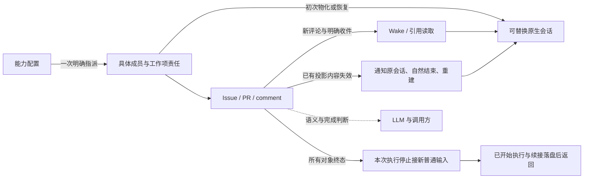

# 第二轮产品复审

本轮没有发现需要再次改造整个产品模型的证据，但追加的真实协作取证揭示了一个尚未解决的产品缺口：普通消息可能等到长时间原生执行结束才进入成员输入。上一轮已经批准的普通追加走 Wake、按讨论收件、关闭自然收尾、保留关闭关联 Issue 正文，能共同服务于“LLM 自己维护协作记忆”。进一步复杂化最容易发生在结束范围与成员恢复上，应先守住现有边界，修正不一致的行为和说明。

本报告区分当前实现、已批准方向及新建议。当前源码阅读是机制证据，历史归档是旧运行观察，既有 cell 的定向检查是该单元报告的验证；本轮没有独立运行新二进制，因此不把它们合写成“最新产品已验收”。

## 当前模型与工作流

图表示当前已经选择的产品边界，不是说实现的每条退出路径都已满足它。Pi 内部会话树没有 Braid assignment；原生进程退出、成员责任消失、对象关闭以及整个调用结束是四个不同事实。

| 用户工作流 | 当前可解释行为 | 本轮判断 |
| --- | --- | --- |
| 从能力目录创建两个工作项 | 同一配置派生两个具体成员；创建成功先表示责任登记，随后异步执行 | 保留。不能把 profile 当作联系人，也不用取消指派释放空闲资源 |
| 编辑已有项的负责人 | 显式移除当前具体成员并添加配置，得到新成员；保留 clone，旧地址不可达 | 保留。没有证据要求一个成员同时持有多个工作项或可自由迁移的全局成员池 |
| 在另一项讨论中请某成员协助 | 负责人、同串作者、当次 @、显式 watch 取并集；按具体身份去重，不转投新人 | 已实施的收件范围合理；无需用模型判断每条消息的重要性 |
| 普通评论、根五分钟检查 | 新输入通过 Wake/引用读取；不因完整投影哈希变化就 reset | 旧发现已修，不重复报为当前问题 |
| 改写 description、已有可见评论或折叠状态 | 对当前工作项及有直接投影依赖的 PR 失效；原会话收到通知并自然结束后重建 | 保留。无需取消自编辑重建来减少实现复杂度 |
| 关闭自己的工作项 | 记录对象状态，正在执行的工作自然结束；没有强制额外 finalization | 旧发现已修；关闭不能天然代表新的一次质量检查 |
| 已关闭成员后来被联系或工作项重开 | 责任和具体名字保留；休眠组从当前对象重新物化原生会话，clone 保留 | 产品上可以成立。保持的是同一个成员，不承诺原生聊天历史永远复用 |
| 根和全部对象终态 | 当前范围停止领取普通讨论输入；已开始的执行及 reset continuation 结束后返回 | 维持已有选择，但存在一条绕过该条件的退出路径，见技术核对 |

源码证据入口：`objects.rs::reserve_member_for_profile / edit_with_parent_and_assignees / discussion_changed / lifecycle`，`store::begin_work_item_reactivation / complete_work_item_reactivation`，`group/dispatch.rs::reactivate_work_item_agent`，`local.rs::delivery_complete`。

## 本轮最小产品建议

### 1. 将本次执行边界说明完整，维持已选范围

上一轮的“根关闭作为结束请求”没有被采用，本轮不重新默认采用它。继续规定所有新建对象属于本次工作范围；要在范围外保存后续想法，可以由 LLM 在说明或评论里记录，再由调用方决定后续工作。Braid 无需自动识别 backlog、检查 close 理由或推断应用完成。

应使用同一对象范围解释停止接收新执行和返回结果。当前实现已经有全对象终态判断，却还存在“根已关闭且暂时静止就返回”的另一条路径。这是实现不一致，不需要新增产品模式解决。根已关闭但仍有开放项且没有可执行输入时，最小建议是明确报告范围未收敛并保留状态，不能把暂时静止冒称完成；是否表现为已有 blocked 结果，进入技术方案时沿当前错误契约确定。根开放时继续保留用户要求的五分钟检查。

另一个需要补齐的使用说明是：comment 的 `queued` 只说明消息已持久登记，不保证本次 invocation 会开始处理。全对象终态后，普通输入保留在数据库；仅以同请求再启动而不重开范围，仍会立即退出。建议最终结果可见地说明哪些普通输入因范围已关闭而留待后续，并明确需要重新打开工作范围；不需要新增 inbox、消息优先级或每条消息一套状态机。当前 `result.json` 只给执行终态与 delivery commit，未列未派发输入；comment view 仍能看到 queued。

这是输出透明度建议，尚未采用，也没有证据证明旧任务曾因这一输出缺口丢失业务结果。不能把所有排队消息强行执行到空作为“修复”，那会恢复关闭后无限延长的旧问题。

验收判据：根 CLOSED、另有 OPEN 未指派项时不能走全范围完成出口；全对象终态但仍有排队普通消息时，调用方能区分“本轮停止派发”与“已送给成员”；重开范围后同一保留消息可继续处理；根开放且可恢复时，五分钟检查仍有效。当前执行在最后关闭之后可以自然落盘，期间重开对象必须恢复正常派发。

### 2. 将收件和可编辑记忆的边界说准确，先不增加控制面

稳定成员指令仍写“回复会通知该工作项的参与者”（`group/provider.rs::local_instructions`），而新实现已经是同一讨论的历史评论作者加负责人、当次 @ 和显式 watch。成员可能据此以为另一个 thread 的协作者也会收到。建议只修改这一句，让入口语言与当前收件规则一致；需要跨 thread 协作就显式 @ 或 watch。

`unsubscribe` 控制整个工作项的显式 watch。它没有抹除历史 thread 参与身份，当前负责人也不能用它解除自己的通知责任。`resolve` 折叠截至当时的历史，不结束责任、不停止以后回复、更不判断讨论的业务完成。当前规则可以成立，但“退订持续有效”不应被解释为所有 thread 静音。没有具体运行证据要求 thread mute，不建议本轮新增。

可编辑 Context 的自动依赖范围是当前工作项及直接关联 Issue→PR 投影。一个成员经 CLI 临时读取其它任意对象，不会自动注册一条永久动态依赖；隐藏/resolve 其它 thread 不会清洗所有曾读者的原生历史。建议保留这一有限边界，重要纠正由 LLM 在实际讨论中追加明确更正或定向通知。不要为了实现“全员忘掉旧事实”自动追踪每次 CLI 读取、建全局失效图或管理 Pi 子代理 Context。若用户实际要求跨任意读取者的自动撤回，那是不同范围，需先举出工作流再设计。

验收判据：同串参与者收到回复，未参与且未 watch 的其它线程成员不收到；取消全项 watch 后普通别串回复不送达，当次 @ 仍到达，同串参与不被悄悄删除；已 resolve 历史不重新进入完整 Context，后续新回复仍可见且送达。以上是产品边界，不要求 LLM 做机械确认回执。

### 3. 异步协作应在工作期间可见，而非只能等整段执行结束

追加输入来自 [共享契约因果记录](../experiment-infrastructure/cells/shared-contract-braid-causality.md) 及其 `shared-contract-delivery.json`。这份主线独立取证区分了两个事实：glm-6 在 11:48 已读到初始裁决却仍选择旧形状；之后 #109（12:36）和 #118（12:50）的明确纠偏截至 13:38 仍 queued/pending，所在 batch 没有 turn，成员的原执行自 11:47 一直 running。后两条不能归因于模型“读后忽略”，也不能由频繁 reset 解释。本 Agent 阅读了证据文件，未再次独立打开该 Sheet 归档。

当前源码也有相符机制：普通评论对 OPEN 成员发 Wake；只有 Assign 在 ingest 时标 urgent；运行中仅转发 urgent batch，普通 batch 只在成员 idle 时开始执行。收件正确和最终能恢复，不足以保证长时间工作期间能收到协作者的更新。这比通知总数更直接影响异步协作是否有用。

建议增加一条明确产品承诺：真实已合并的普通收件批次，在 provider 支持的可接收时机进入正在工作的成员输入，不必须等待整段长执行结束；Braid 不判断“这是重要契约”来选择消息。继续使用现有持久批次和引用读取，避免每条评论强制打断、不新增高低优先级分类器，也不重建 Context 来代替送新消息。究竟采用原生 steer、何种安全插入边界及接收回执，需要在产品复核之后核对 adapter 能力，不能先用 `followUp` 的名字就假设它能在长执行中生效。

该承诺尚未批准或实现。它只保证进入可供成员处理的原生输入，不保证模型遵循建议、修正实现或确认回复。`queued`、原生接受、实际进入输入及模型理解是不同事实；当前 delivered 已声明只表示交给原生会话，不能扩张为“已理解”。

验收判据：一个有真实工具活动、仍未结束的长执行期间，另一成员发来的普通纠偏消息能在整个执行终结前进入正确原生会话；批次可追溯，不误计为已读取或自动回复；provider 忙碌拒收时保留待投递输入、不伪造成功、不改成另一个成员；原生可接收后恰当续送。不能只证明新执行结束后最终看到消息。

### 4. 成员恢复失败应结束不可兑现的投递，不能隐式创造一个同名新人

身份模型本身不需要推翻。明确指派生成具体成员，Context reset 和正常重开保持该成员，明确改派生成新人，这些边界足够简单。

历史 21,206 条唯一键错误暴露的是恢复入口违反该边界：旧 `glm-3` 已 blocked，排队消息却进入创建新 assignment 的路径，并继续使用 `glm-3`。当前新投递入口已将 blocked/retired 成员判 unreachable，但历史已入队消息没有同样的终态收尾；这不应通过删除唯一索引、自动换名字或转交新负责人解决。

最小方向是保留身份，给不能恢复的历史投递明确失败事实；需要换人由明确改派表达，需要恢复原执行由已有宿主恢复路径处理。Braid 不从消息内容判断“值得复活”，也不把错误重试次数当应用失败标准。此项属于现有承诺的修复，详细证据见 [技术核对](technical-followup.md)。

验收判据：同一历史 blocked 成员的旧 pending 消息不再产生同名 assignment 或不断重复不可满足的事务，回执包含不可达原因；正常 sleeping 成员仍以原身份处理新消息，明确改派后新旧名字及回执可区分。

## 已修与证据边界

| 上一轮发现 | 当前状态 | 本轮不作的推断 |
| --- | --- | --- |
| 追加导致全量 reset | hash 兜底已删除，显式失效路径保留 | 不将历史 40/39 次追加型 reset 当当前 reset 数 |
| 全项隐式订阅 | 收件按 thread/负责人/@/显式 watch；创建/参与不自动 watch | 不宣称新运行通知量已下降多少 |
| close 固定 finalization | 新关闭不创建该阶段，旧归档仍兼容 | 不把保留的历史 finalizing 分支视作未修 |
| 关闭关联 Issue 丢正文 | 当前 renderer 保留当前正文和可见讨论 | 不宣称已证明改善模型理解或得分 |
| 空批次重放与冷恢复 | 既有 packet 报告实现及定向真实续进 | 不用这些证据覆盖成员唯一键忙重试 |
| Codex 收据 | 已有独立普通/steer 收据记录 | 完整工作项 reset 端到端仍未验收 |

## 待用户复核的范围

建议复核的是长执行期间普通协作输入的及时可见承诺，以及三项窄范围澄清：维持全对象终态并统一退出解释；明确本轮未派发输入的可见说明；校正 thread/watch/Context 的入口说明。成员唯一键和提前退出是当前承诺下的技术矛盾，不以采纳新产品为前提。

无需复核或新增：根单独关闭模式、自动契约/V&V 判断、语义通知过滤、可移动全局成员池、Pi 子代理管理、动态读取依赖图。现有证据不足以证明它们有必要。本轮没有修改权威文档，因为产品建议仍待复核。
