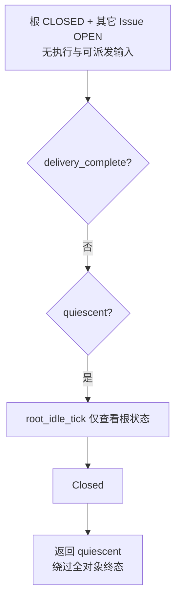

# 产品结论后的技术核对

这里核对的是 [产品复审](review.md) 已明确的边界。静态控制流和旧归档不是当前二进制的运行验收。没有启动模型、benchmark 或新模拟测试，也没有修改源码。

## T1：根关闭加静止可以绕过全部对象终态条件

证据为当前 `src/local.rs:251` 的 `quiescent`、`:256` 的 `delivery_complete`、`:534` 的 `RootIdle::Closed` 分支，以及 `src/objects.rs:277` 的根状态判断。

`delivery_complete` 要求根和全部对象终态，且没有未解决合并。主循环首先检查这个条件，但如果不成立，后面仍会在 `quiescent` 时调用 `root_idle_tick`；该函数只要根不再 OPEN 就返回 Closed，主循环立即返回 `quiescent / 当前没有可执行工作`。`quiescent` 不检查开放对象，也不检查 unresolved merge。

因此，根 CLOSED、另一个未指派 Issue OPEN、所有执行和事件计数为零，是允许出现且足以走第二出口的状态。文档说全范围终态才结束，实际却已有一个隐式“根关闭加静止”模式。这里没有声称该序列曾发生于真实 benchmark，也没有把这个例子当运行复现。

修复应让退出入口采用同一范围契约，保留现有 turn/reset continuation 的自然收尾。不能仅删除这个 return 后无限空转：根已关闭、其它对象开放且没有可执行输入时，必须明确保留状态并说明尚未收敛。具体返回值沿已有结果类型设计，不新增语义完成判断。所需验证见产品复审第 1 项；当前尚未实施。

## T2：历史 member_login 冲突尚未闭环，当前入口仍保留成因

本轮独立只读打开 `runs/e20260927-03-github-resume/g01/stop-preservation/20260927T133809Z/e4e7f35f55eb/workspace.zip`，从日志重新计出 21,206 条 `UNIQUE constraint failed: assignments.member_login`，首末时间为 `11:57:44.111963Z` 与 `13:37:57.215527Z`。完整查询和少量原文见 [member-conflict-evidence.json](member-conflict-evidence.json)。

末快照中 Issue #2 的 `glm-3` assignment 为 blocked，`local_items.desired_member_login` 仍为 `glm-3`，其 27 条 pending direct_contact 指向同一成员；回执中还有 25 条 queued。事件数与回执数本来就不是同一口径。早一份 12:36 专项快照记录 26 条，不能把时点差异当作证据冲突。这里没有计算模型调用、token 或净延误。

当前源码链仍成立：

1. `store/mod.rs:3111` 的 assignment_candidates 只在存在 materializing/active/finalizing/stopping/sleeping assignment 时排除 direct_contact；blocked 不在集合中。
2. `begin_agent_assignment` 从当前 desired_member_login 取得旧名字；`:3681` 的地址/revision 检查会通过，因为本例 desired 没变。
3. direct_contact 跳过关闭状态的 activation 过滤；随后仅排除 stopping 及 materializing/active/stopping assignment。
4. `:3756` 使用原 desired_member_login，`:3761` INSERT 新 assignment；`migrations/0009_member_identity.sql` 的全局唯一索引拒绝重复名字。事务失败也回滚事件消费，候选仍 pending。
5. `objects.rs:837` 已能拒绝 blocked/retired 成员的新消息，但没有处理故障之前就登记的历史输入。

这是身份不变量和历史事件收尾不一致，不是普通追加 reset 或无输入批次回环。最小修复范围应覆盖历史输入进入 assignment 物化的共同边界：已有 blocked/retired 地址不能经普通消息隐式创建新逻辑人；落地不可达收据，保留历史。正常 sleeping 仍走 reactivation；显式改派仍新建具体成员。

截至本轮只有归档观察与当前源码静态成因，没有当前版本修复、运行复现或验收回执。下一阶段若获授权，至少要用该类真实保留快照证明事件得到确定性收尾；不能只看到日志减少就判成功，也不能删除索引掩盖身份复用。

## T3：入口说明仍描述旧收件集合

`src/group/provider.rs:75` 仍说“回复会通知该工作项的参与者”，而 `objects.rs:889` 只选显式全项 watch、负责人和同 thread 历史评论作者，再在 `direct_mentions` 处理当次 @。这是可直接修正的入口文案不一致。权威 Local 契约已描述新规则，更新入口时引用同一规则即可，不新增教学协议。

另有较低优先级文档不一致：`docs/20-product-tdd/local.md:46` 同时称 add-assignee 只用于未指派状态，又称重复选择当前配置返回原成员。实际 CLI 的 Issue/PR edit 都调用 `edit_with_parent_and_assignees`，`:697` 会拒绝已有负责人时单独 add；remove 当前具体成员再 add 同配置则是明确重新指派并产生新成员。建议保留已有显式改派语义，删去容易误导的无操作承诺；不为了这一句话增加一套兼容操作。`set_assignee` 内部辅助函数的同配置无操作行为不能代替用户 CLI 证据。

## T4：长执行的接收时机、busy 拒收与通知丢失应按一条投递链核对

证据分两份，不能混成一个已证明的因果关系：

- 历史 Sheet 的 [共享契约投递链](../experiment-infrastructure/cells/shared-contract-braid-causality.md) 记录，纠偏 #109/#118 已排队但直到 13:38 都没有 turn；目标原执行自 11:47 持续 running，没有中间 reset。初始裁决则确实被模型读到。这是产品复审第 3 项的实际问题依据。
- 最新 [WSL 过程截面](../braid-product-hardening/cells/live-run-evidence.md) 记录 DeepSeek Sheet `20260928-025746-66feadac` 于 03:10:17–23 UTC 两次 `Agent is already processing. Specify streamingBehavior ('steer' or 'followUp')`，随后 `channel lagged by 115`。这是主线保存的实时观察，本 Agent 没有独立读取 WSL 原始文件；两条 failed turn 和 40 条 wake 不能直接归为同一错误或重复调用。

当前静态边界已足以给出有界核对顺序：

1. `objects.rs::deliver_comment_to` 将 OPEN 成员普通收件（包括 @）转为 Wake；`store/mod.rs:2203` 仅 Assign 将 batch 标 urgent；`:5239` 运行中转发只选 urgent=1，`:4901` 普通 claim 需要 idle。因而当前普通消息没有保证在长执行中进入原生输入；新产品承诺需先复核。
2. `provider/session.rs:248` 以自身 Running/Idle 决定 steer 或 start_turn。普通消息遇 Running 时返回 Acknowledged 却丢弃，由上层 `dispatch.rs:506` 判未开始并失败；接口把“已接受”和“未送出”放在同一返回值，不足以承载可靠投递语义。应核对对应 durable batch 如何保留和重试，不把 ACK 当处理收据。
3. `provider/pi.rs:381` 在 prompt 请求成功之前重写内部 current_turn_id 及 stdout reader 的 turn_id；若原生仍忙而拒收，现有原生事件可能被贴上本次未开始的 ID。是否实际造成该 run 的 terminal 错配，须从错误前后的 native event、RPC ACK 与 Braid turn ID 配对确认，不能单凭源码断言。
4. `provider/session.rs::send_user_msg` 持 inner 锁跨越 provider 请求；notification listener 的 handle_notification 也先持同一锁。Pi reader 把绝大部分 frame 变成 Activity，与 terminal 共用 512 容量 broadcast；一次消息请求等待期间可能积压。当前 lag 统一变 Disconnected，令句柄 unavailable。先核对等待区间和活动量、terminal 是否丢失，以及状态是否可恢复；加大 buffer 不建立正确性保证。
5. `dispatch.rs:513` 只有 reset notice 的 already-processing/compacting 拒收被特殊延后，普通消息则失败。这说明原生可接收性和输入收据应统一核对，而非继续按每个报错文本补一次例外。

下一阶段所需最小证据是同一成员、同一物理会话的一段有边界时间窗：源 comment/event/batch、Braid claim/status、prompt 或 steer 请求及 ACK/拒收、原生 user 输入、终态事件、后续重试。已有 live cell 没有给出这条完整链，因此当前停止于候选成因与产品要求，不给出代码修复结论。

验收应区分“运行中可接收”“持久消息未丢失/未重复”“通知证据完整”三件事。不得为验证绕过 Pi 内部生命周期或读取其子代理停止收据；不得把 Braid 的接收正确性包装成模型必然按契约实施。

## 下一阶段核对清单

| 边界 | 判别观察 | 不能冒充的证据 |
| --- | --- | --- |
| 正常指派/改派/重开 | 新工作项新名字；重开原 assignment；旧地址不转新人；clone 保留 | provider ID 改变不等于新成员 |
| blocked 旧消息 | 旧 pending 终结并回执明确；没有同名 INSERT 忙重试 | 空批次为零不足以证明本项 |
| 同线程与全项关注 | 别串不广播、显式 watch 有效；unsubscribe 不被 @ 重新打开 | 收件数不是执行轮次 |
| 编辑后重建 | 原通知有处理证据，先自然结束及 teardown 再替换；自编辑可续接 | 新 Context 文件存在不等于 provider 实际收到 |
| 关闭后的联系 | 保持关闭与原成员身份，真实输入才执行；睡眠恢复取当前 Context | fresh physical session 不等于偷偷改派 |
| 全范围结束 | 开放对象不能绕过；已接受执行自然完成；未派发输入可解释 | quiescent 不等于应用完成或 V&V 通过 |

关闭成员恢复会重新渲染 Context 并建立新物理会话，所以 `emit_with_id` 对 sleeping assignment 的 Invalidate 降为 Noop，并不单独证明睡眠成员恢复后使用旧正文。本轮追踪了 reactivation 的 renderer 与新 session 路径，排除了这个误报。跨任意 CLI 读取者的自动失效也不属于当前有限 Context 契约，不能未经产品扩范围就报成缺陷。
