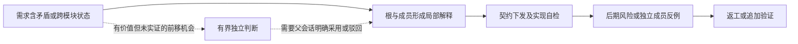

# Advisor 的实际使用与判断前移审计

2026-09-28，只读审计。结论是：**六组可取得的原生记录中，advisor 执行尝试为 0，真实子会话启动为 0，因而没有可归属的 advisor 返回或父会话消费。角色并非普遍不可发现：四组记录有实际 `subagent(action:list)` 返回 advisor；DeepSeek GitHub 还明确考虑过咨询，随后选择自行验证。** 最有判别力的问题是独立判断何时进入重大决策，而不是补足调用次数。

建议暂缓 K2.7 根模型实验，先把已有独立判断能力是否能影响早期具体决定这一假设弄清。这里没有证明 advisor 一定提高分数，也没有证明强根模型没有价值；两者尚无受控对照。本次未改源码、角色或提示词，未启动模型、应用或实验。

## 范围、身份与计数

以父原生消息中的 `toolCall` 为调用事实，核对 `agent/task`、`parallel`、`chain`、`workflowScript` 等输入；本批实际出现单次 `agent` 和 workflowScript，未出现 parallel/chain 执行。逐条关联 `toolResult`，再用真实子 transcript、模型 usage 和 artifact meta 验证启动。`list/status/wait`、Braid 指派、会话重建、文本中出现 advisor 均不算执行。

归档 `native/` 与 `work/native-homes/` 按原生 session ID、消息 ID、时间去重；无 session header 的续接文件先用 `braid-state/sessions.json` 的文件名映射。一个 Braid 成员的多次原生重建不是多个原生子代理。审计代码与完整路径见 [extract.py](advisor-left-shift-audit/extract.py)，调用、结果、配置和覆盖缺口见 [audit-evidence.json](advisor-left-shift-audit/audit-evidence.json)。保留的完整提取分别是 [官网](advisor-left-shift-audit/hosted.json)、[本地](advisor-left-shift-audit/local.json)。

| 生成来源 | JSONL 文件 / 可读原生 session | manifest ID 未匹配到消息 | subagent 工具调用 / 其中 list | advisor 尝试 / 启动 | 可证实的其它真实子会话 |
| --- | ---: | ---: | ---: | ---: | --- |
| 官网 GitHub，终态 435b79927a47 | 663 / 459 | 9 / 465 | 12 / 4 | 0 / 0 | 3 executor |
| 官网 Sheet，终态 bd7ac1b232ba | 776 / 682 | 4 / 686 | 0 / 0 | 0 / 0 | 0 |
| 本地 Flash GitHub，356dab3a5fe6a6，取消 | 8 / 8 | 0 / 8 | 0 / 0 | 0 / 0 | 0 |
| 本地 Flash Sheet，739b90d54f05db，取消 | 8 / 6 | 0 / 5 | 8 / 1 | 0 / 0 | 1 executor |
| 本地 DeepSeek GitHub，保留历史至 continuation03 终态 | 89 / 42 | 6 / 44 | 11 / 4 | 0 / 0 | 4 vision |
| 本地 DeepSeek Sheet，保留历史至 continuation03 终态 | 527 / 263 | 9 / 268 | 6 / 3 | 0 / 0 | 2 vision |

这些文件全部可解析，JSON 解析错误为 0。表中 manifest 是原生会话登记数，不是 Braid 成员数。“未匹配到消息”不能自动解释成丢失文件或未运行：可能只有登记、空会话或恢复期间身份差异；完整 ID 保存在证据 JSON，未将其算作零调用会话。DeepSeek Sheet 另有两个历史原生 header ID 不对应当前 manifest，仍纳入扫描，但没有父 spawn 链，不能当子代理。其归档文件名分别以 `004-2026-09-28T03-03-22-072Z_01a0e5f7…`、`011-2026-09-28T03-04-58-636Z_01a0e5f9…` 开始。

`subagent_wait` 另有官网 GitHub 99、Sheet 38，本地 Flash GitHub 13、Sheet 8，DeepSeek GitHub 11、Sheet 37 次。它们不证明执行，许多是把 Bash 的 bg ID 交错工具；详细机制沿用 [入口调查](native-discovery.md)。所有 37 次 `subagent` 工具调用的原始参数均已核对，没有藏在 workflowScript 中的 advisor。

### 来源链与不能外推的窗口

- 官网 GitHub：`38dc20e99fa5 → e4e7f35f55eb(g01) → 64e0bebcf6f3(g02) → 435b79927a47(g05)`。g05 从 g02 原始 ZIP 接回，并非沿 g04 工作区；g03 `6b45225a668c` 在启动 Braid 前 SQL 失败，g04 `8159d597a305` 根刚恢复即被全局旧成员错误终止。这两个独立恢复窗口不在本次终态 ZIP 全量扫描中，按既有故障账本保留限制，不宣称全链绝对零。`595ab74c90a9` 是固定应用重放，没有新生成。
- 官网 Sheet：原 `20a1cfd5dec9`，g01 `5d3d5da846d9` 受停机证明阻断，g02 `65f8764677d3` 受执行位阻断，g03 `3445926a1142` 实际续接，g04 `bd7ac1b232ba` 从 g03 取消前快照接续。本次扫描终态保留的历史，不把前两次入口失败或 `1efffb84ae1b` 应用重放算独立模型生成。来源账本见 [恢复实验记录](../../acceptance-integrity/experiments.md)及[官网 Sheet 使用分析](hosted-sheet-usage.md)。
- 本地：Flash 来自 `e20260928-01-flash-team/attempt-02`；DeepSeek 来自 `e20260928-02-deepseek-direct/attempt-09/generation/runs/`。持久目录 GitHub 后缀 `88884da4b94a0f`、Sheet `984a08e3155e3e`，03 执行身份分别 `3d75045c72f1d6`、`22730f82778f3a`。本次全保留历史扫描，不仅是 09:20 之后增量。Sheet 收尾 `130e238edd5a6a` 仅物化、模型请求 0，不重复扫描副本计新调用。终态来源与 token 对账见 [终态成本审计](../../braid-product-reaudit/cells/token-final-review.md)。
- 更早独立官网运行、旧 K3 实验及未留存窗口没有被本次穷举。历史报告只能说明各自当时观测，不构成“全部历史都未使用 advisor”或根模型对照。当前没有需要无限追查的 advisor 消费链：所查范围没有启动，消费只能记“不适用”；缺窗仍是未知。

## 可用、发现、尝试、启动、返回、采用是六件事

冻结官网包和本地早期材料确实包含原生 `advisor`：`factory26/kimi-k3`、high、fresh、append，不继承父项目上下文/技能，工具 `read, grep, find, ls, bash`，正文要求只读、独立建议、反例与关键不确定性。**K3 是角色配置，绝不是本批已实际调用的 advisor 模型。** 因为没有真实子会话，本次无法报告 advisor 实际模型、成功返回或净收益。

当前 [advisor 配置](../../../variants/pi-braid/agents/pi-glm-fast/agents/advisor.md)与旧冻结配置有差异：旧包没有 `completionGuard:false`，有 exploration-tools；本地后续恢复材料及当前配置显式关闭 completion guard、移除了该技能。模型、fresh、只读判断职责保持一致。角色原始文本和哈希保存在证据目录。源码 `extensions:""` 是模板，冻结材料中的 PBB 绝对路径是装配结果，不能机械当功能差异。

当前 [父指令](../../../variants/pi-braid/agents/pi-glm-fast/instructions.md)已有角色目录发现方法和有界重要问题可咨询的说明；它是现在的源码事实，不倒填给全部旧窗口。旧父会话实际 list 返回更强：官网 GitHub 11:24:42、11:27:35、12:04:57、12:36:13，以及本地 Flash Sheet 03:09:56、DeepSeek 两题共七次，均显示 advisor 的独立判断描述与 fresh。官网 Sheet 和 Flash GitHub 没有同类发现证据，只能证明材料配置存在。

本角色有 bash，因此不能沿用 vision “纯读工具却被判实施任务”的启动拒绝来解释 advisor 为零。其它角色真实启动也说明整个 subagent 入口并非一概失效。但 K3 路由、模型预算、该角色的完整启动与完成链没有实跑证据，不能据 list 承诺 advisor 必然可运行；本次不发模型请求补此缺口。

作为识别方法的对照：官网 GitHub 三次 `agent:deepseek` 得到 Unknown agent，再有三次 executor 真实启动，实际原生模型为 DeepSeek Flash；前两次终态未知，第三次 SIGKILL。Flash Sheet 的 `minimax` 和 workflow `qwen` 名称错误不算启动，executor 子会话有 26 条 usage，取消前未见完成。DeepSeek 两题六个 vision 子会话均有 exit 0 meta，实际模型为 `factory26-visual/deepseek-v4-flash-vision-exp:high`；GitHub 另两次 vision 启动前误拒。这些模型结论来自子原生记录，不从 Braid 名字猜测。已有返回消费细节见 [跨窗口账本](usage-map.md)，本报告不以子调用量替质量。

## 三个有判别力的决定窗口

下列时间为 UTC。[原始评论摘录](advisor-left-shift-audit/decision-comments.json)保留 writer group/turn 与时间；原生定位保存在 local.json。没有展示模型逐字推理，也不从事后结果倒推出当时一定应该咨询。

| 决定 | 当时已可见的信号与实际行动 | 可前移的独立问题 | 结论边界 |
| --- | --- | --- | --- |
| Sheet 启动种子契约 | 03:04:22 根 #1 已拆共享基础和后续批次；03:06:19 #4 的 #8 评论把两表种子纳入验收；03:08:34 根 #13 明确认出五种互斥 GIVEN、模板损坏，采取覆盖最多表述的种子折衷；03:08:36 #14 下发 #2，要求各子任务遵循。 | 在统一契约下发前，区分全局启动状态、场景前置条件与可经 UI 构造的状态；寻找一个能推翻“折衷覆盖即足够”假设的需求内反例，并说明权威信息不足在哪里。 | 这是已有不确定性被转成全员约束的早期高影响决定。未见根为此考虑或调用 advisor；不能据此断言咨询会修正契约，也不能把 58 分全部归因于种子。外部评分信息在此时不得成为生成输入。 |
| Sheet 共享契约与跨表 undo | 03:06 的 #8 已列结构、公式、验证、透视联动；03:07 的 #11 给出校验唯一来源和批量拒绝语义。到 06:04 的 #89，结构端点已支持跨表 inbound 引用并报告 50/50 API 检查；09:23:29 #214 由 Braid #5 实测发现单表 undo 不能恢复另一表的 raw；09:24:24 根 #217 采纳 relatedSheets 原子恢复，09:25:14 #220 定稿双边消费契约。 | 在端点/History 各自完成前，以“一次结构操作会改变哪些表，逆操作必须恢复哪些状态”为问题，核实跨模块可逆性与最小原子边界。 | 运行已经有有效的跨成员独立发现和根消费，并非没有协作判断；只是发生在实现与多轮自检之后。09:24 根面对具体复现和两方案时迅速做出窄修，额外再咨询不必然有价值。机会在早期不变量，不是每次 merge 前加一关。 |
| GitHub 的验收判据与是否独立复核 | Issue #8 原生 session `01a0e6d6-cb04-71a2-866e-fe6152132cd2` 07:08:35 list 已见 advisor；07:18:25.967Z 顶层续接 JSONL 第 146 行，在实现/自查之后，明确考虑交出 REQ-6-2-1..4 验收风险问题，随后选择自行验证风险交互。 | 在实现与验收脚本定型前，依据需求确认能区分“实现符合自己假设”和“用户路径确实成立”的反例、前置状态及可观察结果。 | 这是知道角色而主动未委派的直接证据，咨询被理解为事后追加复核。不能自动判定该次拒绝正确或错误；也不能证明 advisor 看同份实现摘要就有独立 oracle。 |

另一个较弱线索是 GitHub 05:08:07 的 `01a0e668-e1f6…`、`native/012-…jsonl` 第 41 行：面对截图中的 Fork 文案疑点，曾把图像读取与 advisor 混在一起考虑，最后自行判断。后来有真正 vision 调用，说明能力选择可修正；这不足以说明全体父会话不会区分角色。

根 #13 的事实足以指出“明知重要假设、仍直接承诺”；不需要断言其不知道 advisor。#214→#217 又表明父会话能采用独立的具体反例，瓶颈不能概括成拒绝一切外部判断。GitHub 的明确未委派行为则表明，发现目录和泛化说明不保证独立判断会进入问题定义期。

机制和指南只能给有限解释：角色正文已有问题定义/反例方法，当前 SVC design 也已有早期验证与接口核实，所以“再加一句早点设计”不是由证据直接导出的修法。强视觉分工有明确任务入口，而 advisor 的使用由父模型评估边际价值；当前可见的直接例子把它与完成后重复检查比较。**这是关于决策时机和价值判断的解释，不是已证明的提示词根因。** 本次未完整还原每轮实际系统提示（部分原生记录 redacted），不能声称角色正文一定全部进入过模型上下文。

## 强根模型与早期 advisor：当前怎样取舍

| 竞争解释 | 已有证据支持什么 | 尚缺什么 |
| --- | --- | --- |
| 根模型本身应更强，才能识别/保持跨场景约束 | #13 和验收判据本来由根负责；更强根可以连续持有上下文，也负责是否咨询和消费。 | 没有固定同一输入、工具、反馈与时机的根模型对照。旧 K3 或新 K2.7 整轮成绩不能单独隔离该因素。 |
| 已有 K3 advisor 应在承诺前参与有界判断 | 角色已配置且实际可发现，六组中尚未真正使用；重大假设和跨模块不变量存在明确早期窗口。 | advisor 能否运行、能否给出需求内的可验证反例、父会话是否因此改变决定，三者均未实证。fresh 也可能因材料不足而判断更差。 |
| 更主要的是验收 oracle/输入本身，而非模型选择 | 种子互斥已被识别；独立成员 #214 的最小反例比继续泛跑更有信息。 | 缺失前置状态的权威解释不能由任何模型凭空补齐。模型对照必须控制可用信息，不能把外部评分泄漏给生成。 |

前三项建议按决策价值排序：

1. **暂缓 K2.7 根 variant 的打包/实验，保留已准备源码。** 现在更需要辨别已有能力没用、用晚，还是用了也无帮助；直接再跑强根整轮会同时改变太多因素，难以解释得分与成本。该判断是实验优先级，不是证明 K2.7 多余。
2. **把未来一次有界验证放在高影响承诺前，成功标准是决策差异。** 使用允许需求、原始约束和一项待定问题，看能否形成新的可检验反例或缺失事实，以及父会话如何采用/拒绝；不要先把现有方案包装成待背书结论。无需新增工具、强制审批或 explorer→advisor→executor 流水线。任何模型验证须另按既有授权执行，本次没有执行。
3. **接受已经有效的直接协作，不以 advisor 取代具体证据。** #214→#217 这种复现、选择、原子契约与单一所有者已能改变实现。若早期 advisor 只重复现有判断、或者没有可观察差异，应停止把调用本身当改进，才重新提升强根对照的优先级。

最小缺证是实际 advisor 启动与一项前置决定的返回/消费链；不是再收集一整轮无新判别反馈的验收次数。零调用、token 开销与评分停滞分别是不同观测，不能互相换算成质量因果。
