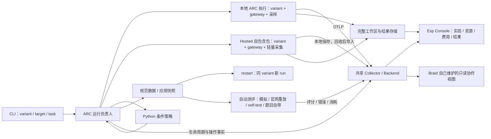

# ARC 实验设施重设计

本文是本轮实现采用的产品与技术方案。2026-10-06 用户已完成开工复核，批准源码实施、提交和真实模型独立会话验收，授权见 packet。核心调度和控制单位是 run。Console、共享 OTLP、统一 ARC 装配、采集驱动的自动控制、完整结果保存、同 variant 数据接续、自动测评和 stages 都在范围内。最新决定是 pause/resume、以 restart 表达数据接续、删除跨 variant 接续和 extract，并增加由 variant 脚本解释的 status。

## 要达成的使用体验

用户输入 variant name、run target、task 即可启动实验，可覆盖 gateway route config 和是否参与比赛。由维护的 target 配置提供宿主、路径、依赖、网络、存储、凭据引用与观测服务地址；每次启动自动保存实际采用的配置。普通实验不要求填写 artifact 引用、物理容器身份、证明文件或逐步执行 compile/doctor/build/start。

restart 迁移 data、重新装配当前程序，因此新 run 也按 target 名称重新解析维护配置和 runtime；来源停止与保存继续使用来源冻结的 target。same task 只决定需求和原生状态接续，不隐式固定旧依赖。需要固定旧 runtime 时使用已有 LAB_CONFIG 明确选择该版本，不新增恢复模式，也不将重新装配当前程序称为完整精确恢复。

接续后的只读监控可明确选择跟随已有restart来源关系，并同时显示来源run与当前run；遇到多个后继呈现分支，不自动选最新。独立评测虽然也有source_run，但不是生成接续，不能成为此跟随的后继。控制动作仍作用于明确指定的run，不将旧ID悄悄重定向。本run的producer用量与原生会话全量分别展示，接续继承的旧消息不能冒充当前执行新增用量或有效动作。

恢复实效由同一采集事实汇总材料采用、接续后请求及variant有效动作，保留每项来源和时间；running而尚无有效动作时如实显示，不增加恢复门禁或第二采集者。原生会话可恢复不代表职责已再次运转：同任务接续由variant/Braid恢复入口把接续事实送入已有正常事件机制，按具体职责状态激活仍需执行的工作，不在公共restart里追加评论、重开已关闭事项或普遍清空重试计数。

启动后，运行程序完成服务装配、执行、资源与过程采集、规则控制、终态及结果回收。CLI 和 Exp Console 都能回答该运行使用了什么、目前做到了哪里、耗费多少、为何停止，以及应用和完整原件在哪里。Pi-only 与 Braid variant 都是正常实验，不以存在 Braid 为实验可见的前提。

stages 由普通 Python 程序按顺序调用运行 API。restart 保留同 variant 的全部规范数据，重新装配程序后启动新 run；无需挑选应用、Braid issues 或原生状态的路径。阶段发布应用后，程序自动启动配置的测评，下一阶段可与测评并行。公开测试反馈可显式作为下一次执行输入，官网隐藏结果仅供实验分析。

题目可以原生声明 `stages` 单阶段 task 列表，由同一个三参数 start 入口派发第一阶段并自动启动普通 Python 推进程序，不要求使用者手写脚本。推进程序留在启动命令所在控制宿主，以保证下一阶段可以从维护源码和 target 重新装配；各阶段运行的观察、保存及测评仍由其已有自动化负责。初始 run 保存题目声明和实际派发记录，不增加实验级身份或统一生命周期。每个单阶段拥有自己的需求和评测配置；阶段声明不嵌套。

## 用户提出的范围

供应商模型配方由 variant 声明，公共 model-proxy 只执行该配方及统一模型运输接口。自费运行将所选供应商链冻结到 run 输入；官网比赛不加载供应商配方、不带 proxy，直接消费平台注入的 OPENAI_BASE_URL / OPENAI_API_KEY。两种路径均不要求 variant 判断费用模式；原生角色模型选择与请求预算仍属于 variant。

2026-10-07 补充的交付约束：固定 runtime 只承担 Harness 启动和运行所需依赖，不为可能开展的应用开发预装整套浏览器、字体、数据库开发绑定和通用工具环境。Chromium、better-sqlite 等按实际消费者划分，应用开发需要的工具由相应使用入口接线，不能把精简成本变成实验使用者的手动安装清单。必要的原生执行依赖须保持可用，不能按包名盲删。小范围程序修复优先派生冻结基座，只更换有来源记录的执行字节；远端复用已部署基座建立独立副本，只传变化内容，旧 runtime 与旧 run 不原地修改。完整导出成功后即保存产物身份，清理错误另记具体原因与残留，不用清理网络状态否定已完成的导出。

强耦合 ARC 与 self-test 意味着任务映射、已有登录态的安全接入、执行侧依赖和结果保存属于设施职责。普通使用者不必提供 cookie 路径、复制秘密、猜测评测任务名或修正 Mac/WSL/sfp7 接线；实际服务失效则保留具体原错，不伪装为配置成功。

| 需求 | 对设计的影响 |
| --- | --- |
| Exp Console 不再需要实时介入 | 移出编辑 Issue/PR、评论、实时工作树写入及为此存在的访问容器/停写协调；运行级启动、停止、挂起归实验控制入口。 |
| 数据走 OTLP；Braid 视图由 Braid 实现 | Console 负责通用实验、资源、费用、日志与结果；Braid 拥有协作语义和视图，只读消费观测数据，接入方式按实际交付成本确定。 |
| Console 包含 Collector、Backend，本地共享 | 一套维护的观测服务供本地运行使用，运行无需各自携带完整查询/UI 服务。服务的物理位置从网络与故障域决定。 |
| 官网自包含且低内存 | 官网包自行执行、采集和保存，不依赖本地 Console 在线；接收与缓冲开销要在官网资源约束下实际测量。 |
| 资源占用数据采集 | CPU、内存、进程、磁盘与执行限额关联到实际执行环境；重用已有采样器，补齐缺失字段与 OTLP 出口。 |
| 耦合 ARC-Bench，统一装配和路径 | 以真实 ARC SDK/Hosted 契约为主线，统一 variant、gateway、collector 和运行目录，不继续为尚无需求的通用 backend 增加抽象。 |
| Python 脚本按采集变量自动操作 | spend、native session/turn 空闲时长等来自真实采集；由运行负责人执行预设策略并记录效果，脚本无需自己爬日志或轮询官网。 |
| 自动保存全部结果 | 成功、失败、取消均保存平台可得的整个工作区、评测结果、日志、模型消耗与原始错误，回收可独立接续。 |
| 移除所有 gate、校验 | 重新审查并删除现有流程门禁、手工证明和重复扫描；不把旧 gate 隐藏在新命令之后。 |
| 支持 start、stop、pause、resume、restart 及 stages | pause/resume 作用于原 run；restart 同 variant 迁移数据并创建新 run，执行方式按真实 target 能力映射。 |
| 规范程序和数据路径 | 程序重新装配，数据整体迁移；删除 extract、通用路径映射和跨 variant 状态转换。 |
| status 提供可用的运行摘要 | 无参数显示未归档、未正常完成的 run；执行状态和绑定脚本给出的活动判断同时可见。 |
| 自动且强耦合测评 | 内建公开需求模拟评测、官网应用重放、self-test、试题自带评测四种路径，不让每个实验重写打包和评分脚本。 |
| 模型配置按 provider/deployment 区分 | contextWindow、maxTokens 和协议兼容项归集中 catalog 的具体 deployment；选路后应用已确认能力，不按统一模型名覆盖不同供应商。 |

采用现有 OTLP 协议接收能力，以一个共享 Python 服务和本地 SQLite 承担 Console 的 Collector/Backend；Hosted 只携带轻量接收/落盘核心。以下说明理由与适用边界；不保留 lab.exp 的状态与资源治理机制。

本地与 Hosted 统一运行接口、轻量程序材料和容器内安装入口，不强制使用同一种运输格式。本地运输程序目录，Hosted 运输同一材料的 ZIP；两者均在正式启动 Harness 前按相同版本、lock 和补丁安装依赖。原先“本地只读挂完整 runtime、Hosted 预打完整 runtime”的路线已由用户要求的同环境安装方案替代。SDK 的复制行为不能成为保留两套正常运行环境的理由；缓存仅加速下载，不增加准入或手工证明。

用户 2026-10-07 补充 provider 级模型配置后，采用 advisor 的 deployment 归属与预算语义：集中 catalog 保存已确认的模型能力与兼容项，recipe 只选 deployment 链。每次实际上游尝试从原请求重新计算输出限制；已给上限取请求与供应商上限的较小值，不抬高调用者的小预算。未给上限且没有明确 default 时保持缺失。协议字段只有在确认等义时转换，多预算字段冲突报告具体错误，不猜优先级、不删 thinking/reasoning 来求成功。逐 attempt 保存白名单 requested/effective、deployment 和来源，不保存提示词或凭据；更小的上下文或不兼容消息格式不能靠输出 cap 掩盖。本轮真实验收使用 variant 声明的当前自费供应商配方，不再采用已耗尽的 ARC 路由。ARK Kimi K2.7 的已核实数值与来源归 catalog 和 provider-model-config cell，不套用其它型号或套餐的上限。

## 四项共同设计责任

本任务按可以独立采用的结果组织，不能将执行、观测、UI 和环境分别修完后再临时接线。

| 责任 | 拥有的行为 | 当前负责人 |
| --- | --- | --- |
| ARC 实验执行 | variant/任务/target 解析、服务装配、阶段、控制、策略和结果保存 | 主 Agent；cold_local_profile 持有本地执行；execution_owner 持有 builders |
| 观测与 Console | OTLP、资源采样、费用与 turn、存储查询、通用实验展示、Braid 视图边界 | cold_console_profile |
| 产品与跨组件架构 | 实验场景、评价标准、路径与数据归属、完整生命周期、交付分批 | 主 Agent |
| 重大设计取舍 | 复杂度来源、候选结构的因果收益与风险、保留或替换判据 | advisor |

## 执行与数据流

以下是职责草图，不表示额外新增同名微服务。



观测传输、运行控制和大文件归档承担不同工作。OTLP 连接过程、资源、消耗与时间线；启停动作使用明确的本地进程/Docker/平台 API；工作区和应用直接按文件归档。归档在观测中提供关联，避免把整个工作区装进日志或依赖 OTLP 才能下载应用。

只读 Console 通过 Backend 查看保存数据，不为了浏览运行而进入生成容器、执行 Braid CLI 或打开可写数据库。Braid 负责描述自己的对象、会话关系与展示；Factory 只提供运行和查询上下文。纯 Pi 仍有通用会话、资源、费用和应用页面。

## 本地共享与官网自包含

“本地”包括 WSL、sfp7 等自管执行目标，并不要求服务在 Mac。一个维护好的 target 解析其运行位置、gateway route、OTLP endpoint 和结果保存位置；使用者每轮只选 target。共享 Backend 的部署位置优先靠近运行和存储，避免 Mac SSH 隧道成为生成必经路径，具体选择由网络和可用性证据决定。

2026-10-06 的只读拓扑读回支持首选 sfp7：该宿主可用空间约 110.8 GiB，WSL 约 25.1 GiB；二者都是约 15 GiB 内存。WSL 已有 loopback Console，不能由 Mac 看不到服务推断全项目没有 Console。建议新共享 Backend 放 sfp7 的独立服务目录，WSL/sfp7 都保留执行 target，Mac 控制与回收在 WorkSSD。此选择不清理或迁移现有数据。本次只证明两域 SSH 可达，服务实际 HTTP/OTLP 端口、容器到宿主路由和目标目录配额在部署准备中确认；不把旧 WSL loopback 地址直接配置给远端容器。依据见[环境专项读回](cells/execution.md#只读环境拓扑与部署建议2026-10-06)。

本地运行直接向共享 Collector 上报。短时不可达时，使用已有原始日志/有界落盘缓冲保存可回收数据；Console 读取延迟可见，UI 退出不改变运行。不能仅因为共享地址存在就删除所有运行原件，也不能为断网另造一套复杂复制协议。

Hosted 使用同一组数据语义，携带轻量采集与持久保存，不携带 Console、完整查询后端或大型观测栈。终态回收后，Backend 可导入其遥测和结果；如果平台允许流式外送，再作为可选能力验证。当前代码提供 OTLP/HTTP traces、logs、metrics 接收和原始 SQLite 保存，能否原样达到内存目标尚未实测。

共享服务失联、磁盘写满和采集缺失如何影响自动规则，要按规则依赖处理：不能把未知费用或缺失 turn 当作零；策略可明确指定数据过旧时等待或停止。观测服务的暂时不可用本身不成为所有实验统一禁止启动的 gate。

### Collector/Backend 的推荐实现

提取 `lab/otlp.py` 已有的 OTLP/HTTP protobuf、gzip、三信号接收、持久存储和分页能力。Collector 和 Backend 是同一常驻服务内的接收与查询模块，不需要先拆成微服务。Backend 在接收/导入时为 run、时间、signal、session 等实际查询建立少量索引，保留原始 batch；页面不得每次全量解码历史。Hosted 使用相同的原件格式，回收时再建立查询索引。

不沿用 `lab.exp.telemetry` 的 wire/payload 双份存储、每批全表 SUM、额外封口证明链，也不直接把现有 ThreadingHTTPServer 的无界线程和 64 MiB 批次上限称为低内存。接收并发、解码批次和 producer 批大小需要在真实数据量下确定；接收失败保留具体错误，不连带终止生成。

这项选择不是因为截止临近：本产品需要 run/session/turn、原始正文与评分关联的专用查询，而标准 OpenTelemetry Collector 负责接收、处理和转发，仍需另外提供存储查询 Backend。当前已有协议实现可复用，引入另一整套观测服务不会消除上述产品工作。[OpenTelemetry 组件职责](https://opentelemetry.io/docs/collector/components/)

SQLite 放在 Backend 所在宿主的本地磁盘，所有远端通过 HTTP 访问，不能跨 Mac/WSL/sfp7 挂载同一 WAL 文件。单数据库写入串行，查询分页、短事务；若真实并发与正文量证明它达不到预算，则替换接收或存储瓶颈，不绑定整个平台重写。[SQLite 并发边界](https://www.sqlite.org/whentouse.html)、[WAL 的同机限制](https://www.sqlite.org/wal.html)

Braid 自己维护只读视图和 Braid 数据解释。现有 lab.analysis.braid_telemetry_viewer 的 reader、展示和页面资源移到 sources/braid/viewer，Factory 模块仅保留离线导出的薄入口；Console 只提供运行上下文和 Braid 页面入口。共享 Backend 显式装载 Braid 模块并承载其只读路由，不建立插件发现框架，也不为 Braid 再开一套服务。

Braid reader 只解码新增 batch，保存累计已解证据；有新数据时最多每 30 秒选择一次固定 cutoff，后台调用既有重建核心，完成后原子发布投影。同一个 run 不重叠重建，HTTP 读取已发布结果并显示 cutoff、as_of 和更新错误，不等待重建。对象/session 目录及诊断分页，正文按材料引用和 offset 获取；不将全部会话和 Markdown 嵌入页面，也不访问运行中的私有 DB。Portable 的后续 snapshot 可能引用早期 chunks，不能只重建当前页或最新 batch。

运行中的Summary直接携带Braid当前对象、负责人、会话关系、状态及最近活动，以及有界近期turn/event；不读取native全文或长正文，仅由Braid viewer解释这些语义。它明确为当前状态、非完整历史，不要求先有Portable才能显示协作事实。终态保存沿用现有Portable导出和导入取得完整原件；强制取消时只采用实际保存材料，缺项保留。旧Summary只有库存时显示具体不可用原因，不能冒充零对象或完整覆盖。

sources/braid/src/evidence.rs 将读取 protobuf 与从完整 evidence records 重建拆为同一核心的两个输入入口，使累计已解记录可复用，避免后台仍重复解码全部 protobuf。现有 snapshot/artifact/chunk 语义继续归 Braid，不新增 Rust 增量状态数据库。30 秒是刷新默认值，重建较慢时显示实际投影延迟；累计证据与实际资源占用的上限由真实反馈报告。

## 统一装配与数据路径

2026-10-07 用户批准公共设施、variant 与共享原生适配的边界，并要求公共 native runtime 不随提交包预打包。本地与 Hosted 使用同一轻量程序材料和统一启动安装入口，在各自执行容器内按相同 lock、补丁与版本准备 Node/npm 依赖；约2.5 MB的 OTLP Python 依赖闭包随包携带，不引入 pip 安装。本地缓存只减少下载，不作为官网没有的隐式完整 runtime。团队编译的 Braid/model-proxy 是程序执行字节，可随程序交付，不要求受限容器编译或访问未确认的自建 release 域。安装失败属于设施失败，记录具体阶段、原错及耗时，不把修环境任务交给生成 Agent。已有冻结或在途 run 保持原材料。

公共装配拥有最终目录/ZIP，统一加入 gateway、OTLP、run 输入、迁移材料和启动器；variant 只准备其程序、角色、技能及明确原生支持。公共服务不推断原生模型别名或 Pi/Braid 目录；绑定 program 的 observe.py 采集原生事实，status.py 解释活动，共享原生 helper 保留自身身份与事实合同。程序入口统一完成安装、公共服务生命周期和调用 variant，不依赖各 variant 自行记得初始化公共服务。

统一三类位置：安装的 Harness 材料、可写 Harness 状态、生成应用工作区。gateway、collector 和临时文件也由本次运行入口选定，variant 不再各自推导主机路径或创建独立后台控制器。

统一装配器拥有 gateway 的创建/关闭、路由配置、资源采样和 OTLP 接线；variant 只拿已解析路径、端点和自己的 Harness 启动参数。本地 Collector 共享不意味着 gateway 必须跨 run 共享：默认使用执行侧 run-owned gateway，隔离路由和请求归属，复用已有网关实现。跨 run 共享网关只有在现成实例已支持独立路由/归属时才采用，不为此另建网关租户系统。Hosted 由同一装配逻辑生成包含这些必需能力的自包含包。

运行目录固定以下职责，物理挂载服从 ARC SDK 和 Hosted 导出接口。数据与程序必须分开，不能再让原生 home 或 Braid worktree 依赖某次 run 的程序目录：

```text
run/
  manifest.json       实际 variant、task、target、route、版本和阶段来源
  program/            组装后的 variant、状态脚本、角色技能与依赖入口
  inputs/             本次 task 的只读需求和显式公开反馈
  data/
    workspace/        完整生成应用与 Git
    harness/<origin-run>/  原生 home/session、Braid DB/worktree 等可写状态
  records/            本次日志、遥测、费用、status 与平台/控制响应
  snapshots/          已保存的数据快照和独立应用快照
  evaluations/        评测 run 引用与报告，生成 Agent 不默认读取
```

装配入口向 variant 提供 program、inputs、data/workspace、data/harness 的确定路径；所有新 run 的容器内逻辑路径一致，宿主路径可不同。variant 改接这些入口，保留自己的原生文件格式。ARC 的应用交付仍只消费 workspace；自包含运行数据全部放在平台可导出的目录内，由外层收回。Mac 的所有生成目录、cache、临时文件和服务存储继续位于 WorkSSD。

私有凭据从装配开始就放在 workspace 和公开归档之外，通过受限文件或进程配置提供，运行记录只保存引用。不能先把凭据写进整个工作区，再靠回收时扫描删除来兼顾“完整归档”。Native home 中可能包含的认证文件需要在实际 variant 接入时明确分离。

自动保存涵盖整个 data 及 program/inputs 版本、records、应用快照和评测原件，不擅自过滤依赖、Git 或原生状态。restart 只迁移 data，不复制上次 records、进程句柄、服务地址、凭据或隐藏评分。公开报告必须显式进入新的 inputs。停止执行、应用可用、回收结束和实际进程/容器清理分别记录；无需等全部记录传完才能 restart，但不得先删除唯一数据再尝试回收。

## Run 是调度与控制单位

每次可以独立启动、停止并取得结果的实际执行都是一个 run。生成 run 固定 variant、target、具体 task/stage、路由和输入；独立评测 run 固定应用快照、评测器、task 和 target，variant 只是来源信息。restart 和独立评测创建新 run。pause/resume 保持原 run；restart 即使恢复同一 native session 也是新 run。

只保留 run_id 和 run 内的快照名称/序号；Docker/Hosted、native session/turn、平台请求 ID 保留生产者原身份。新 run 用 source_run 与所用数据快照，或 evaluates 与所用应用快照引用来源，动作顺序和真实返回保存在所属 run 中。旧 run 的输入和执行身份不改绑，日志、终态、迟到费用和回收结果仍可追加。

实验只是可选标签或比较集合，没有 controller、控制权或统一终态。顺序 stages 由普通 Python 策略从前一 run 的应用启动下一 run；不需要新的 chain ID 或实验级调度器。安装、生成、导出等步骤可以是 run 内的过程阶段。若 Hosted 把生成和评分放在同一不可拆分的平台运行里，就作为该 run 的内部阶段，不伪造两个可独立控制的执行。

新入口不保留内部 capacity 调度、slot、admission、reservation、等待容量的运行队列或相应释放协议，也不把它们藏进 target 配置。调用 start 就尝试启动；资源不足保存 Docker、宿主或平台返回的具体错误，由调用者决定是否重试。CPU/内存采样是观测，Docker 实际 limits 是执行配置，均不承担启动准入。平台自身的排队状态如实展示，不在 Factory 再建一层队列。

## 完整命令入口与 restart

以下是拟议用户接口，不是已经实现的命令：

```text
lab start <variant> <target> <task> [--route <file>] [--competition] [--script <file>]
lab stop <run>
lab pause <run>
lab resume <run>
lab restart <run> [--target <target>] [--task <task>] [--route <file>] [--snapshot <ref>]
lab status [<run>] [--all] [--json]
lab wait <run> [--json]
lab logs <run> [--follow]
lab evaluate <run> --kind <simulate|official|self-test|task> [--snapshot <application-ref>]
lab archive <run> [--undo]
lab serve --config <file>
```

CLI 与 Python API 采用同一组运行函数，JSON 输出保留实际来源和原始错误。start 完成程序装配和实际启动后返回 run_id；运行及采集不依赖 CLI 存活。task 是 ARC 任务身份或需求目录，四个测评后端的命令/题目由该 task 的维护配置提供。没有独立 compile/doctor/build 准入步骤。

restart 固定来源 variant，默认继承 task、target、route、比赛费用模式；只在显式给出参数时覆盖 task、target 或 route。重新装配同名 variant 的当前程序，记录实际版本，支持修复代码后保留数据重启。原 run 的程序与记录保留。不存在 variant 覆盖、任意路径映射或 extract。

活动或暂停的来源先停止，保存本次全部 data 为确定快照，再迁移数据、重新装配并启动新 run。已结束来源使用其终态数据，未保存完则先完成保存。任一步失败直接返回具体错误，保留现场，不回退到旧快照或空目录。--snapshot 可明确选择较早已保存数据；所用引用只解析一次写入新 run。Hosted 只可取得平台返回的数据时点，restart 明示覆盖范围，不能保证强制取消前最后一次写入已收回。

新执行没有原进程或网络连接，native session、Braid 状态和应用如何继续由同 variant 的入口处理；variant 将所有可继续的状态放入 data/harness，使用已有原生恢复入口，不由 Lab 改写私有数据库或静默改成新会话。同 variant 的代码更新若无法读取旧数据，直接保存启动错误；本轮不提供通用迁移框架。

同 task 默认继承来源保存的需求版本：Pi 沿用 session 文件，Braid 保留原 Braid run identity 和 retained request，调用 local --offline-resume；Lab run_id 仍是新的。manifest 保存 native_state_path 和生产者原身份，同 task restart 沿用 data/harness 中原路径。Braid 已完成 root 的同 task 重启可能迅速再次结束，restart 不自动重开已完成目标。

显式切换 task 或需求版本时，完整 data 仍迁移，data/workspace 应用继续；variant 在 data/harness/<新 Lab run_id>/ 建新 Pi session 或新 Braid run/root，使用新需求输入。旧原生数据保留为历史，不自动成为本阶段待办或全部进入 prompt。任务身份包含实际需求版本，不只比较显示名称。该分支由 variant 入口按 task 身份处理，无额外用户迁移模式。原逻辑 workspace 路径保持稳定，不能改写 Braid retained request 假装同任务兼容。

wait 读取并等待 run 的执行终态；结果保存尚未完成时展示其实际状态，不要求所有关联测评结束。logs 读取该 run 已保存的日志，--follow 持续跟随同一来源。evaluate 冻结或选定来源应用快照，启动独立评测 run 并返回新 run_id；它不读取来源 Harness 内部数据。正在生成的应用只从明确 Git 提交发布阶段快照，不能边复制边声称已冻结。

archive 只设置列表归档标记，--undo 撤标；不停止、删除、搬迁或压缩数据。自动结果保存对成功、失败、停止均执行，与归档标记无关。serve 在配置给定宿主启动 Collector、查询 API 和静态 Console 的同一前台服务，服务退出用宿主常规进程管理；配置只提供持久目录、监听地址和访问凭据，不新增服务登记/准备协议。

## status 与绑定状态脚本

status 无参数选择未归档且 lifecycle != completed 的 run，包含 starting、running、paused、failed、stopped、unknown；status RUN 可直接读取任一 run，--all 包含正常完成和归档项。列表显示 run_id、variant/评测器、target、task、lifecycle、activity、运行时长、费用及 brief/依据时间。评测正常执行完得到零分仍为 completed，环境或评测程序失败为 failed。

lifecycle 是执行器的 starting/running/paused/completed/failed/stopped/unknown 事实。activity、brief、last_activity_at 和判断依据来自绑定的只读 Python 状态脚本；例如运行仍为 running，但 i14 脚本根据最近 native provider turn 给出 stalled。脚本不启动、停止或修复运行。生成 run 使用 variant 的 status.py，评测 run 使用评测器脚本，不套用来源 variant 的 native idle 规则。

状态脚本随该 run 的 program 固定版本，由执行侧既有观察循环周期调用，保存 records/status.json 并通过 OTLP 上报。CLI 和 Console 读取同一保存结果，不再各自远程轮询或进入容器。Hosted 包内持续保存脚本输出，由外部唯一平台观察者取得平台可得摘要；平台不能实时取出时显示最近取得的时间和限制，终态收回完整记录，不能把未知伪装成最新状态。

状态脚本从 stdin 接收 JSON：执行 lifecycle、带来源/时点的 native、spend、resources 事实，以及 data/workspace、data/harness 路径；stdout 输出 activity、brief、last_activity_at 和可选详细依据，stderr 保存具体错误。脚本可只读 data 内的原生材料。i14 与 Pi-only 的阈值和解释各归自己的 status.py，Lab 不内置所有 variant 的活跃判定。脚本退出错误、输出不可读或所需采集缺失时 activity=unknown 并保留具体错误，lifecycle 不被改成失败，运行也不受门禁阻塞。查询时间和最后活动时间分开显示。

## 自动测评

单 task 和 stages 都由同一个默认 Python 自动化程序，在应用快照发布后调用配置的独立测评；supervisor 不再另启动一次。task 配置在 experiments/<name>/task.json 保存需求来源和 evaluations 实际执行列表；它是 ARC 任务与评测的输入配置，不具有控制器、队列或统一实验终态。直接选择需求目录时采用 ARC 题目自带评测；自实现模拟命令和官网重放须在 task 配置中列明。start 展示并保存展开的评测列表，不额外要求许可字符串或确认步骤。

每项只需 kind、测试/命令来源、visibility，以及官网重放的 billing_mode；应用引用由程序绑定本次发布的同一快照，不能在配置里写可变 latest。simulate 的 command 采用 argv 列表，task 使用 ARC 本地随题入口，official 使用官网冻结应用重放并明确 self_funded 或 competition，self-test 使用官方自测服务及其 platform_task。未配置的测评不自动启动。费用模式记录在各自评测 run 中，不由模型 route 猜官网费用；真正实验授权仍由对应 packet 的已批准矩阵承担，不在设施新增审批机制。Python 用户脚本直接调用同一 evaluate API。

例如以下 task 配置表达四个测评后端；其命令和费用值只是接口示例，不单独授予付费执行许可：

```json
{"requirements": "<ARC需求目录>", "evaluations": [
  {"kind": "simulate", "command": ["<应用测评程序>", "<参数>"], "visibility": "public"},
  {"kind": "task", "visibility": "hidden"},
  {"kind": "official", "billing_mode": "self_funded", "visibility": "hidden"},
  {"kind": "self-test", "platform_task": "github-stage-1-req-test", "visibility": "hidden"}
]}
```

四个入口消费同一快照的独立副本，保存各自题目/测试版本、日志、评分和消耗：

| 内建测评路径 | 复用的现有能力 | 结果解释 |
| --- | --- | --- |
| 自实现模拟测试 | ARC 应用评测执行环境、`lab.arc_bench.evaluate` 与自实现测试命令 | 面向生成应用；按公开需求定义，结果不是官网正式成绩 |
| 官网重放 | `package_arc_replay`、`arc_replay.py` 与 Hosted 提交/观察 | 只上传冻结应用，不再生成；独立执行身份和平台费用 |
| self-test | 官方自测服务的应用 ZIP 上传与私有结果读取 | 非正式、不计排名；独立 submission 身份，不能由旧 Hosted 生成入口关闭推导不可用 |
| 试题自带 | ARC Runner 的 tests/requirements 与 experiment-result | 测试缺失/环境失败和有效业务评分分开；不能把“随题附带”自动等同公开 |

self-test 不继承来源生成 run 的 Hosted 提交入口或模型配方。它保存同一应用快照身份、实际包装 ZIP 身份、外部 submission ID、原始结果和具体错误；根 Dockerfile、50 MB 等限制来自该服务实际上传合同。服务未公开精确评测器版本时保留未知，不冒称版本完全一致，也不新增启动门禁。kind 继续表示具体入口，不引入与之并列且可任意组合的 backend 维度。

测评种类与反馈可见性分开配置。每个评测条目有任务内名称、kind、测试来源和 public/hidden 可见性；默认只报告。例如 simulate-public 的公开报告可由 Python 程序明确选为新 run 的 inputs；没有配置就不等待或复制。公开性来自实际测试来源，不能只因文件叫 public 或随题附带就推断。官网隐藏反馈不注入 prompt，也不用于自动选择下一阶段、提示或重试。生成 data 与评测结果目录分开，完整分析材料不能直接成为下一阶段默认输入。

单项评测失败不取消其它测评或改写生成结果。每个 run 分别展示自己的执行结果、回收状态和派发记录；已派发的关联 run 自己负责执行，不要求整条关系链结束才称来源 run 已结束。用户未授权的额外比赛费用不因“自动”而取得许可。

## 条件策略与运行操作

普通 Python 程序读取本次运行的费用、native session turn、执行状态和资源事实，直接调用 start、wait、stop、pause、resume、restart、应用快照和 evaluate。状态脚本只提供观察，自动化脚本选择动作。每 run 的 supervisor 负责自己的实际执行、采集和回收。脚本在完成一次触发后离开相应分支，不在每次观察时重复启动；不增加 action 解释层、未来任务队列或规则 DSL。

自管 target 的自动化程序在实际执行宿主运行，--script 追加用户 Python 程序，不替代默认观察、保存或任务自动评测。lab.automation.watch 持续读取已保存事实，不建立第二个采集器；重复提供同一快照以支持按当前时间计算 idle，保留原始 as_of 以区分采集过旧。Hosted 包内脚本只能处理当前执行，创建下一 stage 或其它评测 run 的程序放在包外的控制宿主。程序源码、日志和 PID 记录在首个 run 的 records 中；它没有实验/chain 调度身份。CLI/Console 退出不影响它，停止它使用实际宿主进程句柄。已经启动的 run 独立继续，不承诺自动化程序崩溃后的任意代码行恢复。

即时策略在执行侧读取本地产生的事实，再把决定和实际效果送往 Backend，不能等待共享 Collector 接收后才控制预算。精确阈值可由一次可信事实触发；疑似 stale 等时间条件才需要连续观察。新 run 启动后由自己的 supervisor 执行，不依赖来源 run、自动化程序、Console 或聊天存活。运行 API 保存实际调用的参数、平台请求身份和返回结果；已经发出的平台 POST 效果未知时，查询该次请求，不换 ID 重发。这是已发生写入的记录，不是未来任务队列。不承诺 Python 程序崩溃后恢复到任意代码行，也不自动重放整段脚本；已有 run 继续，重启脚本可读取其记录后明确接续。

费用需要保留来源与更新时间。gateway 估算、供应商用量和平台账单可能在不同时间可用；策略指定采用哪一种。native session turn 必须按原生会话和实际轮次计数，不能拿 HTTP 重试、OTLP 批次或 Braid 工作项数量替代。规则的次数和费用约束属于用户实验策略，由脚本表达。

用户脚本拿到采集层已经归属好的变量，不自己遍历文件或调用官网。`spend` 带 value、currency、actual/estimate、来源和 as_of；没有实际账单时可以明确采用估算，但订阅套餐不能套一个虚构单价。单 run 页面始终报告自身费用；跨 run 规则明确选择当前 run、来源及接续集合，或指定标签集合，不隐含继承或清零。策略保存采用的范围，费用与额度由这些真实 run 的记录派生，不建立实验级预算控制器。恢复同一原生会话时按生产者事件/请求身份去重，不能重新统计整个 native 文件后再累加。

spend表示本run新增货币支出，套餐购买成本属于账户既有支出，不自动均摊给run。公共proxy将供应商返回usage归到实际request/attempt/deployment，fallback后的通道不能按原生模型别名猜测；失败但可能受理的尝试仍保持费用未知。token、供应商明确返回的套餐单位和账单金额分别表达，普通请求次数不能冒充套餐抵扣次数。没有账单或已核实deployment价格时总金额保持unknown，保留已知部分及缺项；不要求先建立账户系统或让用户补成交价才能运行。

跨宿主 run 集合的费用可能依赖异步汇总，必须带各来源的截止点和缺项。本地采集独立不等于全局账单永远实时；远端费用不可得时，集合 spend 为 partial/unknown，由脚本决定行为，不能承诺 Backend 离线时仍有精确全局硬预算。

`session_idle_for` 与 `turn_idle_for` 基于同一 session/turn 最近一次可信原生活动，包括请求、流式更新、工具开始/结束和重试；同时提供 running、waiting_tool、retrying、terminal 等事实。工具等待不自动判为卡死。采集失联与“已知没有活动”分开，计时在执行侧进行，Backend 到达时间只描述传输延迟。当前没有准确 native turn 生产者的路径明确提供 session 级活动或 unknown，不从日志行数猜测 turn。

原件已证明这需要补生产者接线，不是仅改查询：Pi 历史 events 保存了 turn_start/end 与大量 message_update，但默认 raw OTLP 丢弃 message_update；timing 扩展只记录第一次流式更新，不能据其后十分钟无记录断言没有活动。Braid provider 的 Activity 当前只写 trace，Pi 的 provider turn 完成以 agent_settled 为边界，也不等同每个 Pi turn_end。实现需在共同采集入口保存低频最近活动时间、原生 session/turn 来源与生命周期，沿同一事实驱动策略和 OTLP；不把所有 token delta 逐条送 Backend。策略和页面明确显示采用的 turn 来源，不能混用 Braid 工作轮次、provider 执行轮次和 Pi 原生 turn。

策略所说的“采集正常”，指执行侧仍可读取所需生产者数据且消费没有落后，不是 Backend 收到批次。Backend 失联时本地事实仍可驱动动作；本地 reader 失效时 idle/spend 的新鲜度为 unknown，由脚本显式决定。恢复导入保留实际接收区间和缺口，归档完成也不能证明 OTLP 无丢失，不为这些独立事实再造统一健康准入状态机。

例如 Python 条件可以选择“spend 为已知估算且累计达到 20 CNY 时 stop”，或“某 session 的 active turn 已 10 分钟没有可信活动、采集仍正常时 restart 当前 run”。数值只是表达能力示例，不是本任务实验预算或已启用策略。费用在响应/账单到达后才更新，停止动作存在延迟和在途请求，不能承诺零超支的精确硬上限。

原生 turn 条件不替代仓库现行的按 Braid session 计数和预算约束。具体实验仍采用已授权的模型、费用与输入范围；移除通用设施门禁不自动撤销这些用户限制，后续按明确实验策略表达，不再要求操作方逐层补证明。

Hosted 内部可观察 native turn 并结束生成过程；外部观察者可调用平台 cancel。二者不是相同效果，动作结果中明确是哪一层停止。官网最终费用若只能终态获取，就不能声称据此实现实时精确止损。

强制取消可能绕过包内 finalizer。外部回收因此仍需独立存在，并展示平台实际给出的 workspace 时点、范围和缺项；不保证所有停止方式都能取得最新完整现场。低内存、断网继续和无限无损也不能同时无条件承诺：采用有界内存与磁盘暂存，保存失败时记录具体缺口，不暗加统一停机 gate。

人工取回现场归同一个保存操作，CLI 入口为 `lab save RUN`，不另设平台 download 或 workspace 子系统。可搬运包沿用 data/workspace、data/harness、records 和 run 来源身份，包路径、采集时间与缺项直接返回。终态自动保存使用相同的数据边界；已保存的终态现场可直接打包，不重复下载。运行中保存取得当时现场，不停止运行、不改写生命周期，也不承诺多文件一致或完整检查点恢复。restart 和评测仍承担各自的接续、应用冻结语义，不因为取得包就扩展恢复能力。

官网原始 project.zip 保留为证据，但规范现场包必须剔除设施安装的 runtime、工具环境与安装缓存。剔除依据实际安装归属和确定目录，不用通用 node_modules 或数据库文件名规则误删应用自己的依赖和业务数据。本地保存采用同一边界；安装环境重新装配，不能迁移为持久数据。archive 命令继续只隐藏运行，不兼任现场打包。

操作语义需完整写清：

- 启动创建一次实际运行；接续指定上一次应用或可恢复的 Harness 状态。
- stop 只终止指定 run 的实际执行并保存停止结果；原件回收和迟到平台结果继续保存。不操作其它 run，也不撤销 Python 程序中尚未执行的代码。
- pause 保留当前进程/工作区以便 resume，不能保证释放内存或外部网络连接；自管 Docker 用实际容器 pause/unpause，Hosted 当前不支持。
- stages 使用同 variant 的 restart，将下一 task 显式传入，并按该 variant 的原生入口继续数据。

用户和策略调用同一个 stop 原语。默认顺序 stages 程序只在前一 run completed 后进入下一阶段，stopped 不当作 completed；失败/停止后仍可由脚本明确调用 restart 或评测。restart 封装停止、保存数据和重新启动的实际顺序，前一步失败就报告原错。设施中不存在“尚未派发的后续 run”，无需撤销清单。

stop RUN 不等于停止独立的 Python 自动化程序，后者若仍在执行，仍可按其代码启动别的 run。要结束整个自动化活动，先停止该程序，再停止明确选定的 runs；不增加实验级控制器或级联取消机制。

当前 Hosted adapter 声明仅支持 start/stop，pause/resume/checkpoint 不可用。新接口如实显示该能力；将停止后新建运行表达为接续，不能标成原进程挂起/恢复。

自动控制需求已纳入本轮设计。策略脚本、预算和目标确定后，运行可以按预授权继续；本次需求讨论本身不启动或取消现存运行。

## 移除 gate 与校验的处理

用户原话是“移除所有gate、校验”。本轮按这一目标逐项梳理来源与成本，不沿用第一轮方案“保留三处校验”的预设。

优先删除的候选包括：要求操作者手填授权字符串或证明链、正常启动依赖完整历史域清点、同一材料在多个内部阶段重复全量 hash、辅助遥测/归档缺口阻塞主体工作、为尚无真实消费者准备的严格 schema 及泛化恢复准入。哪些可以整段删除，由 execution_owner 追踪实际调用者与后果。

我的保留建议仅针对直接的具体风险：接口认证和凭据不外泄、文件写入不越界、停止操作不命中其它运行、收费请求超时不盲目重发。这些通过访问边界、固定运行 handle 和动作结果记录实现，不要求操作方先准备证明文件。这一建议尚未作为用户认可的“例外”写入既定需求，设计复核时明确呈现其成本和后果。

配置不存在或平台不支持操作时，直接返回原始错误。基础设施不为它追加层层预检；输入来源记录、错误保存和用户指定的停止条件继续有用，它们无需成为阻塞所有步骤的 gate。

## 实现边界

两条纵向调查已产出[执行材料](cells/execution.md)和[观测材料](cells/observability.md)，用于说明实现来源与因果证据；目标架构以本文为准。具体源码改动顺序归 implementation，真实反馈方法归 evaluation；实现计划不把信息收集、调查或探索性实验作为阶段。

已有可采用证据包括：停止后容量责任未闭合造成下一次启动阻塞；当前资源采样失败会阻止 payload；现有资源采集主要覆盖内存、swap、pids 和进程，尚无完整 CPU/I/O 采样；Braid 默认 Summary 与可用 Portable 导出需要分别评估；纯 Pi 有自己的 native/OTLP 路径。这些决定具体删除、补齐或改变生命周期的范围，不支持用新的五套 manifest 来统一一切。

本轮建议的实施边界如下。旧冻结运行仍由其原执行器处理，历史材料只读，不批量迁移或接管；新入口不再依赖退役流程。源码删除安排在调用者迁完后，不能破坏其它任务的活动执行。

| 范围 | 保留/提取 | 替换/移除 |
| --- | --- | --- |
| ARC 执行核心 | SDK、Hosted API、实际进程/容器控制及具体错误 | 通用 compile/doctor/build 前置流程、authority/receipt 证明链、内部 capacity/slot/reservation 与运行队列；每 run 的 supervisor 只承担当前执行生命周期，跨 run 顺序由普通 Python 表达 |
| 装配与 variants | 已有 runtime、网关、Harness 原生入口 | 各 variant 自启 gateway/collector、路径推导与重复清理；统一装配后传入上下文 |
| 资源 | 已有 memory/proc 采样 | 采样成功门禁；补 CPU/I/O 与 OTLP 输出，区分共享 Backend 自身开销 |
| 遥测 | lab/otlp 协议和原件格式 | 重复 receiver、逐批全量扫描、额外证明链；增加实际查询索引和 API |
| Console/Braid | 通用 React 组件、Braid 既有 evidence/视图能力 | live CLI 写桥、accessor/writer、停 HTTP 登记；语义与视图归 Braid |
| restart/路径 | 应用与原生数据、已有恢复入口 | 程序与数据混放、跨 variant 状态迁移、extract/路径映射；同 variant 整体数据迁移 |
| 测评/回收 | ARC evaluate、replay 打包、self-test 和平台取回 | 每次手拼评分入口；整合四个测评后端、完整归档、费用及失败回执 |

实施时的明确分工是：Braid 维护自己导出的对象、原生关系和视图；Factory Backend 只解析 OTLP 通用 envelope、索引与返回记录，提供 Braid 模块的调用及 HTTP 承载。已有 viewer/evidence 能力按上述边界移动和复用。restart 整体保留 data 内的 Braid 状态，其恢复调用归同 variant 的入口；Lab 不导入另一 variant 的 issues，不通过复制数据库声称通用跨 Harness 热恢复。

### 交付顺序与验收边界

1. **完成 run 执行与共同装配。** 接通两个自管 target 和 Hosted 打包入口；新 run supervisor 管 start/stop/pause/resume、真实身份和终态。移出 variants 的 gateway/collector 生命周期，规范 Pi-only 与 Braid 程序/数据路径，接入同 variant restart。旧冻结运行不迁移、不被新控制入口接管。
2. **接通同一运行的观测与 Console。** 提取接收核心、实现保存/分页查询、补资源 CPU/I/O 和原生活动事实；接入 variant/评测器 status 脚本，CLI 和 Console 共用列表/详情、资源、费用、日志、快照及关联运行，Braid 自有视图接入。
3. **完成自动闭环及旧入口退役。** 顺序 stages、费用/idle Python 策略、四个测评后端和完整回收共用 run API；迁完调用者后删除旧流程门禁、容量框架和写入协调，更新实际受影响的产品、技术与使用文档。

target 配置提供执行宿主、数据目录、共享服务地址与平台可导出目录，不从 Mac 路径或 loopback 猜远端地址。共享服务数据常驻独立目录，Mac 侧缓存、控制和结果保存在 WorkSSD。端口可达性、真实资源占用和平台取消后的回收范围属于部署与真实使用反馈，不作为尚未决定架构的占位项，也不承诺已验证。

真实反馈应覆盖 Pi-only、Braid、同 variant restart、spend/idle 规则及配置测评，尽量复用成果覆盖保存、资源、Console 和 stages。该安排归 evaluation，不列入实现计划中的调查阶段；具体题目、模型/route、费用范围和允许停止损失仍按实验授权确定。“参与比赛”的费用与提交语义按 ARC 实际接口落实。

Hosted 低内存与查询时延尚未测得。实现交付必须报告 collector/gateway/采样的真实 RSS、CPU、批次/正文规模及相对生成负载的占用；异常峰值应先修缓冲/并发或正文搬运，不先增加机器或关闭原件保全。平台强制取消后可取得的范围、原生恢复兼容性和缺少实际计费来源的路径，始终按实际能力展示。

评价同时覆盖本地与 Hosted、纯 Pi 与 Braid、成功与失败/取消、单任务与 stages、费用和 turn 策略、断连与终态回收。profiling 必须实际走这些用户路径；只读诊断不能代替开展实验或服务部署验收。不得用重命名的 smoke、自检或模拟测试替代真实操作。

分批依据是可用成果：先完成一条能启动、观察、控制并自动保存结果的完整路径，再接通另一执行模式、Braid 专用视图与策略变体。具体哪一条先交付由依赖、工期和决赛运行需求决定；不预先把 Console、自动控制或 Hosted 排除出任务。
