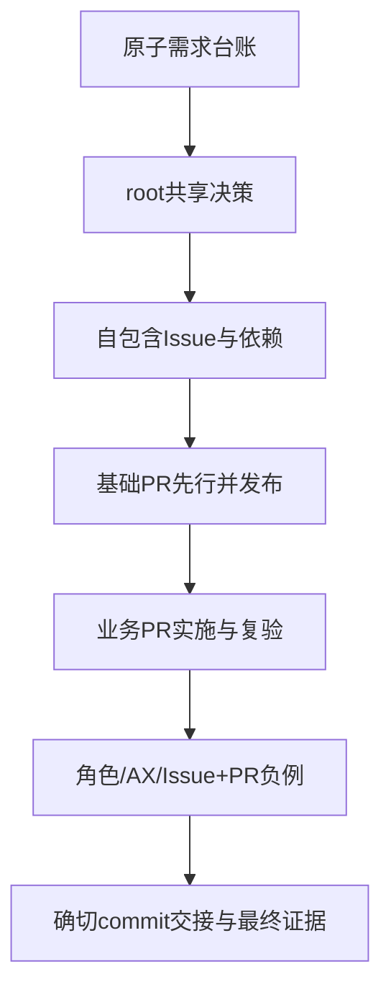

# GitHub缺陷到Harness改进：因果复核（调查中）

应用层已证结果来自public-requirements-followup.md。目标转为解释已证缺陷，不扩大失败项、不修改冻结应用、不重评。模型/组件选择与工作流程的因果待分层核实。

## 用户确定的产品边界

子Issue不自动继承父正文是刻意且正确的隔离；父任务显式交接相关原需求与设计依据，使子项自包含，不以自动复制父上下文修复遗漏。
每个Issue（root/sub）应实际获得产品设计→技术设计→验收方案设计→实现计划→计划排障与预演→交PR实现→Review的工作方法，按任务规模落实，不制造文档模板。
root先承担基础架构、脚手架、开发设施的设计与交付责任，通过其基础PR落实并验证可用；随后开启业务subIssue派发，最后组织聚合。不得把基础工作再次整体转为subIssue，也不让Issue Agent绕过PR直接实现。
此流程的具体权威文件、system/user instruction入口、技能导航与打包变更要先形成可复核方案；第十次迭代新实验未获启动。

## 已有证据与未闭环项

公开需求→根共享契约→子任务→实现与自测的三条缺陷链已在应用报告给出。root-reading-evidence.md排除了简单的“首次cat截断导致ROOT从未送达”：根随后分三段读完全部description；是否场景信息在提炼中遗漏须单独核对。
当前设计技能确有方法，不能用“装了”证明采用；子项未继承父正文不是系统投递故障。需要区分模型主动压缩的语义损失、指令要求先拆分的注意力顺序、原需求与共享契约之间的权威关系、验收是否重新对照原需求。
组件/图标假设应追查手写/返工量与时间注意力占用、进而与具体需求取舍关联；没有组件库或已有共享UI单独都不足以证明/否定该因果。

K2.7准备完成释放执行容量后，Astra continuation09_monitor 已成功接续独立审查；此前thread limit拒绝记录为历史状态。Sheet恢复由另一个6-Sol与主Agent继续，不挪用调查者。

## Astra 因果复核与最小修复方案

复核边界：只读当前 Harness 源码、attempt-09 continuation-03 原始轨迹及 `public-requirements-followup.md`、`root-reading-evidence.md`、`workflow-entry-audit.md`。不修改 prompt、源码、冻结应用或运行，不把新 dirty 源码的行为倒推成 continuation-03 已部署行为。

最早可审阅的偏离不是“子 Issue 没继承父正文”，而是 root 在读完 requirements description 后，先按“40 atomic”规划并派发，却没有把对象范围、非累积角色边界、精确 AX 角色和验收前提形成可核对台账。`root-reading-evidence.md` 证明首次 `cat` 截断后 root 又分三段读完 218 行 description，因此不能把缺陷归因于 ROOT 从未送达；root 在拆分前是否完整阅读 scenario steps 仍未知。

已证的三条放大链如下：

|链条|放大/漏检|替代解释排除|
|---|---|---|
|Write 只能查看 → 线性 `ROLE_LEVELS`|共享契约把操作级边界压成 `Triage+`，前后端同时放行；Bob/Write 实际关闭 Issue，且同规则覆盖 assignee/label/milestone；负例只测 Read/Eve|不是按钮显示错误，服务端已持久化 `closed_issue`/`reopened_issue`|
|Issue **或** PR 里程碑 → 只建 Issue 字段|拆分、schema、页面均未承接 PR 侧，最终没有 `pull_requests.milestone_id`|不是缺少组件库；没有库不能解释数据模型和路由均缺失|
|reviewer role option → button|实现与 e2e oracle 同向改写，正向点击通过但 AX 合同错误|不是 reviewer 持久化失败，请求和移除均成功|

组件库/icon 缺失只能作为间接成本假设：当前应用已有共享组件和 CSS；公开已证失败是权限、role、PR 里程碑。没有返工量、时间和需求取舍证据前，不把它列为根因。视觉技能存在也不能证明被采用。

### 最小修改位置

1. 在 `variants/pi-braid/run.py` 的 root prompt 或等价 workflow 指引中，要求首次派发前记录一页可读决策：关键跨模块旅程、对象/状态所有者、共享权限操作表、Issue/PR 并列范围、精确 AX 角色、共享接口和验收前提。只记录改变任务边界的决定，不造固定模板。
2. 在 root 共享基础 Issue/设计材料中用操作级矩阵表达 Write/Triage/Maintain/Admin 的允许和拒绝动作；子 Issue 引用原子 ID和矩阵，禁止用“`Triage+`”替代原文语义。权限实现按动作守卫，Harness不替成员决定产品策略。
3. 每个 root/sub Issue 自包含产品设计、技术设计、验收方案、实现计划、排障/预演和 PR 交接依据；父正文不自动继承。Issue/PR 并列对象分别列字段、入口和持久化。
4. 验收 oracle 为每个非累积边界加入相邻无权负例（Write/Bob），对精确 AX 合同断言 role/name，并为 Issue 与 PR 各保留代表路径；失败时回到原子需求而非改断言适应实现。
5. root 先交付基础 PR 并验证可消费，再开启业务 subIssue；新包记录 prompt/profile/skills 哈希和实际冻结来源，避免把新 dirty 源码行为归因到旧运行。

验证顺序应先审阅台账和共享契约是否保留原文，再查子 Issue 是否自包含并引用正确原子 ID；随后用 Write/Bob、Read、Triage 三个边界和 Issue/PR 两个对象走最小真实路径，最后核对服务端状态、AX 树、发布 commit 与 PR 交接证据。局部绿测不能外推官网总分。

确定因果是：操作级需求在 root→共享契约→子任务→测试 oracle 中被压成线性等级，造成 Write 越权；并列对象范围在拆分/建模时收窄，造成 PR 里程碑缺失；精确 AX 合同被实现形状反向定义，造成 reviewer role 错误。根 prompt 初次读取截断、组件库缺失、子 Issue 不继承父文正文均不是当前证据支持的首要根因。

尚缺证据：47 条公开需求逐例与官网失败项的完整映射、root 在首次拆分前实际读过哪些 scenario steps、视觉返工是否消耗可归因时间。补齐前不扩大失败清单，不把 16/100 解释成 Harness 单一缺陷，也不启动第十次实验。

## 按用户指定流程复核（不把题目语义硬写进 Harness）

### 根基础先行、再业务分派、最后聚合

|检查项|当前证据|分类|
|---|---|---|
|root先做基础架构/脚手架/开发设施并以基础PR验证|根 #1 明确要求共享基础唯一 owner；#2 在 03:08 左右写入栈、数据表、认证/API、权限和共享 UI 骨架；基础提交 `039dbd5` 早于 REQ-5 `d35b1ec`，后续 PR/最终合并有提交链|已有正确的流程意图和实际基础 PR 先行证据|
|业务 subIssue 在基础可消费后再派发|现有记录证明基础 PR 早于部分业务提交，但本批摘要没有逐个 `create` 与 `assign` 时间、基础 PR 可消费回执和首次业务派发的精确交叉证据|needs_review，不能判未遵循|
|最终由 root 组织聚合|最终 PR #13/合并 `c3fb22d`、根评论记录整合复验|已有正确；验收质量另按需求证据判断|

因此当前不能把“业务提前派发”写成已证 Harness 根因。最小补证是从 root 原生定向读取首次 `create`/`assign` 事件及基础 PR 可消费回执；若确有先后倒置，再修 root 的调度提示或交接门槛；否则保留现有流程。

本次补查已完成顺序核对：SQLite `events` 显示 PR #1 closed `05:06:14.174Z`；Issue #3/#4/#5 assign 分别为 `05:06:46.642Z`、`05:06:47.838Z`、`05:06:48.381Z`，对应开工评论在 `05:07:07–08Z` 明确写“共享基础已合入 develop，merge 012fb04”；第二批 Issue #6/#7 assign 为 `05:33:45.961Z`/`05:33:46.353Z`。基础 Issue #2 随后于 `05:10:52.683Z` reopened，基础修复 PR #3 于 `05:41:30.522Z` closed、Issue #2 于 `05:42:12.924Z` closed。故不能说业务派发早于基础 PR；可证的实际问题是第一批业务实现期间暴露了基础会话/种子缺陷，第二批派发时基础修复尚在进行。根评论 `05:34:43Z` 仍将 #3–#7 标为并行批次，说明并行安排确实存在，但尚无证据证明它违反“基础先行”——基础首版已发布。最小改进是把“基础 PR 可消费”与“基础回归缺陷仍开放”分开记录，是否暂停第二批由 root 依据影响决定，不在 Harness 预设门槛。

一条完整链为：Issue #3（REQ-1）在 `05:06:46Z` 指派，`05:10:17Z` 提交方案与验收设计；其 PR #2 交接评论 `05:38:30Z` 给出 head `1953081` 与 e2e/backend 证据；共享基础 PR #3 修复会话缺陷并于 `05:41:30Z` 关闭，Issue #3 在 `05:42:55Z` 更新为 rebase 到 `038e059`；PR #2 最终以 merge `354b198` 于 `05:50:12Z` 关闭，root 在 `05:51:07Z` 回 Issue 记录独立复跑 build、backend 27/27、e2e 72/72。该链证明方案→实现→基础修复→rebase→复验→Issue回收实际发生；不能把所有流程问题概括为“没有完整设计链”。

### 每个 Issue 的完整设计链与 PR 回环

|检查项|当前证据|分类|
|---|---|---|
|Issue 具备产品设计→技术设计→验收方案→实现计划→预演/排障|`group/provider.rs` 已给 Issue/PR 分工；SVC design/verification skills 可达；子 #2–#7 正文包含各自 REQ、种子/依赖和交付摘要，但没有逐项证明每个 Issue 都完成了全链|能力已接入，实际采用未完全可见|
|PR 独立实施、验证、Review|关联 PR 与独立 clone、commit、评审提交和最终合并存在；PR #7 的权限 oracle 仍漏掉 Write 边界|流程大体遵循；oracle 质量设计缺口|
|回 Issue 做验收与未决项收敛|根评论与最终整合记录有验收复跑；旧依据、子项自包含与父正文不继承均符合用户边界|已有正确但证据粒度不足；不建议强制每项新增模板|

这里的实际问题不是缺少一条“通用阶段流程”，而是**设计链中的保真交接和独立 oracle 不足**：原子需求在共享契约、子 Issue 和测试断言之间被压缩。Harness 应保持通用，只要求来源可追溯、并列对象不被遗漏、非单调规则保留和独立负例存在；不预制 Write/Triage 或 Issue/PR 的题目矩阵。

## 组件/视觉间接成本的有界取证

已有源码/提交证据：共享基础 PR #2 建立 `Form`、`RepoNav`、`StatusBadge` 等组件与 CSS；一条前端 PR（REQ-5/PR #7）沿用这些组件并实现权限控件，另一条 PR #13 在整合时修正种子与团队解析。公开报告没有给出组件重做提交数量、模型耗时或明确因视觉取舍删掉的需求。现有 27 张参考图和 vision 轨迹只能证明材料可达，不能证明 root 在拆分前完成了视觉系统决策。

因此，当前对“没有组件库导致工时挤压”的结论应标为 `needs_review`：可以合理假设手写 CSS/局部 SVG增加一致性维护成本，但没有连接到具体返工量、提交间隔或需求取舍的证据，不能作为 GH 缺陷根因或建议立即引入依赖。若要继续，只需定向比较共享基础 PR 与一条前端 PR 的重复样式/组件重做、对应提交时间和是否因此删减需求；没有连接证据就保留缺证，不扩大调查。

## 修复方案的通用化表述

把先前题目化的建议改写为以下通用处理：

1. **保真需求交接**：root 在业务派发前把会改变边界的对象范围、状态所有者、共享接口和验收前提写入可读 Issue/材料；子 Issue 继续自包含，不自动继承父正文。
2. **非单调规则保留**：共享设计和子项引用原子需求中的允许/拒绝关系，禁止用“更高角色都包含低角色”或类似单调排序替代原文；Harness 不知道具体领域角色。
3. **并列范围枚举**：对需求中并列的对象/入口逐一登记并交给对应实现 owner，防止只建模其中一种；仍由成员选择 schema 和 UI。
4. **独立 oracle**：对每个边界保留至少一个相邻无权负例、精确可访问角色和真实持久化检查；断言来源独立于实现，不把局部自测绿灯当产品验收。
5. **证据闭环**：基础 PR 先行、业务 PR 交接具体 commit 与检查证据、root 回收未决项；只有在事件时间证明流程倒置时才修改调度提示，不预设所有项目都需新 gate。

这五项是可审阅的方法约束，不是 Harness 预制 GitHub 语义。验证优先级为：先定向补齐基础 PR/首次业务 `create`/`assign` 事件；再抽查一项完整 Issue→PR→Review→Issue 验收链；最后核对需求保真和独立 oracle。若证据显示流程顺序已遵循，则只修交接/oracle，不重写通用流程。
