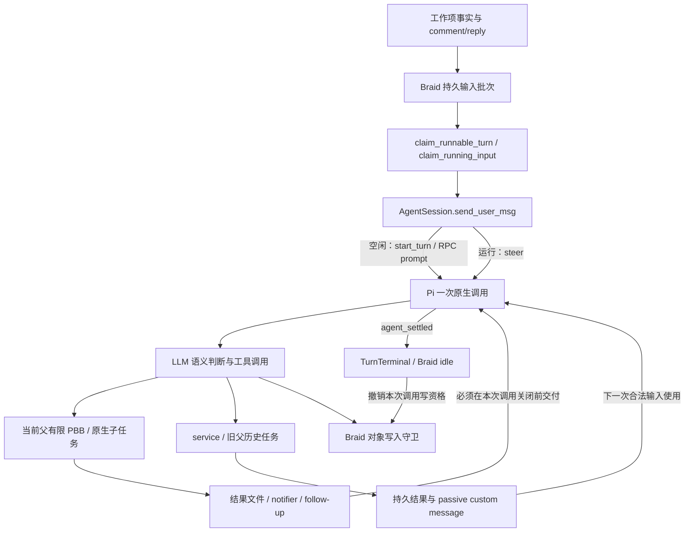
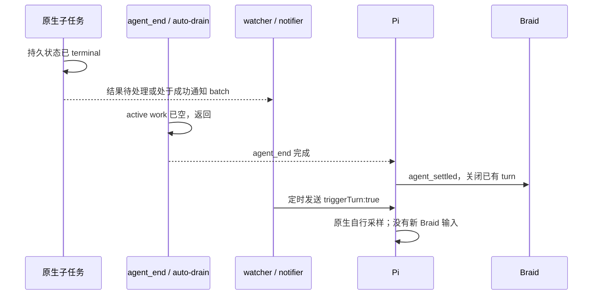

# 执行结束与异步输入：产品与架构审计

结论：保留 Braid 工作项调用与 Pi 内部执行的分层，但应补齐一个明确的接入契约：**原生会话可以持续存在和积累事实，只有已接受的 Braid 输入可以打开一次调用；当前调用产生的有限工作及其必要回执必须在关闭调用前排空，关闭后到达的事实不能自行采样。** 这不是新增业务状态机，也不是让 Braid 接管子任务。FR1 的 `triggerTurn:false` 是历史结果路径的正确局部修复，但不能据此认定所有正常或异常异步续轮入口已收口。

本报告只读当前源码与既有定向报告，没有执行测试、探针、构建、模型或实验，没有更改实现或提交。读取期间主线已将 observer 改为 `triggerTurn:false`；以下把旧 FR1 机制与当前树分开。依赖证据来自本机锁定 Pi 0.85.1 及 pi-subagents 源码，根路径为 `/Users/lanzhijiang/.cache/factory26/runtime-faf60473273ddeed/node_modules/`。缓存接口核对不等于冻结制品已应用工作树补丁。

## 产品义务与终态判定权

[Factory PRD](../../../../docs/prd/index.md)明确由 LLM 持有任务语义、拆分、协作和验收判断；跨工作项通过 comment/reply 交换事实，原生子任务只服务所属工作项。[技术说明](../../../../docs/product-tdd/index.md)明确 Braid 不管理 Pi 内部子代理生命周期。这些边界合理；不能因为一次时序错误就把工作流决策搬入调度器。

| 真实义务 | 应由谁承担 | 不应偷换成什么 |
| --- | --- | --- |
| 判断工作是否完成、哪些结果必要、是否继续或重派 | LLM；通过工具取得事实并表达决定 | Braid 根据子进程数量推断业务完成 |
| 接受输入、给一次执行建立身份、终止后撤销写资格 | Braid 的输入批次与 AgentSession 接口 | Pi 进程存在便持续有写权 |
| 当前原生调用的工具、有限作业、子任务及回执能完成或给出具体失败 | Pi 和扩展；适配器将确定执行终态投影给 Braid | 最后一句 assistant 回复即所有活动结束 |
| 历史任务身份和成果可找回、避免无依据重复派写任务 | 原生持久记录与 observer 的只读索引，LLM 决定使用 | 新父看见结果便自动接管旧任务 |
| service 可以跨多次调用存活，状态可查询 | PBB 的显式 service 契约 | service 必须退出才允许一次调用结束 |

“每条历史结果或服务退出都应立即唤醒闲置成员”不是上述 PRD 的必要推论，当前没有看到明确产品承诺。它是一个可选择的主动响应产品要求，包含成本、恢复后是否仍需处理、对象已结束时如何处理等差异，不能从 `triggerTurn:true` 的现状反推它必不可少。

因此至少有五个不同事实：进程存活、持久会话存在、本次调用正在执行、某个原生任务尚有工作、业务已完成。前三者不能互代；后两者也不能由 Braid 自动解释。Pi 报告的是执行终态，LLM 决定的是业务终态。

## 当前真实调用拓扑

具体入口不是抽象设想：`sources/braid/src/group/dispatch.rs:450–631` 先领取已有输入，再通过 `send_user_msg` 投递；Deferred 保留批次重试。`provider/session.rs:256–298` 区分 running steer 与 idle start，拒绝两者不符。`provider/pi.rs:372–412` 在 RPC prompt 接受后产生 provider turn，保留被拒绝的初始 context；stdout 在没有当前 turn 时只记 idle activity，不替原生自发活动补造 turn（同文件约 492–533）。

Pi `agent-session.js:773–810` 等待 agent loop、扩展 agent_end、retry/compaction 和已有原生队列，最后发 `agent_settled`。Braid `provider/pi.rs:583–608` 将其投影成 TurnCompleted，`provider/session.rs:181–199` 清本次 turn。`objects.rs:197–205` 除运行中的 turn/provider 外还要求有效 assignment/agent 与未封存 run。这解释了为何改 writer 条件不解决问题：错误活动在写命令之前已可能花费模型、执行 shell 或修改文件。

输入保存和采样启动也不同：Pi `sendCustomMessage`（`agent-session.js:1099–1138`）在 `triggerTurn:false` 时将消息写入或暂存至本轮结束，不要求再产生一条 assistant；`true` 在空闲时直接 `_runAgentPrompt`。所以“已经通知/保存”不等于“模型读过并采取行动”，也不等于“为一次新调用获得授权”。Braid 的 RPC acknowledged 同样只表示接受，不是语义消费证明。

## 关键时序与仍缺失的边界

既有 [Sheet349 原始链汇总](../writer-followup.md)证明旧版本有限 PBB 未被排空、Braid turn completed 后原生继续，最终遭 writer 拒绝；它不证明当前补丁或 observer 分支已经在真实运行重现。当前 PBB 补丁把有限作业登记到 background-work，并在 headless agent_end 等 completion、冲刷回执；service 保存而不触发下一轮。这是在原生边界修根因，层次正确。

FR1 说明另一种身份错误：旧父任务归属没转移，但新父 watcher 曾因为“当前 session 未变”就 `triggerTurn:true`。主线当前改为被动记录，是正确的历史可见性语义。新父可以在合法回合主动检查旧任务，不能据此自动等待所有历史任务，更不能重新绑定它们。

然而只读接口核对又发现两个不能被 FR1 或 PBB 局部修复覆盖的条件窗口：

**A．原生子任务的执行排空不等于通知排空。** `pi-subagents/src/extension/index.ts:720–724` 的 headless agent_end 只等待 `drainOutstandingWork`；`runs/background/auto-drain.ts` 按 active runs/provider work 清单判断结束，没有等待 notifier。`subagent-wait.ts:570–650` 在执行状态终止后返回，明确提示通知可能尚不可见；auto-drain 未将返回的 completion 内容交给父模型。`notify.ts:388–392` 的成功通知仍放入 batcher，默认 debounce 150ms、max-wait 1000ms（`completion-batcher.ts:28–36`）。result-watcher 接受结果后才异步等待 notifier，其 owner 校验是 session/completionOwner/epoch，而不是当前调用（`result-watcher.ts:218–225,525–545`）。

这是由现有异步边界允许的时序，未动态验证实际发生率。若结果已排入 Pi 队列，或其它 handler 使 batch 先冲刷，则仍在合法调用内续轮；反证不能只展示一次成功排空，必须对齐最后任务终态、通知进入原生队列与 settled 的顺序。关闭 batching 只能缩短窗口；它不能证明文件 watcher 已处理完最后结果，因此不是完整根治。

**B．agent_end 抛错并不阻止 settled，也不自动成为 Braid failure。** auto-drain 默认 30 分钟，超时、读取异常或 tracked provider 消失等可返回错误并 throw。Pi `extensions/runner.js:623–650` 捕获 handler 异常、emitError 后继续；`agent-session.js:773–788` 仍在 finally 发 settled。Braid 又按最后 assistant stopReason 判断 completed/failed，未把该扩展错误映射为本次调用失败。当前同父 watcher 未因此撤销，迟到结果仍可 true。这里不能说任意单个子任务失败都会提前放走兄弟：all:true 通常仍等待最初集合，失败只是排空结果的一种错误。确定风险条件是屏障退出而结果或任务仍在途。

这两条是源码机制发现，不是新的实跑故障结论；已即时回传主线。它们支持把“排空到哪一层、屏障失败时谁收口”提升为明确原生接入契约，而不是逐个增加“等一下”补丁。

## 所有权、可见性与输入积累

observer 按父保存活动/历史清单，同工作区旧父作为 previousRuns 展示，当前父 pending work 不纳入旧任务；这是必要区分，应保留。冷恢复有持久结果不等于旧进程仍存在；状态无法核实时应继续显示 unknown，不把它自动改成失败、完成或需要重派。

同一个 native session 在多次 Braid 调用间仍可保存 service/历史结果，恢复或后续合法 prompt 可读到。代价是没有新输入就不保证立即消费。`triggerTurn:false` 在运行中也不是“立即 steer”：消息可能到本轮结束才追加，所以若该结果是当前交付依赖，LLM 必须在有效回合查询/等待，或原生有限工作屏障必须把它作为必要回执交付后再关门。不能把历史消息保存成功写成任务闭环成功。

若将来要求闲置成员主动处理，应让 native adapter 把带原始 owner、run 与结果引用的事实交回 **Braid 已有输入接纳/批次入口**，由现有 assignment 与对象存活规则决定路由，再经 `send_user_msg` 正常启动。当前接口没有现成的“任意 native completion 唤醒”调用，不能假称只换一个参数即可；也不能让闲置原生进程用失效 writer 给自己写评论制造合法输入。Braid 只需接纳一个外部事实，不必轮询或管理内部任务状态。目标成员已退役时，保留可见性与重新指派必须按产品要求区分。

## 选项与推荐

| 选项 | 收益与代价 | 用户可观察的改变 |
| --- | --- | --- |
| 只保留 FR1 窄修与当前 PBB patch | 最小改动，修了已定位历史通知和有限 PBB 路径；没有覆盖 A/B | 历史/service 不再自动响应；同父子任务边界仍未闭合 |
| 简化为所有异步结果只记录，LLM显式 wait/status | 可删掉自主续轮入口，协议最容易说明；但仅机械改 false 会使 auto-drain 结束后没有父模型分析结果 | 必须把“父模型读取 wait 工具结果并继续”作为采用方式，否则当前有限任务可能无人收尾；改变现有自动 follow-up 体验 |
| **推荐：保留分层，收口原生调用与结果交付边界** | 当前父有限工作与其回执排空到原生队列，正常续轮均留在同一调用；settled 后只积累事实；屏障失败明确结束为失败/未知并禁用独立续轮。改动应集中于原生 session/notifier 生命周期与 adapter 错误投影，不新增 Braid 子任务表 | 保留当前有限任务自动收尾；历史/service 无新输入时不保证立刻处理；失败不再伪装成功 |
| 增加 native completion → Braid 输入桥 | 闲置也可及时处理，恢复后可投递；增加路由、去重与投递确认要求，必须定义旧 owner 和关闭对象行为 | 晚到结果可多花一轮模型费用；可能在原任务交付后再次激活成员，需要用户明确选择 |

推荐第三项的设计方向，FR1 保留为其中一个结果分类的实现。不是要求现在直接实施广泛重构：先利用已有 notifier/pending 队列与原生 run-active 边界，明确一次调用的关闭线；同父有限任务的“执行完成→结果被接受→必要后续采样完成”属于该调用内部。任何入口在关闭线后只保存，真正需要再次执行才返回已有调度输入。检查 `isStreaming` 然后另行启动仍可能存在检查与动作之间的竞态，不能把宿主进程存活或一个旁路布尔量当最终授权。

更省事的产品替代是第二项，但它把自动收尾责任转给显式工具调用及模型采用，不能只为了少改代码悄悄削弱原承诺。让 Braid 管理每个 Pi 子任务、放宽 writer、固定宽限期、无限保活整个会话，都不符合已确认职责，也没有需求依据。

## 待决定与最小后续证据

无需用户重新决定“失效调用不能自行采样”或“历史可见性不转移所有权”。需要用户决定的产品差异仅是：历史结果/service 退出是否必须在闲置时主动处理；以及是否接受全面显式 wait 取代当前有限任务自动收尾。当前 PRD 足以支持暂按被动积累历史事实、保留当前有限任务自动收尾的推荐。

若后续获准实现，权威技术说明第75行应同步解释有限工作与service区别、执行终态与通知接受边界，而不只提醒模型取得退出码。原生接入细节归 Pi/Braid 对应接口说明，Factory 不复制调度器内部模型。

最小后续证据沿已授权真实生成定向获取：对一次最后原生子任务完成，对齐 terminal、notifier 接受、父下一段采样及 agent_settled；对自然发生的屏障异常保留具体错误与 Braid 终态；对历史结果观察 settled 后只写历史、下一合法输入能够找到结果；对没有后续输入的场景明确记录“已保存、未承诺消费”。没有自然发生的条件继续标未证，不新增测试/探针/模型实验，也不为造证据重跑两题。
