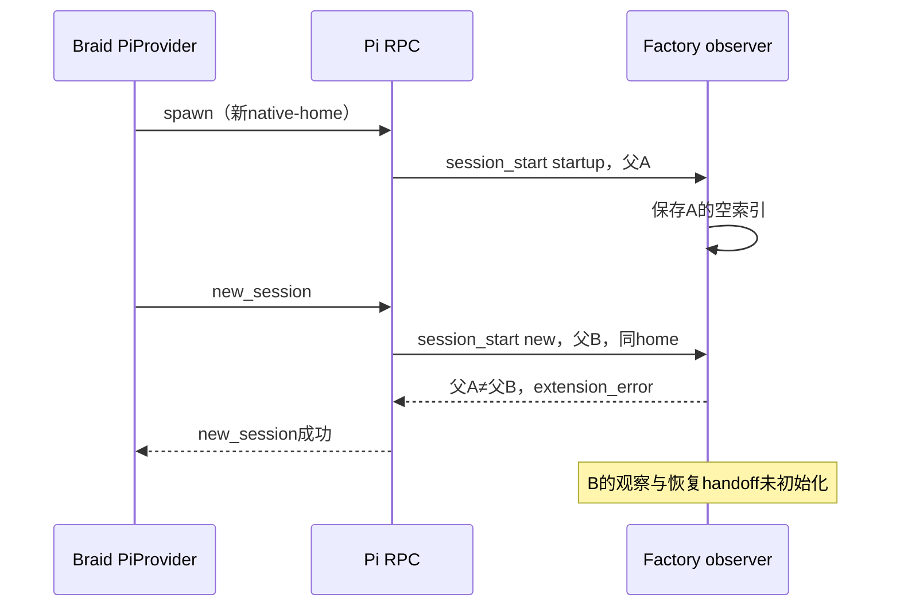

# 最后一次独立修复复审

本轮以用户产品边界、29项修复、12项增补和Z01–Z03为范围，重点独立核对恢复身份、职责与技术生命周期。读取基线为本目录 `source-snapshot.json`。未改源码、原应用、原始证据，没有运行测试、探针、实验、应用或评分；既有报告只作带出处的证据，不冒充本轮行为验收。逐项深度见 `coverage.md`。

结论：有一个应在新制品冻结前修复的确定回归。Z01正确补上同父恢复的索引保留，但把“同native-home”误作“必定同父身份”，与当前Braid正常fresh启动协议冲突。F2收敛本身可以接受，并非必须通过收养旧任务或无限保活来实现；它仍需以旧任务可见、状态未知不等于停止、结果适用性由当前负责人判断为条件。其它修复没有发现足以支持整树回退的新问题，其模型采用与评分收益仍未验证。

## FF1：正常fresh启动的新身份被当作索引损坏，观察及恢复交接失效（P1，确定静态机制）

关联R11、Z01，牵涉R15/R16的连续性。故障源位于两个活动variant的 `extensions/factory-subagent-observer.ts:103–110`：只要清单存在，父ID不等于当前ID就抛错。此判断不是仅在异常或用户手动切换时触发。

证据链来自当前源码与本机锁定Pi 0.85.1包：

1. `sources/braid/src/provider/pi.rs:308–313` 的正常 `start_session` 先spawn，再发送RPC `new_session`；spawn不带 `--session`。
2. Pi `dist/modes/rpc/rpc-mode.js:289` 启动先调用 `rebindSession`。`dist/core/agent-session.js:1926` 触发startup `session_start`。observer第328行调用 `observe({})`，即使没有子任务也写入父A的清单。
3. RPC `new_session` 在 `rpc-mode.js:336–342` 调用 `runtimeHost.newSession`，然后再次bind。`dist/core/agent-session-runtime.js:147–173` 新建SessionManager，保留同一个agentDir，生成父B并发reason=new的 `session_start`。
4. observer创建父B时读取同home的父A清单，在身份检查抛错。第330行之后的旧run扫描、持久入口与watcher初始化不执行。`observer ??=` 的右侧未成功，因此随后需要 `current()` 的子代理事件仍会重遇该清单。
5. Pi `dist/core/extensions/runner.js:631–649` 捕获handler异常并报extension_error，RPC new_session仍能成功。这限制了影响结论：不是证明Braid启动必然退出，而是“主会话看似成功、observer观察与handoff缺失”。也不能说原生子代理必定执行失败；该扩展并不拥有它们。

所读原生包根：`/Users/lanzhijiang/.cache/factory26/runtime-faf60473273ddeed/node_modules/@earendil-works/pi-coding-agent/`，package.json版本0.85.1。未运行该包。

根本修复应区分同父恢复、正常新会话和真正损坏，而不是取消身份校验或吞掉全部错误。同父继续合并既有条目；正常启动产生的前置空清单不应阻止新父初始化；如支持同home切换有内容的旧父，旧记录不能改挂到新父或被静默丢弃。可以在真实session_start生命周期中解决，或移除Braid中确无必要的二次创建，但后者会扩大provider语义核查范围；不要求新任务生命周期系统。

本项已及时回传主线。它是源码可确定的路径冲突，不是本轮实跑复现；修复后应在已授权真实生成中检查正常startup/new、同身份resume、清单与handoff的连续性。不得为此新增或换名运行被禁止的测试。

## FF2：F2收敛的能力边界可接受，但它不是旧任务完成保证（R11、Z02）

原始故障是新父在同一工作区重复派发仍在活动的写任务。`tasks/factory-subagents/cells/iteration10-role-audit.md:30–37`给出两个executor时间重叠与旧身份未消费的证据，并明确未证同文件写冲突。这首先要求重建时能知道已有谁在做、状态与成果入口在哪里；不直接推出每个历史任务必须被新父接管或令新父永不结束。

当前observer在首轮提供同工作区旧run索引，在消息构造时重新读取原生status/result/meta；状态缺失显示unknown，而不是failed。它在存活期间转送终态，并明确这些条目不转移所有权。父指令要求恢复先按旧ID查询状态/产物，executor要求检查已有负责人。这组合保留了避免无知重派所需的信息与决策边界。持久文件不是pending-work，Braid不需要解析它；同父恢复原生pi-subagents还具有restoreActiveJobs、恢复wait订阅和结果扫描，不应由Factory另造同一机制。

因此，不以关闭父以后不能自动唤醒为由要求adopt或无限保活。任务是否仍属必要责任是LLM的判断；尚需结果时不应把工作项当作已交付，未知状态也不能当作可以安全重派的证明。有限PBB当前任务的完成等待与历史run观察是不同职责，不能类推为所有历史run都应注册pending-work。

限制仍存在：此机制不能保证新父一定读取并采用结果，不能保证旧执行仍存活、冷恢复一定具有原生临时状态，也不能保证已关闭后无人再恢复时还收到通知。若用户要求的是“无论父是否存活，必要在途任务的结果自动送达并推进”，当前实现不满足；本轮依据中的核心需要尚不足以要求那项新增产品能力。FF1未修前，正常fresh路径甚至无法可靠建立上述handoff，所以目前不能将F2标为实际闭环。

## FF3：Sheet新增证据支持已有通用修复，BodyArgs是恰当的窄入口修正

Sheet最终报告的普通编辑误用恢复豁免、重叠规则优先级相反、pivot成功写入未同步其它表公式缓存，都是“真实调用/修改路径与跨组件不变量未被一起核对”。当前SVC technical明确用途变化即契约变化、追调用者到判定/写入、旧豁免前提；implementation要求同一次修改更新消费者，并经过真实入口；check-design要求可达交叠和真实跨组件结果。pivot新证据不要求Harness知道Sheet公式业务；它检验下一轮是否真正采用这些方法，不能再加题目专用规则来冒充通用改进。

`BodyArgs`同时被Issue/PR/comment操作复用，源码99–124行已有文件和stdin读取。Z03只让help暴露该入口、指出内联shell展开；问题发生在shell先行处理文本，CLI事后自动转义无法还原已执行或丢失的内容。当前做法针对能力发现，不是修复解析器；未证明模型以后必然采用。无需新自动转义器。

报告所述pivot路径是静态推导，最终58/100与7/24没有逐例错误；本轮没有动态重现、没有重新全读263会话，不将任何过程失误直接分摊为官方失败数。GitHub已修的seed/session问题同样不重新计为最终缺陷。

## 仍需在获授权执行中观察的事项

PBB补丁把有限job纳入原生pending-work并在agent_end内冲刷follow-up，职责正确；无UI child不加载subagents，PBB自己的等待补上这一边界。此前加载成功不证明完成→结果入队→父消费→settled顺序，也不证明取消能及时结束等待。service排除与未分类长任务同样需要真实观察。保留原有F3，不臆造固定超时。

正式平台Node20.19.3/npm逐目录安装与开发工具Node24/pnpm是两种环境；RUN_CONDITIONS已明确兼容和独立安装，预打包没有改交付协议。生成自检成功仍不能代替正式启动反馈。保留原有F5，不增加第二套框架。

这些是效果或时序证据缺口，不与FF1这个确定回归混为一类。完成FF1消费后，可按主线已有授权推进WSL两题生成与各题冻结后的官网self_funded重放；本轮审查没有另发实验授权，也没有更改该范围。
