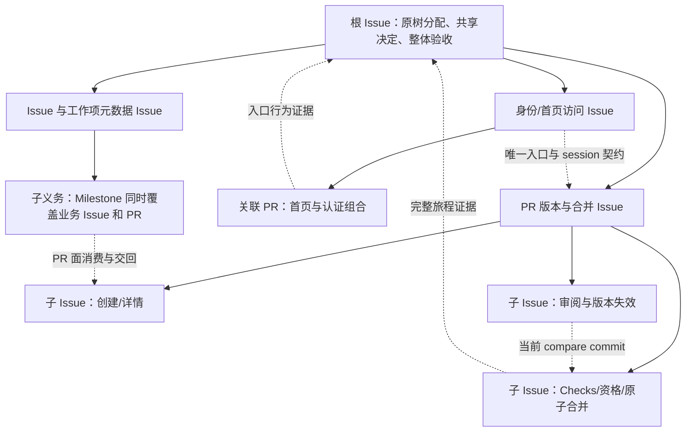
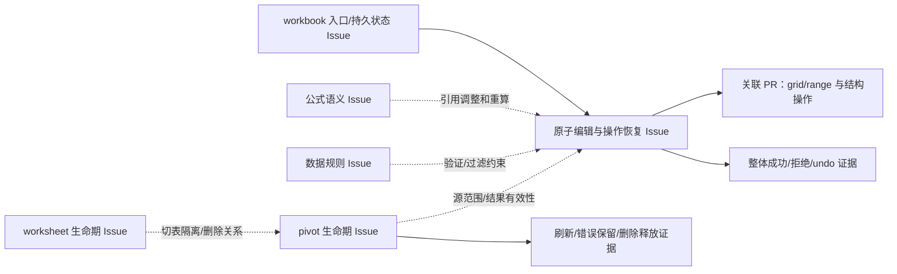

# 利用 Requirements 树组织 Braid Issue/PR：研究结论与实施前规划

2026-09-30。状态：研究与方案已形成，等待用户复核；未实施、未创建工作项、未运行生成或评测。

**建议采纳用户提出的方向：以原始需求树作为理解、初始分域和覆盖追溯的骨架，让 Issue 承担需求及验收责任，让 PR 承担候选实现和证据交付。默认从内聚子树形成工作包；当一个用户动作跨越多个分支时，按完整实现与验收单元组织，并保留所有原节点身份。** 要研究的不是“树好不好”，而是树中的义务怎样完整地到达负责人、实现者和验收者，跨项排除怎样仍有人承接，以及何种证据足以关闭这些义务。

初步结果支持从方法改进开始。Braid 已有正文、评论、关联、订阅和折叠能力，早期也已有相应方法规则；但关系不自动继承父层约束，合并/关闭不自动完成责任交接，原需求被引用也不证明行为被覆盖。不能用新提示的存在承诺模型遵守，更不能承诺提分。

简短复核入口见 [决策摘要](decision-summary.md)。两份有界独立研究分别提供 [107 个原节点的完整责任映射及六个例子](mapping-review.md)、[Braid 历史/当前能力边界](context-boundary-review.md)。本文是方案及后续工作的主入口，不复制两份附录的全部事实表。

## 1. 研究对象、已知事实与不作出的推断

### 1.1 原树及原始身份

| 题目 | 原始输入 | SHA256 | 实际结构 |
| --- | --- | --- | --- |
| GitHub | [requirements.yaml](../run-audit/github/requirements.yaml) | `bdc17d23265a6b1948aec150e69d0b2accfa37db4c569305c97be7ff7f3b0b8f` | 65 节点：18 FOLDER（含 ROOT）、47 ATOMIC；100 scenarios；73 条显式依赖 |
| Sheet | [requirements.yaml](../run-audit/sheet/evidence/input/requirements.yaml) | `9cddf67be50748106289ed158648629a6c50c30a490d0eda5bd570c557440b96` | 42 节点：18 FOLDER（含 ROOT）、24 ATOMIC；100 scenarios；49 条显式依赖 |

本轮读了两树全部非叶 description、完整结构及重点原始叶/场景，有界映射研究覆盖所有节点身份。没有把旧报告的 47/24 叶子摘录当作完整需求，也没有重新阅读两题全部原生会话。107 节点的责任表是可复核候选分配，**不是 107 个条款都已有正确行为证据的声明**。一段 description 可包含多项义务，一个 scenario 也可同时约束入口、初态、动作和刷新结果。

后续运行必须冻结实际输入；此处哈希只是研究来源，不把它写成所有未来题目的永久版本。场景没有独立稳定 ID，名称还可能重复；使用“输入版本＋节点 ID＋scenarios 数组位置/原文位置”定位，不靠名字去重。条款需要细分时保留原文段落位置，派生的行标签只是索引，不能制造第二套需求编号或改变原文。

### 1.2 完整过程研究带来的约束

| 已证事实 | 对规划的约束 |
| --- | --- |
| GitHub 初始 ATOMIC 平铺漏掉 FOLDER 正文；REQ-6 父层规定首页唯一 Sign in，最终 shell/body 重复，自验直接去 /login | 输入处理必须包含非叶自身要求；共享入口的最终组合与从入口开始的旅程各有责任。不能据此宣称解释全部官方失败。[断点报告](../github-requirement-breakpoints/report.md) |
| M6 两次看见跨业务 Issue/PR 能力后仍按模块前缀排除；根读到了排除，却未形成接手闭环 | 要改变排除决定的完成条件，不能只加强通知或让 Agent 再读一遍方法。[完整 GitHub 研究](../braid-context-methodology/report.md) |
| PR23 `fa9e3624/L48` 认为已有 spec mapping 无须重建，`45506478/L71` 放弃原需求交叉核对；47 个 ID 全被引用，仍不能证明各对象/角色/状态 | 树到 Issue 的分配映射与需求到证据的语义映射分开复核。最终整合保留一次从原树出发的义务检查。[PR23 原始过程](../braid-context-methodology/final-pr23-flow.md) |
| PR23 194/152 通过及 main `442dc1c` 交付真实；isolated 日志失败被 packet 绑定为另一轮成功，另有同名覆盖 | 保留真实通过，纠正证据身份；一次执行一个入口，报告结论必须对应同次原始结果。不能将错误的一行证据扩成所有检查虚假。[同上](../braid-context-methodology/final-pr23-flow.md) |
| Sheet 全程使用 Issue/PR、advisor/vision/explorer；反例改变粘贴事务、公式错误隔离、排序引用和透视状态 | 保留有价值的跨域协作，聚合工作包不能取消共享消费者或独立反例。不能用 I11 末段无新 spawn 解释全程或两题分差。[Sheet 完整 lineage](../sheet-effectiveness-analysis/full-lineage.md) |
| 两题都有当前 head 多处镜像、自编辑/隐藏后重建、反复核对，也有停止维护及接受旧证据的正例 | 当前事实各有归属，整理须有触发条件和停止条件；无需为减少字数删除未决项。[中段](../braid-context-methodology/middle-content-evidence.md)、[接续](../braid-context-methodology/continuation-flow.md)、[根收尾](../braid-context-methodology/final-root-flow.md) |
| resolve 回复实际折叠整串历史前缀；发生误用后恢复，未证业务损害 | 按可独立关闭的议题组织 thread；不能把“被折叠”或长度当作低分原因。当前已有范围回执，不重复规划已实现功能。[运行语义](../braid-context-methodology/runtime-semantics.md) |

使用的已有报告还包括 [GitHub 机制前瞻](../../pi-minimal/github-score-analysis/i11-mechanisms-forward.md)、[框架核对](../github-requirement-breakpoints/framework.md)、[Sheet 实效](../sheet-effectiveness-analysis/report.md)。前瞻报告里“PR23 原始记录缺失”已被完整 lineage 补齐；[旧 comparison](../sheet-effectiveness-analysis/comparison.md) 已撤回以接续阶段差异解释全程的口径。两题最终评分是不同题目和历史条件下的结果，没有可据以比较协作方案净收益的控制实验。

## 2. 从树读出什么，保留什么结构

原文件仅有 FOLDER/ATOMIC 类型；以下是为了分配职责而作的语义分类，不改原 schema。

| 语义类别 | 两题实例 | 组织方式 |
| --- | --- | --- |
| 产品范围与全局不变量 | GitHub ROOT 服务端权限、原子持久化、seed；Sheet ROOT 排除实时协作等 | 根 Issue 保持最终责任；适用到具体操作的条款进入工作包读取范围 |
| 领域/对象定义及生命周期 | REQ-1 account/session；REQ-6 PR/current compare commit；Sheet workbook/worksheet | 适合形成上位 Issue；同时决定共享状态的唯一解释入口 |
| 父层组合约束 | GitHub REQ-6 首页唯一入口；Sheet REQ-1 稳定打开状态/ARIA，REQ-3 整体失败回滚 | 单独保留义务和验收责任；不能由所有子叶已关闭推导满足 |
| 可交付行为 | 登录、创建仓库、CSV 导入、输入公式、透视刷新 | 内聚行为可聚合为 Issue 或子 Issue；PR 切分依据实现/审阅边界 |
| 操作专属权限与例外 | Write 可评论但不能改 Issue metadata/status；非作者才能 review；Sheet 特殊 0–100 错误文案 | 原文精确条件进入判据，不做“更高角色自动允许”“统一文案”式归并 |
| 初态与使用场景 | public 仓库访客、隔离 PR seed；Q3 Sales、不同表的 filter/validation | 是行为前提，不默认新增产品功能；损坏/冲突文本留未决解释 |
| 跨分支共享概念 | GitHub session、repo 可读性、milestone、commit；Sheet range、raw/result、validation、undo | 指定语义 owner 与消费者；复用定义，不在各 Issue 重建副本 |
| 原始 dependencies | GitHub REQ-6→REQ-4-3；Sheet 切表→filter/validation，删表→pivot | 保留原边，再解释是上下文、状态一致性、验收前提还是实施阻塞 |

**继承是语义适用，不是字符串拼接。** 工作包要读取目标节点、祖先正文、显式依赖，以及从对象/状态/入口发现的跨分支条款。只取祖先闭包仍会漏掉 G1 首页实现必须消费的 REQ-6 入口约束，以及 CSV 导出必须消费的 Sheet REQ-5-1-2 隐藏行语义。父层和叶子冲突时回原文判断作用域/明确例外；没有明确优先关系就记录歧义，不自动取最严条件或最新评论。

GitHub 原文 REQ-5-3-3 明确跨业务 Issue 与 PR 的是 **Milestone**；REQ-5-3-2 的 Labels 标题及正文指 Issue。历史交接有“PR 标签/里程碑”的合称，规划不得据此擅自增加 PR 标签要求。这个例子本身说明：研究摘要、项目契约及工作项说明均不能凌驾原需求。

Sheet scenario 有占位污染。暂行取法是完整 description（含父层）和可读场景相互核对，保留损坏原文及未决范围；不能简化成“只信 ATOMIC”，再次丢掉父约束，也不能猜测隐藏评分逻辑补写需求。

## 3. 比较可行组织方案

| 方案 | 可取之处 | 成立条件与成本 | 两题反例 |
| --- | --- | --- | --- |
| A. 全树直接镜像：FOLDER→父 Issue，ATOMIC→子 Issue | 原身份与责任导航直观；容易看见未分配节点；适合叶子确实独立的输入 | 每叶有足够工作且可独立交付；父 owner 必须负责组合义务；跨树依赖仍要明说。无人负责的目录 Issue 不应为形状而指派 | G milestone 横跨业务对象；S 结构/公式/验证/undo 属同一操作。47/24 叶逐个启动可能制造大量接缝，但数量大本身不是否决理由 |
| B. 子树为责任单元，按内聚结果聚合叶子 | 利用天然分域；源阅读/责任容易对应；少些没有独立决策的中间对象 | 父约束保留，聚合后仍能反查每节点和未决场景；大分支按真正独立交付继续拆分 | 整个 G REQ-6 放一项可能太大；只按 REQ 前缀划界仍会重复 M6 排除 |
| C. 保留树追溯，按完整实现/验收单元组织 | 更容易闭合跨分支原子操作和入口旅程；代码 owner 与整体结果责任清楚 | 需要稀疏分配索引；语义 owner/集成 owner 区分；不能退化为仅按 UI/API 文件夹分工 | S 编辑、行列结构、undo 可聚合；若把所有共享状态聚到一项，又会把真实独立工作串行化 |

**推荐 B 为默认、C 为有证据的例外；A 保留为可比较候选。** 先沿树理解并提出分域，再用三问决定是否开独立工作项：是否有独立要作出的决定/交付？能否写出清晰的输入、输出和验收边界？分开后是否有人承担共同结果？答不清先留在上位 Issue 内，不根据深度、角色或场景数自动开项。

一个 FOLDER 可以只是原始阅读索引；一个 Issue 可涵盖多个相邻叶或跨分支动作；一个节点可由多个 PR 分步实现。来源节点的主责任单元保持唯一，子任务承担其中明确义务，父 owner 负责汇总。一个 PR 也可关联多个 Issue，但关联越广，正文与评论变动造成的重建面越大。小而内聚的子树可以直接镜像，例如 Sheet workbook 创建/打开/重命名；并不要求为了推荐方案把它打散重组。

## 4. 完整追溯与唯一权威：最小信息模型

不新建需求服务，不复制一份“清洗后 requirements”供各方自行修改。原树维持业务要求权威；项目共享文档只保存已决定的实现契约；工作项负责分配和当前工作；证据负责观察。若确需改变题目要求，须是显式外部授权的新输入版本，不能由 Issue owner 的排除悄悄改写。

| 信息 | 唯一维护位置及职责 | 其他位置怎样引用 |
| --- | --- | --- |
| 原始要求及场景 | 冻结 requirements 输入；完整节点 ID、层级、依赖、文本/图入口 | 按版本、节点及位置引用；必要的关键例外可短摘并保留源定位 |
| 要求分配 | 根维护一份 source→主 Issue/义务分派的稀疏索引 | Issue 反向指自己的源范围；索引不复制每项活动 head 或全文判据 |
| 稳定共享契约 | 现有项目架构/领域文档中对应一处；具名语义 owner | 指定发布 commit 和段落；评论保存决定来源，消费者说明采用的版本 |
| 需求解释、验收责任和开放义务 | 所属 Issue description；根只保跨域未承接与整体验收门 | PR 引用该 Issue 与原源；已有 packet 不再维护同一组动态状态副本 |
| 实施计划和局部恢复 | PR 接续该任务 packet，记录当前计划、阻塞、下一行动 | Issue 指向 packet；按仓库既定方法复用，不另造“需求树 packet”模板 |
| 候选、审阅与证据适用性 | PR description/审阅 comment；证据文件按一次执行冻结 | 根与已完成模块保交回入口，不追逐每个 WIP hash |

packet 只承载其当前实施责任范围的局部计划与恢复点；需求开放义务和转交状态归 Issue。一个 Issue 的多个并行 PR 不共同改同一份动态 packet，路径复用或分开由具体交接确认，各自只保存本项计划并链接共同业务义务。

覆盖索引的最小一行是“原节点/条款定位 → 所属义务/主 Issue → 关联 PR → 行为证据或仍未证原因”。并列对象、成功/拒绝、重要初态不能压成一个“已覆盖”布尔值。例如 `REQ-5-3-3 / object=Issue` 与 `/ object=PR` 是同一原节点的两个观察面，不是新增需求；原节点仍只有一个汇总 owner。初期使用现有文档中的表即可，是否需要结构化格式留给离线检查结果决定。

关系须区分：

- **part-of**：Braid parent/sub-issue 表示工作分解；不自动传需求或关闭父项。
- **实现关联**：Braid Issue–PR link 表示背景关联；候选实际兑现哪项义务写清楚，不能把 link 当作完成承诺。
- **消费依赖**：在正文说明生产者、输出/版本、消费者、何时需要、满足条件；Braid 暂无对应 typed dependency，不能伪造命令。
- **验收覆盖/证据替代**：以源位置、观察、候选、环境和 execution identity 表达；一次通过不是所有未来版本通行证。

原树 dependencies 保留为来源事实；上述协作解释不能覆写原边。实施依赖可通过稳定接口并行推进，验收依赖则留到相关状态出现后闭合。比如 Sheet 切表可以先实现，但带不同 validation/filter 的隔离未证时，完整切表义务仍开放。

## 5. 两题的具体 Issue/PR 示范

以下是可供后续开工复核的示范名称，均未在 Braid 创建。更细源行号、权限和证据条款见 [映射附录§4–5](mapping-review.md)。G0–G6/S0–S6 是责任单元，不是必须同时启动的十四个 Agent。

### 5.1 GitHub：保留子树，同时补齐跨业务对象义务

| 工作包 | 原源及父层约束 | 责任/依赖/未决 | PR 交付和验收证据 |
| --- | --- | --- | --- |
| 首页→登录→目标业务旅程 | REQ-1、1-1-2；REQ-4/5/6 的首页入口及唯一命名；ROOT session/seed | G1 实现 shell/home/login 的组合，G6 消费 reviewer 旅程；父层约束虽在另一树枝也显式列入 | 从新匿名首页唯一 Sign in 开始，通过表单看到 username、可见仓库入口、PR；刷新保留。直接 /login 或 API 成功只证明局部能力 |
| 业务 Issue/PR 的 Milestone | REQ-5-3-3；REQ-5/5-3 的权限、预置、本仓库范围、None；REQ-6 的 PR 页面身份 | G5 是整条原需求汇总 owner；G6 在其详情 PR 接入 PR 面并交回。若排除，G5 保持未承接义务，不能猜“另一组会做” | 两对象分别即时选取/清除、刷新保持；暂按同一 capability 的 Triage/Maintain/Admin 规则设计 Read/Write 拒绝及服务端不改状态观察，PR 面权限作用域须在解释决定中确认。Issue-only 证据不能让该节点全覆盖 |
| 当前版本→审阅/check→合并 | REQ-6 父层、6-1、6-3-3/4、6-5/6；REQ-4 branch/commit | G6 汇总；G4 提供 commit/branch。审阅决定/check/比较版本的生产者与同页资格消费者需约定；保留作者/非作者及 Draft/Open 例外 | 同页 pending→success 更新资格；新 compare commit 使旧 review stale、inline Outdated；拒绝时 base/PR 不变，成功原子更新。局部 reload 或直接打开 eligible seed 不代替这个状态链 |

Milestone 的两个业务对象是明确要求；权限句另用了 repository planning and issue-management pages 的作用域措辞，上表对 PR 面采用同一权限集合是待确认的解释，不能伪称已消除原文歧义。

权限契约以“主体/目标范围/有效角色/操作/状态”描述。ROOT 禁止自动累进，Write 的允许操作不包含 Triage 的全部操作。REQ-2-3 另要求最高有效角色，遇多个来源 grant 的边界须记录一致解释及具体反例；没有批准前不把它偷偷改为权限并集。组织同名 team、撤销成员影响搜索/直链等进入 G2→G3/5/6 消费义务，无需每角色开一项。

**示范交接文本的实质内容：**“REQ-5-3-3 的 PR 面仍未完成。请当前 G6 详情 PR 负责人承接 Milestone 选择/None/刷新及指定权限；本仓库数据由 G5 共享契约提供。G5 保留汇总责任，直到 PR 面的行为证据交回。若范围不能接，请给出阻塞/新承接方案。”接收方可在约定 Issue thread 表示承接和候选入口，也可由后续明确正确实现行动证明；不要求额外套一轮空 ACK。

### 5.2 Sheet：围绕完整操作聚合跨树义务

| 工作包 | 原源及父层约束 | 责任/依赖/未决 | PR 交付和验收证据 |
| --- | --- | --- | --- |
| workbook 入口与 CSV | REQ-1 子树及父层稳定状态、ARIA；REQ-4 计算值；REQ-5-1-2 export 包含隐藏行 | S1 可直接按内聚子树拆两项；公式/网格/过滤由 S3–S5 提供，S1 负责组合 | 首页打开/创建/导入到同一可刷新状态；导出当前 active sheet 的计算值且含隐藏行，操作不改界面/数据；失败无半 workbook |
| 原子编辑、结构、undo | REQ-2-2、REQ-3/3-2、REQ-4/4-2、REQ-5-2 | S3 对完整操作负责；S4 定引用规则、S5 定验证、S6 定 pivot validity。可以有数个 PR，但等待某状态接入的义务不能被删掉 | 受验证拒绝的 bulk move 保持源、目标、公式及相关状态，刷新仍不变；结构成功后引用/规则迁移正确，undo 恢复完整状态。保留一般 between 文案与特殊 from 0 to 100 条款 |
| pivot 与源依赖生命期 | REQ-5-3-1、REQ-5 父层只读源、REQ-5-1-2 隐藏行、REQ-2-1-4 删除规则 | S6 负责 source→result 关系；S2 负责删表旅程，S3 负责结构变化。字段移动与被删除须可区分，不能靠旧 range 看起来合法掩盖失效 | 隐藏行仍计入；显式刷新取新源；源字段删去报规定错误且保留旧结果/源；删结果表释放源约束；单独渲染 pivot 不是完整证据 |

本组织不要求预先开发通用状态总线。可以复用已有接口习惯，先把操作输入/输出、事务边界、引用调整、验证和失败回滚说清。完整 Sheet lineage 已显示 C→E 原语发布后还需实际消费核对，S3/S6 的汇总责任不能由“helper 已 push”解除。

## 6. Braid 上下文协议与生命周期

### 6.1 以真实能力为边界

当前静态源码核对及历史版本差异详见 [边界审查](context-boundary-review.md)。关键能力不是假设：

- 普通 Issue 主要投影自身正文、可见讨论及关系引用，不递归读取父/子项。后期及当前 PR 只自动展开直接关联且 OPEN 的 Issue description，不带其讨论；已关闭项须按需读。
- 父子关系、PR link 不自动订阅。`subscribe` 已存在；评论按本项负责人、thread 参与者、订阅者和有效 @ 联系。改派后的旧成员地址不能假定自动转投。
- ready、merge、子 Issue close 不能替代对约定 owner 的显式交回。PR 审阅用 comment 表达，没有原生 `pr review --approve` 状态机。
- 关联 Issue 评论虽不注入 PR，但 edit/hide/resolve 仍可能使 PR 上下文失效。不要为了继承全局约束让所有 PR 关联一个高频整理的总 Issue。
- 预算降档可截短正文，最低只给入口。因此“写进 description”不保证每次全可见；关键决定前须按节点/合同入口取回适用原文。没有证据说明历史低分由实际降档导致。
- 当前两处 Braid 文档对 closed Issue 展开、ready 广播的描述与 renderer/objects 不一致。本规划按已核源码约束设计，后续实施准备须对齐这些差异；本轮不修改它们。

### 6.2 内容写在哪里、何时改

| 载体 | 当前内容职责 | 更新/读取条件 |
| --- | --- | --- |
| Issue description | 目标与原节点入口、适用父约束/共享契约、可判定结果、主责任和未决/未承接义务 | 范围、采用的决定、责任或完成门变时改；实施/审阅前读源文。只复制必需的关键条款，不复制整树 |
| Issue comment/thread | 提案、反例、裁决、排除转交、消费者响应和交回证据 | 每串一个可独立关闭的议题；重要决定采纳后更新当前入口，并给确实受影响者具体动作 |
| PR description | 本候选行为变化、合同版本、实现计划入口、审阅 head、行为证据及限制、合入目标 | 候选正式交回或相关前提变化时改；WIP head 按需查，避免上层多处追逐 |
| PR 审阅 comment | 针对何 head/何源义务，判据是否足够，发现及处理/剩余证据 | 从原文提出能区分缺失实现的观察，再核候选和证据；不能只认同相同说明或同套 PASS |
| 稳定文档 | 已采纳的共享模型、接口、操作矩阵、决定理由 | 改变后发布版本和受影响列表；各 clone 需要 fetch/读取指定内容，文件提交不等于采用 |
| 证据入口 | 一次执行、应用/判据/环境身份、原始结果、结果解释 | 新尝试新文件/目录；旧失败/中断保留，当前摘要准确指向该次。不要把终态 DB 当前正文当作历史版本库 |

跨对象回复须到目标对象本身发出：PR owner 可以在关联 Issue 的交接 thread 回复；不能在 PR 的 `--reply-to` 里使用另一 Issue 的 comment ID。先读目标评论，再按需展开整串，避免 `view --thread | head` 把最新目标截掉。真正需要持续状态的消费者订阅该对象；一次性问题直接定向讨论即可。

### 6.3 依赖变化与责任传播

以“输出发布—需要的动作—消费者采用/阻塞—对上层义务的影响”作为一次交接的闭环，非全员确认。

1. 生产者在原契约处更新已采纳定义，附改变的源条款、旧/新版本、影响的接口/场景及证据入口。
2. 联系实际活动中的实现 owner，不能只联系其 Issue 设计者。身份从当前指派取得；unreachable/拒绝均保留原 owner 的开放义务，必要时由根改派。
3. 消费者判定：无影响并说明边界、按新版本接入、或被具体问题阻塞。明确的实际采用可以代替形式回执；“看到了”不能代替采用。
4. 生产者已发布只结束生产义务；消费者已接入仍须完成所辖行为证据。共享语义 owner 不替端到端 owner 关闭整体结果。
5. 根只维护跨域未决和集成门，完成模块保留自己的稳定交付记录。相关实现变化可再联系旧 owner；普通全局 head 变化不要求所有旧项更新。

### 6.4 hide/resolve 与停止条件

hide 是指定单条可见性变化；resolve 任意回复会折叠该 root thread 截至当前 cutoff 的历史前缀，新回复仍可见。二者不撤销已在途读入的旧决定，delete 也不是日常整理手段。

折叠前先核整串：仍有效的决定/例外有当前入口，未决项有负责者和下一步，需要保留的证据能按身份取回。若一串混有长期合同与未决工作，不因其中一个请求完成就 resolve；可以保持可见，必要时只 hide 明确失效单条并留替代位置。当前工具已能显示 root/cutoff/影响条数，但不能理解业务义务；操作后若实际范围不符，先恢复再处理，不能把隐去等同解决。

**维护触发条件：**有新的决定、反例、责任变化、真实候选交回、证据适用变化、会误导当前消费的旧入口，才更新/通知。只有自己的已完成编辑、已包含的状态或纯 hash 前移时，沿尚未完成的行动继续；没有行动就结束，不再为了“保持整理一致”隐藏提醒、同步正文或发“无动作”回执。可用的历史引用留 redirect 或随下一次实质改动修；破坏读取或误导责任的入口才即时修。

这条规则只减少方法层误用。若要保证自编辑绝不制造新唤醒、或只对投影实际包含的关联讨论失效，须另改运行机制；本方案没有把 Skill 期望写成调度保证。

## 7. 端到端流程标杆及关闭依据

| 阶段 | 工作与交付 | 可以进入下一步/关闭的依据 |
| --- | --- | --- |
| 需求理解 | 冻结原树；读 ROOT/FOLDER/ATOMIC/scenario；列对象、入口、角色、初态、成功/拒绝、持久化、例外、歧义 | 每个原节点有理解/责任入口；歧义区分阻塞和暂行假设，不能因 seed 或文本缺损静默丢项 |
| 拆分与计划 | 沿子树提出工作包；标出跨枝共享义务和依赖种类；Issue 写需求/方案/验收设计 | 无无主范围排除；实施前置已够，其他验收依赖仍保留；无需等待整树全部设计完才启动独立部分 |
| 实现与协作 | 独立 PR owner 接续具体计划；消费指定原文/合同；必要时用已有局部角色做有界调查/反例 | 当前候选兑现哪些义务可定位；共享改变已发到活动消费者；遇缺口保留未决及责任 |
| 审阅与集成 | Issue owner 从原要求检验候选行为；审阅 head/diff 与证据；跨域 owner 检验完整动作 | 语义充分性与身份真实性分别成立；剩余义务被接受转交或保持开放；合并不自动关闭父层验收 |
| 最终验收 | 整合 PR 对原树/分配索引反查所有节点，复核边界、排除、父契约和完整旅程；按相关变化决定复用/新增观察 | 每项必需行为有适用证据或明示未完成；不是只查 ID 出现/测试数量。重要反例要能让不满足实现失败 |
| 交付与关闭 | 核实际交付 ref/commit、有效证据和未决归属；需消费者行动的交接在最终关闭前完成，不依赖关闭后再启动会话 | 上层约束和交付对应，不能因所有 PR merged/子 Issue CLOSED 自动声称完整满足。关键未完成要求使父项仍开放 |

不要求对每节点做全角色×全对象×全状态的笛卡尔积。先从原文明确的可区别行为建立观察义务，再覆盖共享边界；多个条款可共享同次观察，多个证据也可共同满足一个条款。减省必须解释为何已有观察能区分相关错误，不能以“已有 suite 建立过 mapping”免除最终核对。

状态说明须以实际操作结果为准，不能正文先宣告 CLOSED 再执行关闭；同样不把“最后关闭后再通知对方继续做”作为交付协议。最后终态前，所有还需处理的结果与责任必须已经交回并安置。当前 Issue/PR 的 `close --comment` 可将本项结果评论与状态改变同事务保存，但不自动交到父 thread，也不保证终态后消费者再被派发；merge 没有同一参数。具体源码及已关闭项的边界见 [能力复核的关闭附注](context-boundary-review.md)。

最终核验分四问：所验应用是否是候选？原始记录是否支持表中结论？判据是否真的区分原需求的成功/拒绝及父层组合？冻结交付是否仍适用这些证据？缺任一项就保留相应缺口，不把“记录完整”当行为正确。

### 需求/契约变化使证据怎样失效

- 父条款变化：沿源分配和已知跨枝消费者查影响。REQ-6 唯一入口变化会影响 G1 及认证 PR 旅程，不能仅查 REQ-6 叶子 hash。
- 叶子解释扩大：如从 Issue-only 改为 Issue+PR，旧 Issue 面通过仍有效，但不足以覆盖完整节点；新 PR 面为未证，禁止把旧结果整条删除或整条沿用。
- 共享实现变化：如引用调整/验证边界改变，按消费者/动作重判 copy、sort、structure、undo 等对应证据；与该变化无关的登录观察可保留。
- 仅整理文本/存档：核实际 diff、执行输入及环境后可沿用相关证据。新 SHA 是新身份，未必新行为；代码未变而要求改变也可能让证据不足。
- 环境或判据变更：明确受影响观察和理由，补缺失验证；复跑有独立 execution identity。失败不能被后一次同名成功覆盖。

“已观察/待补/不再适用/被哪次替代”只是证据表中的说明，不新建 Braid 状态机。历史事实保留原身份；当前完成结论随适用性更新。

## 8. 能机械检查什么，什么仍需语义判断

本节是未来检查设计，本轮不编写或运行 Factory/Braid 测试、模拟器或所谓探针。对源文件的结构读取和报告映射核对属于本次文档研究，不能据此宣称协议行为已验收。

| 可作机械核对的候选 | 检查能发现什么 | 不能证明什么 |
| --- | --- | --- |
| 全 ROOT/FOLDER/ATOMIC ID、源位置/版本、scenario 索引合法；派生表无遗漏/未知 ID | 平铺丢 FOLDER、引用错源、遗漏分配 | 描述内各义务已正确解释 |
| 原节点/细分义务有主责任、多个 PR 的汇总责任清楚；排除有承接入口或显式开放 | 空 owner、两端同时删除、只写“别人做” | 一句承接正确理解所有例外 |
| 原 dependencies 保留；派生消费边包含输出、消费者、需要时机 | 边丢失、无目标引用、把关系当状态 | 是否应真正阻塞实施、是否漏掉语义隐含边 |
| 证据有 attempt、候选、需求/合同版本、环境/判据入口、真实结果引用 | 错绑文件、同路径覆盖风险、已知版本冲突 | 断言足以证明需求、故障归因正确 |
| 工作项/当前入口引用可达；resolved thread 的未决迁出入口存在 | 断链、折叠范围、未记录转交 | 未决事实是否被摘要扭曲、在途会话是否已理解 |
| 候选差异与证据声明对应 | 声称同树但不同、引用过旧候选 | 相关代码差异是否确实影响某行为 |

原型如果值得做，应是允许需求/分配/证据的离线审计能力，不是又一套 Factory 测试，且不得读隐藏评测来反向制作判据。是否实现、格式放在哪、如何纳入原生材料，需要下一阶段开工范围确认；目前用人工回放先发现规则自身的反例。

## 9. 分阶段验证规划与可证伪指标

### 阶段 0：本轮已做的研究

已冻结研究来源身份，核对两树全部节点结构与父层，完成 107 节点责任候选、六个映射示例、真实 Braid 能力核实和完整 lineage 成果消费。未执行下面的回放评估或新运行；报告不将候选方案标成已验证收益。

### 阶段 1：既有记录的桌面回放与静态语义核对

建议下一步先做此只读研究范围，不动 runtime、variant 或已有工作项，不启动新模型生成/官网评分，不编写设施测试。材料仅用已归档原文、当时输入/正文/事件、既有检查源码与结果，所有判断输出到本任务后续研究目录。

先固定样本及预期判别点，再用同一证据包比较 A 和推荐 B+C；不能只挑方案容易成功的例子。至少包含：GitHub 首页入口、Milestone 双对象、Write 权限负例、Checks 同页资格、#172 保留义务正例、M6 排除、PR23 ID-only 覆盖及证据错绑；Sheet workbook/CSV、被验证拒绝的 bulk move、pivot 源删除/释放、v1.3 到 PR8 的采用缺口、C→E 正确消费、PR14 证据复用、#470 resolve 恢复。每个失败样本配一个有效消费/停止正例。

先由独立阅读者从原树标定样本实际义务，不看候选工作项说明；再给当时可见输入和候选协议，记录“还缺什么才能选择/关闭”。这是分析性桌面推演，不调用历史模型重跑，也不把假想遵守规则当真实行为证据。能证明的是方案是否自相矛盾、遗漏是否在协议下仍可被合法宣告完成；不能证明模型会采用。

| 指标（分母先固定） | 计算/观察办法 | 可证伪标准及边界 |
| --- | --- | --- |
| 父约束可得与使用 | 样本中每次关键决定应适用的父/跨枝条款：分为投影可见、按需读取后可见、仍未知；再核有无实际正确消费 | 推荐方案若仍允许漏掉唯一入口或权限例外而结案，失败。指针存在只计可取，不计已读 |
| 无人承接比例 | 分母为有源依据且被当前项排除/延后的义务；分子为既无有效 owner 接受/行动、也无原 owner 保留的项 | 关键样本应为 0；不能通过减少登记或写根“兜底一切”作弊。根保留必须有具体下一责任决定 |
| 证据对应正确性 | 分母为审阅使用的完成声明；核源条款/对象/条件/候选/attempt/原始结果 | 错绑失败为成功及 Issue-only 证明双对象必须被拒绝；未知单列，不能从分母删除 |
| 语义错误可区分性 | 对已知不满足的局部实现，问所提证据是否仍能全通过；同时核正常实现不会被无关门阻挡 | 首页跳过、PR milestone 缺失等反例必须暴露；不能只多写 REQ ID。实际执行尚待后阶段 |
| 变化传播完整性 | 分母为有已知消费方的共享语义变化；记录发布→活动 owner 可得→采用/拒绝→剩余义务 | v1.3 只到设计者不能记完成；C→E 已实际采用不应再要求无意义 ACK |
| 无新事实唤醒与重做 | 以真实事件和新/旧输入差异辨别无产品/责任/证据变化的轮次；记录其是否又触发实算、改文或回执 | 推荐方法应允许中段纯 hash、自 hide 回声停止；02:29 真实 head/判据变化仍要处理。runtime 未改时不承诺事件数量归零 |
| 上下文冗余与恢复质量 | 计同一易变事实的维护副本、读者重建有效决定所需跨越的过时版本、重复读后的新增事实；同时核未决/例外能否取回 | 减少副本却丢关键条件算退步；文本/Issue/token 数只记成本侧数据，不替代质量 |
| 折叠安全及证据复用 | 对已知 root/cutoff 列受影响义务和替代入口；对候选 diff 分别判断沿用/新增/失效 | #470 类混合未决不得被“只解决一回复”规则放行；PR14 已有效证据可被接受，缺的 platform 仍保留 |

所有比率报告分子/分母、未知数及具体反例，不只报百分比。阶段 1 的进入下一步条件：已知关键断点均不能被新协议合法忽略，至少保留各正例的正确行动，并证明现有接口可表达；有一条未解决就先修方案。对未知历史版本缺口保留 unknown，不模拟补造历史。

### 阶段 2：方法与材料的实施准备、开工复核

若阶段 1 通过，先给用户具体差分草案：哪些已有 Skill 段落增加决策例子，哪些重复规则删去，哪些角色只保触发入口，如何保证原树路径可读，如何让 Issue/PR/packet 各承担一种当前事实。再完成适用的独立 Agent 预演，收敛内容与依赖并呈现开工说明；经用户明确同意才改材料。

优先变更候选是既有 SVC design/task-packet/verification 方法与目标 variant 的交接入口，详细归属需核当时活动版本。目标是六个具体动作：读全层级、跨枝义务有 owner、排除要承接、按可独立关闭议题分 thread、证据绑定一次执行、无新事实就停止维护。不新增常驻“需求树管理员”、不强制所有工作项读整套 Corpus、不复制一个新的方法体系。

本阶段不默认合并任何 runtime 修复。若决定处理两处文档漂移或 self-wake 边界，应单列产品/接口方案、影响面与独立授权；当前已存在的 resolve 回执先核能力，不能重复实现。

### 阶段 3：有预算的真实行为与评分验证（必须另获批准）

历史桌面分析不能证明模型采纳，也不能证明提分。这一阶段才需要新生成与应用验收/官网 `self_funded` 重放。实验 packet 事先冻结输入、各组材料、工具/模型/运行限制、随机因素、预算上限、停止条件和完成定义。

建议最小探索矩阵为两题各一组现行方法与一组推荐方法，共四次从相同干净输入启动的生成；不是沿旧 I11 半成品接续来比较新拆分。先只改变方法材料，不同时修改 runtime；若后续研究 runtime，单独做差分，避免把收益混在一起。每格一次只能观察机制，不足稳定估计均值；有信号且用户认可后，再决定配对重复或加入 A 直接镜像组。若阶段 1 中 A 更合适，应允许它替代推荐组，不能预定胜者。

比较主要观察上述义务/消费/证据指标、实际资源与完成时长，官方分数作为独立末端结果。固定总预算并记录各次实际用量，不能以不同额度、模型/工具、起始进度或恢复版本解释成组织方案收益。生成 Agent 只消费允许需求与方法，不给历史隐藏评分/失败结论或本次调查的题目答案；开发侧掌握的具体缺陷用来设计通用方法与事后分析，不能预埋给候选 Agent 以形成不公平优势。两题均已被深入研究，结果需声明任务熟悉度限制；若要主张通用收益，还需另批准未用于设计的题目。

约束：仅 `self_funded` 自带 key；不使用已撤销的 `official_evaluation` 授权。新制品必须符合按 **Braid session** 的受限模型预算保护；七个受限模型合计一 session 的既定规则不因本方案放宽。具体金额与受限模型在何项使用尚未获批，不在本文虚填。每题生成完成立即冻结并独立重放，不等待整批；生成成本/时间与重放成本/时间分开记。运行反馈按既定监控程序收终态，不由本文开启轮询。完成既定矩阵即报告，分高分低均由用户决定下一轮。

## 10. Skill 能做到的与需 runtime 才能保证的

| 本方案先采用的 Skill/现有工作项做法 | 只有需要强保证时才考虑的设施能力 |
| --- | --- |
| 原树导航、适用父层/跨枝读取、分配索引、责任承接与语义覆盖复核 | 自动条款继承/typed requirement registry/树到 Issue 生成及覆盖门 |
| 用现有 comment/@/subscribe 向正确 owner 发布版本并要求具体消费 | 改派自动转投、依赖图传播、请求—接受的原生状态与超时保证 |
| 正文当前态单归属、按新事实更新；无待办停止；保留稳定历史 | 修改自编辑/关联讨论造成的 Invalidate/Wake/Reset 边界、事件差异与幂等语义 |
| 独立 thread、resolve 前核整体、未决先安置、单条优先读 | 子树级 resolve、业务未决折叠阻止、跨项原子迁移；当前范围回执已具备 |
| 每次执行独立路径、证据适用性说明、核候选和结果 | 自动不可变 evidence manifest、陈旧证据阻断；需先确认现有原生工具是否足够 |

这里不是一张立即开发清单。先用阶段 1 判定哪项方法在真实能力上仍无法表达或约束；再为具体缺口设计最小产品行为，避免重写 Braid 或引入第二套调度器。

## 11. 一手研究的有限参照

只用三组来源支撑不同设计维度，不用文献替代两题证据：

- NASA《Systems Engineering Handbook》[§6.2 需求管理](https://www.nasa.gov/reference/6-2-requirements-management/)强调双向追溯、分解后仍完整满足父要求及变更影响分析。本文借此要求父条款保留和源→责任→证据的反查；不照搬航天审批委员会、表格规模或安全流程，也不由可追溯直接推出正确。
- Parnas 原始 [CMU-CS-71-101 报告](https://prl.khoury.northeastern.edu/img/p-tr-1971.pdf)区分层级结构与良好分解，讨论隐藏易变设计决定。本文类比为“树提供候选边界，完整共享状态/接口决定是否需要聚合”；代码模块的结论不直接等同 Agent 工作项，更不能据此否定所有树镜像。
- Malone 与 Crowston（1994）[协调研究](https://crowston.syr.edu/sites/default/files/acmcs94.pdf)区分任务/子任务与生产者/消费者依赖，后者还涉及传递和可用性。本文据此把发布、消费者采用和责任关闭分开。这是人类/组织及系统的分析框架，不是 LLM 对照实验，也不要求所有通知都确认。

推荐 B+C、共享状态由谁负责、具体停止条件与指标阈值，是结合本地证据提出的设计判断，尚无运行收益证据。

## 12. 待用户复核的选择与剩余未知

本轮按要求先交规划复核。建议下一步是“阶段 1 既有材料回放/静态语义核对”；只读调查属于既有自主范围，不额外设置权限门。材料实施仍按仓库阶段约定作开工复核，新生成及评测另需具体实验授权；不把本次方案认可当作全部 runtime 候选的开工许可。

后续应收敛的选择：全节点分配表在现有项目文档的具体位置；哪些大分支确有必要独立指派；共享合同用版本化 Git 文档还是低频 Issue 决定入口；最高有效角色/非累进权限、损坏 scenario 等源歧义的具体解释。默认使用现有文档和 Braid 文本关系即可，不为这些问题先增字段。

剩余未知包括：模型是否稳定采用新协议，省下的重复工作是否抵消阅读/维护成本，结构化核对能覆盖多少语义遗漏，二题真实评分如何变化，以及对新题是否泛化。已有资料足以形成此规划，没有访问阻塞；未知收益须通过获授权的后续研究与实验解决。

本轮仅新增本目录文档。未改 runtime、variant、Braid 工作项或其他报告，未运行 Factory/Braid/应用测试、生成、官网评测、部署或 Git 提交。
