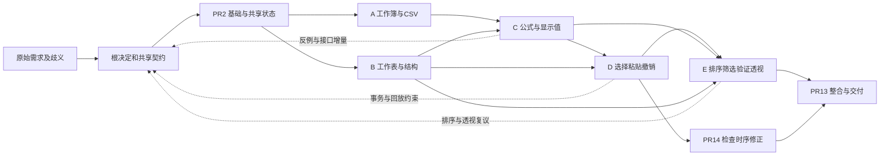

# Sheet 完整 I10→I11 lineage：需求、信息与决定怎样流动

本报告取代“只看 I11 接续段即可解释工作模式”的分析口径。Sheet 从最初需求到最终合入，一直使用设计负责人、实现负责人、Pi 子角色、跨 Issue/PR 复核和共享契约；**不能再把它描述为“少协作、少子 Agent 所以得分更高”**。I11 没有新 spawn 是局部阶段事实，不能代表完整历史。恢复节点、题目结构、模型和材料版本都可能影响模式，但本报告不把任何一个先定为主要原因。

沿完整历史最清楚的机制是：需求被转换为共享决定，决定通过 Issue、PR、packet 和代码接口传递；有效协作以反例、候选消费和可区别的验证闭合，低效协作则常停在多处同步当前状态。两者发生在同一套机制中，不能靠调用数或最终分数区分。本报告只分析 Sheet；两题横向解释交由父会话结合 GitHub 完整 lineage 汇总。

## 1. 身份、覆盖与证据强度

分析对象唯一：Braid run `20260929-042409-811f18d4`，原始 I10 controller 为 `pi-braid--hackathon--sheet-3b5e3eeaa3b062`，经历已有热恢复，I11 首次接续为 `db75cf2c3b82be`，最终为 `pi-braid-i11--hackathon--sheet-396538bc0dda96`。最终 binary 是 `3056feb7…`，不是 GitHub 后来采用的 `d76d65…`；最终恢复 `refresh_native_materials=false`。因此不能用旧阻塞记录否定后续成功，也不能把 Sheet 成功算作另一 binary 的验证。[身份与材料证据](report.md#1-对象已唯一确定旧调查的时间边界已修正)、[恢复原记录](../runtime-stalls/packet.md)。

最终 main `10cba2ad888fd60f283382158c1bfb00b0fad240`，被验 develop `5926059835b8ff0de1256957c4205f75a8861e35`，两者 tree `1a18466bd63e2702b91663033a3e5d62d228de65` 一致。原始采集源包 SHA256 `4a048cc4041dab1621f6a233954a9c0e0954b57f8774bb39b4efe7bd1d160fdb`。这是同一应用 lineage 的身份约束，不是质量判断。

资料覆盖分三层，不能互换：

| 层次 | 已覆盖内容 | 不能据此声称什么 |
| --- | --- | --- |
| 全量索引 | final-source 565 个 JSONL、38,414 行、188,251,949 bytes，零解析错误；14 个协作对象、589 条评论、1,102 条活动、3,494 个事件、359 次 context reset；按真实路径、行号、message ID、cwd 和 lineage key 建账 | 程序解析不是模型逐字阅读全文；565 个物理文件也不是565个独立session |
| 语义过程阅读 | 复用同一 run 的早期全过程审计及增量；按基础/A/B/C、D/E、根/整合分区，定向读后续关键决定、返回、交接和状态演变。尤其08:24后ABC/base采用索引加语义抽查，未逐条细读其全部新增记录 | 不把关键词命中、截断显示或同一payload副本算成新的理解；各 reader 的真实阅读边界见分项覆盖账；不能据此宣称所有遗漏均已排除 |
| 主分析核因果 | 复用原主报告的原文核查；本轮再读根10:02接续、paste争议、pivot复议、rowMap消费、resolve/unresolve原始操作及其返回 | 不把分项摘要当成主审逐条原文阅读，不从结果反推未记录的内部思维 |

导航：[完整索引](full-lineage/inventory/inventory.md)、[早期全读审计](../run-audit/sheet/report.md)、[协调分项](full-lineage/coordination/report.md)、[C后段按会话最终答复导航及关键回读](full-lineage/coordination/c-systematic-review.md)、[D/E 分项](full-lineage/de/report.md)、[根与整合分项](full-lineage/root/report.md)、[主审原文账](full-lineage/primary-reading.md)。早期审计位于 **iteration11/run-audit/sheet**；`iteration10/run-audit/sheet` 是另一 run，未混入。`read-gaps.json`是相对旧正式阅读账的增量分配索引，不是本轮语义阅读后的终态缺口表。

反向核对还发现：早期原件有两条路径不在 final-source，但仍在本地早期增量包；一条 final 文件追加、一条前缀改写。它们均保留来源，不能用最终 canonical 文件覆盖旧历史。DB 只保存当前 description/comment body 与修订号，不保存每次旧正文；活动能证明发生了编辑/关联/resolve，旧文字须回对应 native 请求或回包，未保存部分无法恢复。以下全程结论指阶段与信息链覆盖，不是对全部188MB逐字阅读的声明。

## 2. 从需求开始的过程图景

原始任务是持久化在线表格工作区：工作簿/工作表、网格输入、结构变化、公式、复制移动与撤销、排序筛选验证和透视表，同时包含 ARIA 与精确错误文案。24 条 ATOMIC 描述仍可读；约100个场景的 WHEN/THEN 有308处占位污染，GIVEN 又包含不一致种子。**这在规划前已经可见**，不是产物失败后才找到的借口。

根先读 design/task-packet 方法，向 advisor 提供歧义和候选，向 vision 提供九张参考图，形成 D1–D3：以 ATOMIC 为验收权威；取最大一致种子，其余场景通过 UI 布置；采用自研 ARIA 网格/公式、React/Vite、Express/SQLite、稳定 workbook URL。advisor 的种子冲突分析和显式尺寸/规则迁移/透视状态建议进入契约；“评测是否逐场景重置种子”仍未知。vision 的布局观察没有被当成交互或持久化证明。[原始链与消息定位](cells/inherited-process.md#需求理解规划与持久化方法)。

图中是实际依赖与反馈，不是每个阶段只发生一次的瀑布模型。A–E 子 Issue 都在04:41创建，后续按依赖指派；不能把“尚未指派”写成“尚未创建”。所有 Issue/PR 编号均为 Agent 的 **Braid 协作对象**，不是生成应用里的业务功能，也不是外部 GitHub 项目协作。

| 时间（UTC）与工作阶段 | 当时的选择、反馈与后续动作 | 有效之处与可观察偏离 |
| --- | --- | --- |
| 09-29 04:24–05:50：理解、基础 PR2 | 根集中语义决定；基础建立显式行列、raw、snapshot、事务、平台/ABI 和共享类型 | 契约使后继可开展工作。根一度把两个 profile 当成“只有两个人”，是容量理解错误；但接口前置也真实存在，不能把所有串行耗时归它 |
| 05:50–06:53：A/B 设计与并行实现 | Issue owner 管需求/判据，PR8/9 owner 实现；B helper 发布后 A 切换单一消费入口；B SQLite 位移预演失败后改两阶段位移 | 分工产生真实独立反馈。v1.3 只发到 Issue owner 等，PR8交接仍旧；之后主动重读与根复核补齐，不是消息凭空丢失 |
| 06:53–08:10：C 与 A/B 接缝 | 公式契约、raw/显示值、copy/structure不同重写规则成为共享 API；explorer按既定错误隔离要求发现深嵌套整表抛错；PR10修复并新增检查 | 子角色输出改变实现；C的纯函数/局部证据没有冒充D端到端复制粘贴完成。环境慢安装、工具无终态与应用失败曾需反复区分 |
| 08:10后恢复到10:35：D、旧模块后续义务 | D提出paste必须同事务尾扩张、校验、写入；A/B/C提供反例与接缝约束；PR11修FormulaBar draft、CSS与选区问题，完成46项e2e交接 | 原子性跨B/C/D才能闭合。旧模块并非全无工作，但其正文又反复镜像全局候选；部分“无动作”确认触发继续整理 |
| 10:35–11:50：E与共享语义复议 | B/D反例推翻pivot保留旧range方案；C反例推翻排序只搬raw方案；advisor复议、根裁定、C原语发布、E实际承接及回归 | 真正有用的是可区分反例和调用方消费。权威决定同时散在根增量、E设计串、Issue/PR正文和packet，维护成本不断增加 |
| 11:50后至09-30 02:10：整合、恢复、验收交付 | PR13增加跨模块检查；PR14修撤销检查时序；恢复后PR13读取packet、完成四门、按精确head合入；根核树和证据后关闭 | packet确实支持接续；最终身份一致。部分重跑纪律过度绑定新commit，已有适用证据未明确被接纳；恢复设施中断另列，不当成业务判断失败 |

各阶段原始链见[早期总审](../run-audit/sheet/report.md)、[D/E分项](full-lineage/de/report.md)、[I11主审](report.md#2-正向过程需求如何成为决定分工和检查)。阶段和恢复解释了“某一截图里正在做什么”，本身不足解释两题从头到尾为何形成不同工作模式。

## 3. 四条能验证方向的机制链

### 3.1 接口有生产者，还必须有实际消费者

v1.3 的 #51/#57/#60 在06:12–06:15发布给 Issue owner 等，未直接投递 PR8 活动实现者；06:17 PR8仍交旧候选 `d536aa2`。06:31实现者主动回读根内容，随后修订；根 #64 又按需求拦截缺项，最后合入 `e63efc6`。这证明的是 **发布、可达、采用三个环节没有自动相等**，不是投递系统吞掉了内容。[A原始阅读账及评论链](../run-audit/sheet/cells/a/report.md)。

后期 C→E 做得更完整：#451指出 `7ba7916` 在非法rowMap输入下生成不可词法化公式，同时说明 E 当前合法置换路径不会产生该输入；#459发布 `ed72f89`、验证增量cherry-pick、列出两项实现义务；#470区分域断言已落地与原语尚未承接；#480核实 E head `42f9c5b` 的实际文件hash一致，并把剩余packet旧状态与PR交接回执明确留给实现者。这里没有把“共享实现已经push”当作“调用方已经交付”。[comments #451/#459/#470/#480](evidence/comments.md)，主审逐条回读记录见[primary-reading](full-lineage/primary-reading.md)。

**解释性判断：**清楚的消费者和可核查动作，比泛称“大家同步一下”更容易闭合依赖。**替代解释：**某些附加复算可由环境/候选变化合理要求，不能仅凭重复hash便判浪费。此链支持明确接口消费责任，不支持无限加 reviewer。

### 3.2 反例能纠正设计；独立建议的价值不等于首发现

E的目标是无效透视源报错并保留两表/上次结果。已有B实现把空range对应pivot删掉，E最初改为保留旧文本加stale。B #355 的实际预演随后证明：不触底折叠留下的 `A2` 仍合法且在界内，与普通位移后状态不可区分；刷新会静默汇总错位数据。D补充state逐字回放、空串合法而null不合法。E #362只冻结这一处分支，其余实现继续。

advisor `744ec1d7…` 收到的输入**已包含以上反例和哨兵建议**。它的实际贡献是核代码、比较四个选项、列反论据和边界，不是首发现别名问题。E #375/#377最终采用空串哨兵，要求错误/保留/撤销/幂等检查；同时明确拒绝advisor新增错误文案的建议。该异议被保留，而非把“已咨询”写成全盘同意。原生 transcript L2/L21 与revision=1评论已由主审核对。[原始advisor](evidence/final-source/workspace/official-generation/template/.factory26/20260929-042409-811f18d4/work/native-homes/pi-deepseek-fast-01a0ecca-0119-7532-a2c3-6b0a196170ed/subagent-artifacts/744ec1d7-fe82-4f37-b1f9-9a9ad33da3da_advisor_transcript.jsonl)、[D/E链](full-lineage/de/report.md)。

同一传递还有一处可直接检查的文字偏离：advisor说源表锁定在(a)保留文本、(b)哨兵、(c)额外标记三方案下相同；#375 §5却写成“保留文本/哨兵/删行”三种相同。删行恰会移除这条pivot依赖，且B #355已记录旧分支删后 `pivots=[]`。这支持“结论转写时改变了论据范围”的局部判断；它不证明选哨兵错误，也没有证明该错句导致下游实现或评分损失。不能把报告里大量互相引用自动视为论据已再次核实。

另一个有效链是C的explorer：输入是候选commit、REQ-4-2-2逐格错误隔离和限定文件；实际探针发现深嵌套抛错越过单格边界；#147/#149让PR10在 `d6ca6d4` 修复并补回归。它比再次认同设计提供了新增可区别观察。[C原始链](../run-audit/sheet/cells/c/report.md#13-已发现的契约偏离及收敛)。

**局限：**需求未规定处仍夹有对隐藏评测的猜测，如种子、错误文案、混合 `$` 区间是否入验收。意见一致只说明形成了决定，不证明它与私有验收一致。上述有效反馈也不能外推为所有潜在错误都已被发现。

### 3.3 当前文字既支持恢复，也可能成为下一轮的额外任务

task-packet、README、Issue和PR正文并非装饰。PR13接续原生 `b8b333b0` L12直接读取 `tasks/pr-13-integration/packet.md`，随后按缺失门继续；共享README/types/函数也被实际消费。但多个载体同时保存“当前候选”和“当前未决”，需要持续追踪彼此。最终B packet仍写待负责人验收、C/E尚未交付；README将设计权威指回根正文/comment1，整合packet又要求读v1–v1.6全部增量。部分长期知识没有从讨论提炼成自足的当前接口说明。[SVC与最终文档原证据](report.md#3-svc-是否真正发挥作用)。

主审直接读取的根10:02接续输入有167,672字符，前后含大量契约目录和更新事件；这是输入长度事实，不是“语义熵”的量化。根能识别已在prompt内的 #265/#267，也明确停止多余催问；但仍需重新定位旧thread、更正别人的状态句、查候选。稍后 #288带来真正进展请求，根又核实D实际修改并答复。**同一段既有重复整理，也有有效选择和停止。**[原始范围与消息ID](full-lineage/primary-reading.md)。

I11 #569更明确地说本轮来自自己的PR正文编辑，又进入处理；#567/#568/#569和B #575/#577在“无代码动作”下同步全局候选。结合恢复材料中self-edit→context reset→“请处理工作项”的接线，能够提出一个有证据的反馈机制：**维护当前状态本身可能重新产生待处理输入**。仍须区分不同事件和重复投递，不能说它们都是同一消息无限重发。[I11核查](report.md#52-已完成-owner-镜像全局状态使维护本身继续产生工作)、[runtime记录](../runtime-stalls/packet.md)（L68）。

### 3.4 折叠的是讨论单元，完成的是具体义务；两种粒度曾不一致

E在 #470 原版想折叠已被新决定取代的 #362/#370，执行 `comment resolve 362 370`，返回却显示其所属thread314/331整体resolved。这两个thread还包含有效设计权威及新待办。负责人再查看最新#470，发现也被折叠，识别风险；第一次批量unresolve参数不合法，随后分别调用成功，并编辑#470撤回“随本条折叠”的表述。

这不是从最终DB猜出来的过程：原生11:27:07会话 L53–69，消息 `bd1f3d9d`（操作）、`1a02d6be`（识别）、`f2bd639a`（失败恢复）、`01f7b9ae`（成功恢复）、`f227e4f2`（更正文案）和工具返回均在。[原始session](evidence/final-source/workspace/official-generation/template/.factory26/20260929-042409-811f18d4/work/native-homes/pi-deepseek-fast-01a0eceb-17d3-7412-9829-7a68c18b95a5/2026-09-29T11-27-07-584Z_01a0eceb-2140-715b-a9b1-0455dd8fd4e4.jsonl)。

**直接结论：**作者意图“某个请求已被取代”与工具状态“整串可折叠”不一致，而且模型能凭回包自行纠正。**没有证据：**几十秒窗口是否已让下游漏掉义务，不能宣称造成实现遗漏。早期PR8 #101默认view折叠后body为空、负责人以为没内容，补include-hidden后取回，是另一种读取可见性摩擦；同样应保留纠正而非只列失败。[早期根审](../run-audit/sheet/report.md)。

## 4. SVC与Pi角色的实际作用

SVC是材料与工作方法，Pi角色是原生子任务；Braid的Issue/PR负责人是另一层协作角色。不能把PR owner写代码记成executor贡献，也不能把无显式read记成没有方法输入——advisor/explorer/executor模板分别内联design/investigation/implementation workflow。最终源hash/渲染核查见[material-check](evidence/material-check.json)。

| 能力 | 配置及实际使用 | 已证贡献 | 局限/反例 |
| --- | --- | --- | --- |
| task-packet | B/C/D/E设计与PR交接使用；PR13恢复直接读取 | 保留接口、候选、证据和下一步，支持跨session接续 | 当前态与历史证据混放；部分旧packet未跟最终完成同步，多载体维护产生新任务 |
| design / investigation / implementation | 根/B/C/E显式读，子角色模板内联；设计前咨询、实现前局部预演 | 种子/公式决定、SQLite位移失败修复、独立反例进入实现 | 与角色指令、模型常识共同作用；无法识别单skill净效应 |
| verification / interpreting-results | 保留候选、环境、退出码、失败与superseded；最终根接受有效证据停止重跑 | PR14区别应用语义与检查时序，最终精确head/tree绑定 | 新commit纪律与证据适用性判断并存，已适用证据未总被明确采用 |
| durable docs / shared definitions | README、types、shared函数和接口被调用方消费 | raw/显示值、A1、事务、平台基线形成共同约束 | 部分最终权威仍在历史thread增量，需要后继重建时间顺序 |
| advisor | kimi-k3/high/fresh/read-only；原始需求/候选/反例输入 | 初始种子和持久化面、B/C设计、E排序与pivot复议进入裁定 | 有输入已包含答案、被拒绝建议、隐藏评测假设；不能把每次返回都算新发现 |
| vision | deepseek-v4-flash-vision-exp/high/read-only | 提供参考布局和选区/复制源视觉反馈；承认像素不能证明行为 | 没有证实持久化/公式语义；I11没有新调用，不能声称验证了该阶段vision修复 |
| explorer | deepseek-v4-flash/high/fresh/read-only | C候选的深嵌套反例→#147/#149→`d6ca6d4` | 一次有效实例不证明全应用独立验收；探针不是完整e2e |
| executor | deepseek-v4-flash/high及读写/implementation配置存在 | 捕获的完整调用索引未见该角色spawn；实际由Braid PR owner实现 | 未调用不等于失败，也不意味着应为增加数量而调用 |

完整lineage中advisor/vision/explorer确有贡献。I11段只有 `e3504f2b`（09-29 17:19:28）查询旧advisor `524072e5…`，没有新spawn；181条subagent工具索引包含status/wait/workflow，**不是181次spawn**。[角色原文与消费入口](report.md#4-pi-子角色配置实际输入输出与影响)、[调用索引](evidence/subagent-calls.json)。

## 5. 生命周期、责任与最终验收

最终对象图是根Issue1下A–E五个子Issue；根关联基础PR2与整合PR13，A/B/C/D/E分别关联PR8/9/10/11/12，D另关联稳定性PR14，共8条关联。Issue设计owner与PR实现owner、共享原语owner、跨模块回归owner并不天然相同。有效例是D明确把真验证gate的paste409和undo/pivot接缝交给E；E消费后再把合入树回归交给B/C/A监测方。不能因旧Issue已close，就推断其负责人以后所有通知都无价值。

终态DB保留589条评论，其中3条hidden、28条带resolved-through；活动里有30次resolved、2次unresolved、4次hide，差异来自历史动作与当前状态。hide包括误发probe、shell损坏正文和重复答复；都有可追踪原因/替代入口，不能统称证据删除。374次description编辑也不等于374次新决定。[状态与事件账](full-lineage/coordination/coverage.md)。

delivery显示2,041 delivered、12 queued、174 unreachable；169条unreachable原因是根从 `@glm-1` 迁到 `@glm-9` 后旧目标已reassigned。**delivered只证明输入接受，不能证明理解或实现消费**；queued/pending也不能证明没有其他渠道读取。最终18个mention pending、3个blocked reset与已经关闭的工作项并存，保留了生命周期遗留，不应抹掉或全部当未交付责任。DB `local_run.lifecycle=running`也不能覆盖controller已完成/root已close的另一层终态。

验证同样需按所要证明的义务判断。PR14通过拉长提交窗口证明旧Ctrl+Z检查会抢在history入栈之前，改为等Undo可用；只改spec，留下 `18cfeab` non-skip68 passed及unit/typecheck。PR14 reviewer接受已有证据而不自己重跑，是正例。PR13随后在新head重取四门，其中缺失skip/platform证据有实际需要；已有non-skip/unit能否复用却未被明确评估。不能断言所有重跑浪费，也不能因为新SHA便自动认定必要。[三条主审链](report.md#5-三条直接可复核的因果判断)。

最终PR13候选 `5926059` 四门完成，合入 `10cba2a`，根#588复核证据后#589关闭而不再运行，形成收口。官方末端核对为 self_funded replay `fe617f4f8526` / submission `87acf1919de7`，59通过/41失败、功能8/24，部署启动评分均完成；没有逐例错误。它不是Pi Minimal run `6dc68bef2081` 的40分。私有评测不可见，不能由59对4推断“少协作更好”或“某机制导致低分”。

## 6. 人类实践与一手研究：用来提出问题，不替代证据

| 研究参照 | 与本run可对应的事实 | 可保留的解释及边界 |
| --- | --- | --- |
| Flower & Hayes（1981），[写作过程原论文](https://www.researchgate.net/publication/239552089_A_Cognitive_Process_Theory_of_Writing)，pp.366–371 | packet/正文不是一次完成；已有文本又成为后继session任务环境，作者需反复计划、表达、审阅 | “当前状态”应服务读者下一步，而非完整保留作者整理过程。本文未测LLM心理过程，不把阶段标签当原因 |
| Clark & Brennan（1991），[Grounding in Communication](https://worrydream.com/refs/Clark_H_1991_-_Grounding_in_Communication.pdf)，pp.128–135、140–145 | v1.3发出却未及时采用；C→E实际消费比回“收到”更强；resolve影响后续可回看性 | 用相关行动证明足以继续协作，避免无止境确认；但需要共同判据，不能减少所有回执 |
| Malone & Crowston（1994），[协调研究原论文](https://www.researchgate.net/publication/5176072_The_interdisciplinary_study_of_coordination)，§2.2 | B/C/D/E存在前置、传递、可用性依赖；两profile容量误读是另一种问题 | 排期应从真实依赖出发，产物存在不等于消费者可用；不据此主张最大并行 |
| Parnas（1972），[模块划分原论文](https://wstomv.win.tue.nl/edu/2ip30/references/criteria_for_modularization.pdf)，pp.1055–1057 | 功能子Issue仍共享A1、结构、公式、显示值和事务决定；E变化会回到C/B/D | 模块边界能隐藏稳定设计决定才降低协商；分更多任务并不自动降低耦合，Braid工作项也不必一一对应代码模块 |
| Shannon（1948），[通信理论原论文](https://people.math.harvard.edu/~ctm/home/text/others/shannon/entropy/entropy.pdf)，引言 | 字符量、事件量、重复身份可数，义务是否被理解不能仅靠计数 | 不用“语义熵/信噪比”包装未经定义的推断；本报告保留可测传输事实与人工核实的语义链 |

一手原文的定向读取范围、书目信息及应用限制见[研究记录](full-lineage/research-notes.md)。这些人类研究为可检验问题提供参照，并不证明LLM具有人类的同样内部机制。

## 7. 少量可检验优化候选（未实施）

| 归属 | 候选与本次依据 | 可检验预期、反例与保留能力 |
| --- | --- | --- |
| 提示词/角色 | 交接用“决定版本—受影响消费者—需要的动作/无需动作—结束条件”，明确profile不是实例容量；advisor区分输入事实、独立新发现、建议及未采纳项 | v1.3不再只到Issue；C→E式实际消费能直接结束义务。若仍需反复追问同一判据则失败；保留真正跨域反例与重开已完成owner能力 |
| Skill/文档方法 | 将设计来源/历史证据与自足的当前接口/当前待办分开；当前事实只有明确owner，旧模块引用集成状态，不各自复制最新head | 新接续者不须重建v1–v1.6全讨论也能找到当前判据；B packet不会同时“未交付”与闭合。不能靠删历史达到简短，应仍能追溯被取代决定 |
| 运行机制/上下文 | self-edit接续呈现作者、实际差异、是否已在快照内；resolve显示影响thread和仍有效义务；投递标记与消费证据分开 | #470式操作前能看见折叠范围；自身整理不被泛化成全新业务任务；真实外部新输入仍及时进入。要用事件ID与实际下一步判别，不能只看通知数下降 |
| Skill/验收交接 | 证据按行为范围、应用/测试/依赖与运行条件判断适用性，同时记录候选身份；明确哪项复用、哪项失效及理由 | PR14已有non-skip/unit被显式接受或有具体失效理由；缺失skip/platform仍补齐。代码/环境变化时应重跑，不追求一律省检查 |

这些候选来自可见断点，未声称带来净成本收益或提分；没有实施、试跑或重新评测。最值得保留的是独立反例、明确接口owner、可复现证据和最终精确交付，不能为减少协作表象把它们一并删掉。

## 8. 交给两题综合的结论与缺口

已证差异单位应是一次完整的“输入—决定—传播—消费—验证”链，而非某个I11恢复截点或工具次数。Sheet全程显示：功能分解背后仍有强共享依赖；Issue/PR和Pi角色既能纠错，也能放大文字同步；可执行接口和消费证据比多处同意更可靠；上下文生命周期会改变读者实际看见的决定。恢复阶段只列控制变量，不能作为已经证明的主解释。

尚不能回答：这些机制对59分的独立贡献、两题若交换协作方式会怎样、未细读后段是否还有其它重要决定、原生记录之外未落盘的决定、缺失旧正文的逐版本内容，以及私有评测每个失败原因。不能据当前正例断言Sheet没有GitHub式的范围承接遗漏。也未开展GitHub最终源码断点核查。父会话可使用本报告与GitHub完整lineage按同维度对照；旧[comparison.md](comparison.md)已经明确撤回切片主要解释。新的需求树→Issue/PR协议规划由独立线程承担，本报告不展开其映射设计。

本轮仅分析现有文件与一手研究，保存报告/索引；未改variant或应用、未运行Factory/Braid/生成应用测试、未新评测或调用比赛模型、未提交或推送。
